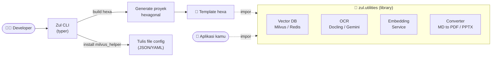
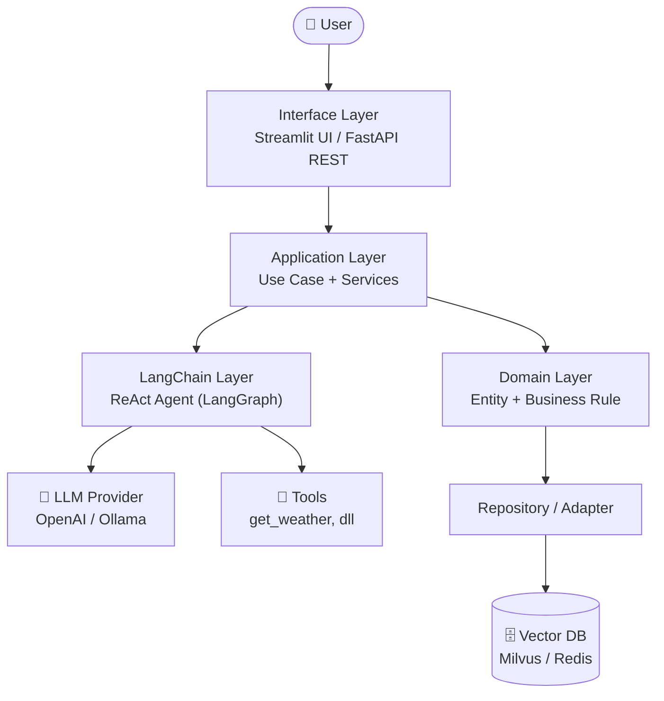
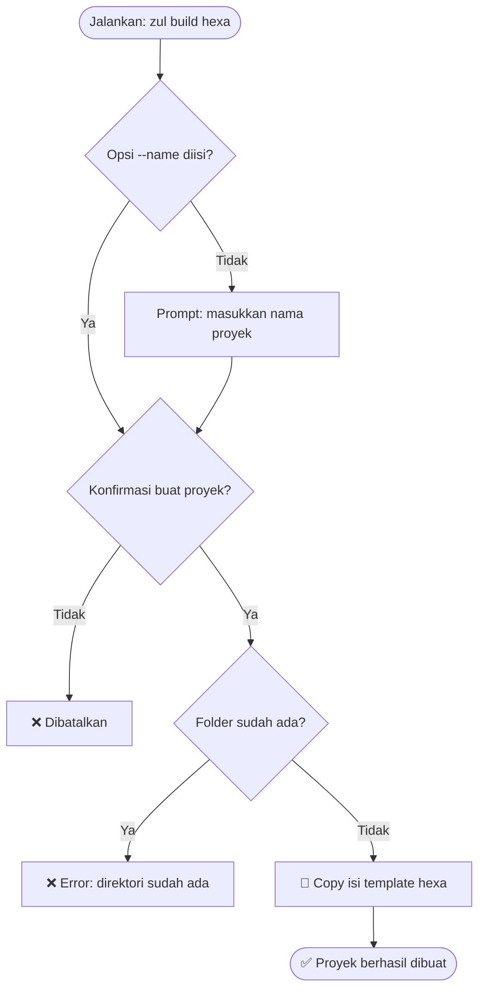
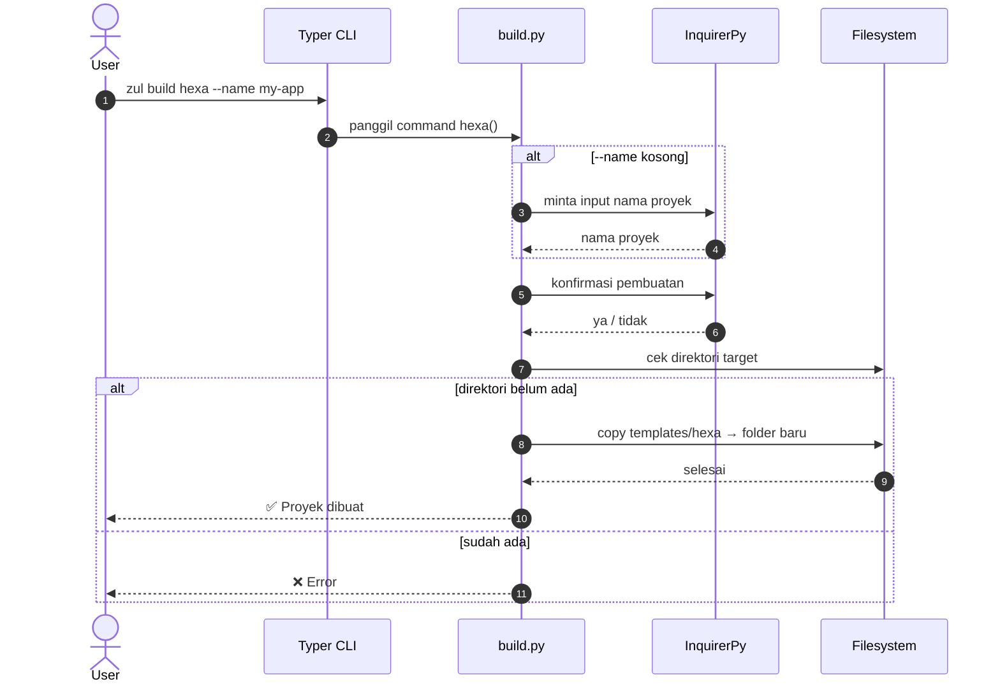
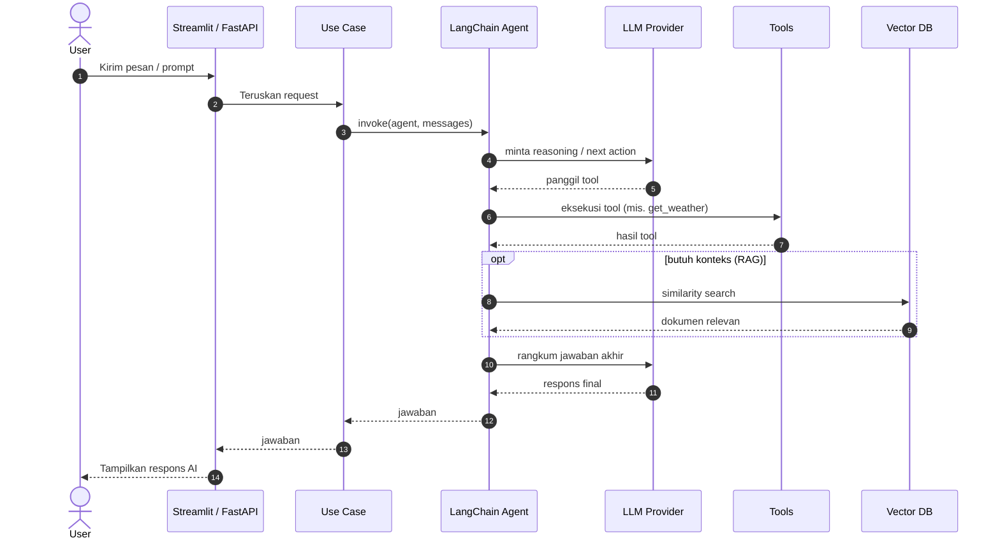
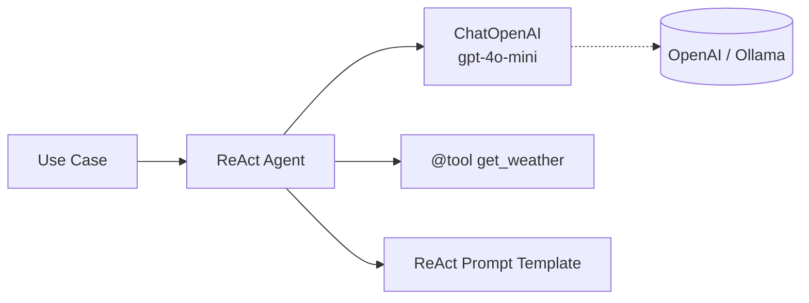
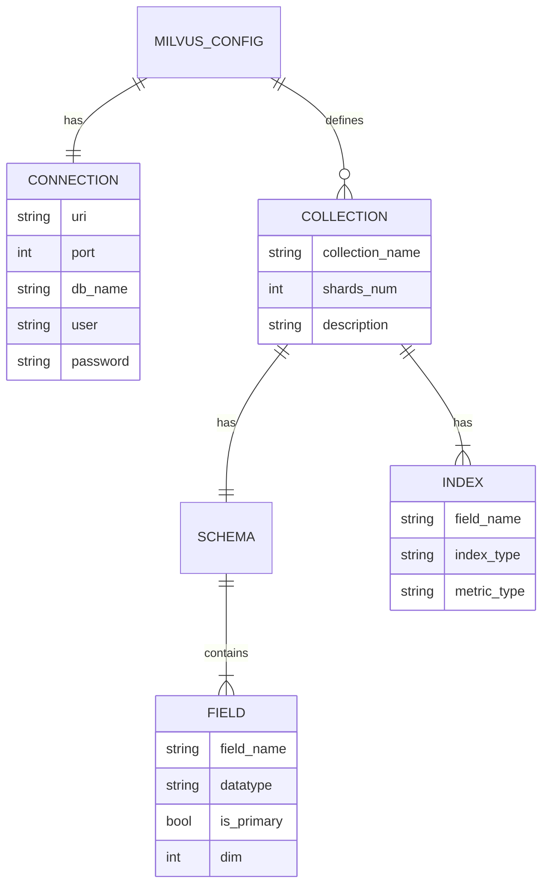

<div align="center">

# 🚀 Zul

**CLI generator boilerplate + toolkit utilities untuk aplikasi AI & data engineering berbasis Python.**

Buat struktur proyek AI production-ready dalam satu perintah, lalu pakai kembali helper siap-pakai untuk Vector DB, OCR, LLM, dan konversi dokumen.

[](https://www.python.org/downloads/)
[](https://opensource.org/licenses/MIT)
[](https://github.com/astral-sh/uv)
[](https://github.com/psf/black)
[](https://docs.langchain.com/)

</div>

---

## 📖 Apa itu Zul?

**Zul** adalah *command-line tool* sekaligus *library* yang membantu kamu:

1. **🏗️ Generate proyek** — cukup jalankan `zul build hexa` untuk membuat kerangka aplikasi AI dengan **hexagonal (onion) architecture** yang sudah terstruktur rapi (FastAPI + LangChain + Streamlit).
2. **🧰 Pakai utilities siap-pakai** — impor helper `zul.utilities.*` untuk Milvus, Redis Vector, OCR (Docling/Gemini), embedding, dan konversi Markdown → PDF/PPTX tanpa menulis ulang dari nol.
3. **📚 Belajar dari contoh** — folder `tutorial/` berisi notebook interaktif untuk tiap utilitas.

> Tujuannya sederhana: **berhenti menyalin-tempel boilerplate**. Biarkan Zul yang menyiapkan strukturnya.

---

## ✨ Fitur Utama

| Fitur | Keterangan |
|-------|------------|
| 🎨 **Interactive CLI** | Prompt ramah pengguna dengan InquirerPy + Typer |
| 🏛️ **Hexagonal Template** | Scaffold arsitektur bersih: `domain`, `application`, `infrastructure`, `interface` |
| 🤖 **AI-Ready** | Sudah tertanam LangChain, LangGraph (ReAct agent), tool calling |
| 🗄️ **Vector DB Helpers** | Helper konfigurasi-driven untuk **Milvus** & **Redis** (termasuk hybrid search) |
| 👁️ **OCR Toolkit** | Ekstraksi dokumen via **Docling VLM** dan **Google Gemini** |
| 📄 **Doc Converters** | Konversi Markdown → PDF & PPTX |
| 🎯 **Type-Safe** | Validasi & settings berbasis Pydantic v2 |

---

## 🧰 Tech Stack

| Layer | Teknologi |
|-------|-----------|
| **CLI Framework** | [Typer](https://typer.tiangolo.com/) · [InquirerPy](https://inquirerpy.readthedocs.io/) |
| **AI / LLM** | [LangChain](https://docs.langchain.com/) · [LangGraph](https://langchain-ai.github.io/langgraph/) · `langchain-openai` · `langchain-ollama` |
| **Backend (template)** | [FastAPI](https://fastapi.tiangolo.com/) |
| **Frontend (template)** | [Streamlit](https://streamlit.io/) |
| **Vector DB** | [Milvus](https://milvus.io/) (`pymilvus`) · [Redis](https://redis.io/) (`redisvl`) |
| **OCR / Dokumen** | [Docling](https://github.com/DS4SD/docling) · Google Gemini · `python-pptx` · `xhtml2pdf` |
| **Validasi & Config** | [Pydantic](https://docs.pydantic.dev/) · `pydantic-settings` · Jinja2 |
| **Tooling** | [uv](https://github.com/astral-sh/uv) · Black · Ruff · mypy · pytest |

---

## 🏗️ Arsitektur Sistem

Zul punya dua peran: **(1)** sebagai CLI yang *menghasilkan* proyek & meng-*install* config, dan **(2)** sebagai *library* utilitas yang diimpor aplikasi lain. Diagram berikut menunjukkan kedua peran tersebut beserta template `hexa` yang dihasilkan.



### Arsitektur runtime template `hexa`

Template yang dihasilkan mengikuti pola **hexagonal**: `interface` (FastAPI / Streamlit) memanggil `application` (use case + LangChain agent), yang bergantung pada `domain` murni dan `infrastructure` (LLM, Vector DB) melalui port/adapter.



---

## 📁 Struktur Folder

```text
boilerplate/
├── src/zul/                      # 📦 Package utama Zul
│   ├── cli.py                    # Entry point CLI (typer app)
│   ├── commands/                 # Sub-command CLI
│   │   ├── build.py              #   → zul build hexa
│   │   └── install.py            #   → zul install milvus_helper
│   ├── utilities/                # 🧰 Toolkit yang bisa diimpor
│   │   ├── vector_DB/            #   Milvus & Redis helper + config schema
│   │   ├── OCR/                  #   Docling VLM & Gemini OCR
│   │   ├── markdown_converter/   #   MD → PDF / PPTX
│   │   ├── script_helper/        #   JSON, save file, eval, dll
│   │   ├── embedding_service.py  #   LLM & embedding config (Pydantic)
│   │   └── react_graph.py        #   Contoh LangGraph StateGraph
│   └── templates/
│       └── hexa/                 # 🏛️ Blueprint proyek hexagonal
│           └── src/
│               ├── domain/       #   Entity, exceptions, prompt templates
│               ├── application/  #   Use case, AI agents (ReAct), DTO
│               ├── infrastructure/ # LLM, tools, database, logging
│               └── interface/    #   http (FastAPI), streamlit, cli, discord
├── tutorial/                     # 📚 Notebook contoh per-utilitas
├── pyproject.toml                # Metadata & dependencies
└── README.md
```

### Penjelasan Layer Template `hexa`

| Folder | Layer | Tanggung Jawab |
|--------|-------|----------------|
| `src/domain` | **Domain** | Entity, exception, dan *prompt template* — logika inti tanpa dependensi eksternal |
| `src/application` | **Application** | Use case, service, DTO/mapper, dan **LangChain agent** (ReAct) |
| `src/infrastructure` | **Infrastructure** | Adapter keluar: LLM (OpenAI), tools, database, koneksi, logging |
| `src/interface` | **Interface (Inbound)** | Titik masuk: `http` (FastAPI), `streamlit`, `cli`, `discord` |

### Penjelasan Modul `utilities`

| Modul | Isi | Contoh Impor |
|-------|-----|--------------|
| `vector_DB` | `MilvusHelper`, `redis_helper`, config loader/schema | `from zul.utilities.vector_DB.milvus_helper import MilvusHelper` |
| `OCR` | `DoclingVLMConverter`, `gemini_ocr` | `from zul.utilities.OCR.docling_OCR import DoclingVLMConverter` |
| `markdown_converter` | `md_to_pdf`, `md_to_ppt` | `from zul.utilities.markdown_converter.md_to_pdf import ...` |
| `embedding_service` | `AIConfig`, `LLMConfig`, `EmbeddingConfig` | `from zul.utilities.embedding_service import AIConfig` |

---

## 🔄 Flow Diagram

### 1. `zul build hexa` — User Flow

Perspektif pengguna saat men-*generate* proyek baru dari CLI.



### 2. `zul build hexa` — System Flow

Perspektif internal: bagaimana komponen CLI berinteraksi saat perintah dijalankan.



### 3. Runtime Aplikasi Hexa — System Flow (fitur AI/chat)

Perspektif internal saat user berinteraksi dengan aplikasi hasil generate (endpoint berbasis LangChain agent).



---

## 🧠 LangChain Component Map

Template `hexa` dan utilitas menyertakan komponen LangChain berikut:

| Komponen | Implementasi | Lokasi |
|----------|--------------|--------|
| **Agent** | ReAct agent (tool-calling) via LangGraph | `application/AI/agents/react/` |
| **Graph** | `StateGraph` (contoh state machine LangGraph) | `utilities/react_graph.py` |
| **Tools** | `get_weather` (`@tool`) — placeholder siap diganti | `infrastructure/AI/tools/weather_tool.py` |
| **LLM** | `ChatOpenAI` (`gpt-4o-mini`) via factory | `infrastructure/AI/llm/openai.py` |
| **Prompt** | Template prompt ReAct | `domain/templates/prompt/react/` |



---

## 🗄️ Skema Vector Store

Zul tidak memakai database relasional; penyimpanan berbasis **vector store** yang dikonfigurasi lewat file JSON/YAML. Skema divalidasi oleh Pydantic (`vector_DB/config`).

### Milvus — struktur collection



**Tipe yang didukung**

| Kategori | Nilai |
|----------|-------|
| Datatype | `VARCHAR`, `INT64`, `FLOAT`, `FLOAT_VECTOR`, `SPARSE_FLOAT_VECTOR`, `BOOL`, `JSON` |
| Index | `FLAT`, `IVF_FLAT`, `HNSW`, `IVF_PQ`, `SPARSE_INVERTED_INDEX` |
| Metric | `COSINE`, `L2`, `IP`, `BM25` |

### Redis — struktur index

| Field / Setting | Nilai yang didukung |
|-----------------|---------------------|
| Field type | `text`, `tag`, `numeric`, `vector`, `geo` |
| Vector algorithm | `flat`, `hnsw` |
| Distance metric | `cosine`, `l2`, `ip` |
| Storage type | `hash`, `json` |
| Hybrid search scorer | `BM25`, `TFIDF`, `DISMAX`, `BM25STD`, dll |

---

## 🚀 Instalasi

**Prasyarat:** Python **3.11+** dan (disarankan) [uv](https://github.com/astral-sh/uv).

<details open>
<summary><b>Opsi 1 — Install dari GitHub (paling cepat)</b></summary>

```bash
# via uv (disarankan) — install sebagai tool global
uv tool install git+https://github.com/kazuma313/zul_utilities.git

# via pip
pip install git+https://github.com/kazuma313/zul_utilities.git
```
</details>

<details>
<summary><b>Opsi 2 — Install dari source (untuk development)</b></summary>

```bash
git clone https://github.com/kazuma313/zul_utilities.git
cd zul_utilities

uv sync              # buat virtual env + install dependency
uv pip install -e .  # install package dalam mode editable
```
</details>

<details>
<summary><b>Opsi 3 — Tambah ke requirements.txt</b></summary>

```txt
zul @ git+https://github.com/kazuma313/zul_utilities.git
```
</details>

---

## ▶️ Cara Menjalankan

### Generate proyek hexagonal

```bash
# Mode interaktif (akan menanyakan nama)
zul build hexa

# Langsung dengan nama
zul build hexa --name my-ai-app
```

### Setup config utilitas

```bash
# Buat milvus_config.json di folder proyek saat ini
zul install milvus_helper
```

### Cek versi & bantuan

```bash
zul version
zul --help
zul build --help
```

### Contoh pakai utilitas di kode

```python
from zul.utilities.vector_DB.milvus_helper import MilvusHelper

# Inisialisasi dari file config (JSON / YAML)
client = MilvusHelper(config_path="milvus_config.json")
```

---

## 🔑 Environment Variables

Simpan kredensial di file `.env` (jangan pernah di-commit). Berikut variabel yang dibaca oleh kode:

| Variable | Dipakai untuk | Contoh |
|----------|---------------|--------|
| `OPENAI_API_KEY` | LLM OpenAI di template hexa & Streamlit | `sk-xxxxxxxx...` |
| `GOOGLE_API_KEY` | OCR berbasis Gemini | `AIza...` |
| `LLM_BASE_URL` | Endpoint LLM (mis. self-hosted/proxy) | `https://api.openai.com/v1` |
| `LLM_API_KEY` | API key LLM untuk `embedding_service` | `sk-xxxxxxxx...` |
| `LLM_MODEL` | Nama model LLM | `gpt-4o-mini` |
| `LLM_TEMPERATURE` · `LLM_MAX_TOKENS` · `LLM_TIMEOUT` | Parameter generasi | `0.1` · `4096` · `60` |
| `EMBEDDING_BASE_URL` | Endpoint embedding | `https://api.openai.com/v1` |
| `EMBEDDING_API_KEY` | API key embedding | `sk-xxxxxxxx...` |
| `EMBEDDING_MODEL` · `EMBEDDING_TIMEOUT` | Config embedding | `text-embedding-3-small` · `60` |

> 🔐 **Keamanan:** semua contoh key di dokumentasi & notebook sudah **disamarkan** (`sk-xxxx...`). Gunakan `SecretStr` / env var — jangan hardcode key asli. Kredensial Vector DB (host, port, password) diatur lewat file config JSON/YAML, bukan hardcode.

Contoh file `.env`:

```env
OPENAI_API_KEY=sk-xxxxxxxxxxxxxxxxxxxxxx
GOOGLE_API_KEY=AIzaxxxxxxxxxxxxxxxxxxxxxx
LLM_BASE_URL=https://api.openai.com/v1
LLM_API_KEY=sk-xxxxxxxxxxxxxxxxxxxxxx
LLM_MODEL=gpt-4o-mini
EMBEDDING_API_KEY=sk-xxxxxxxxxxxxxxxxxxxxxx
EMBEDDING_MODEL=text-embedding-3-small
```

---

## 🧪 Development

```bash
uv sync --all-extras     # install dependency + dev tools

pytest                   # jalankan test
pytest --cov=zul         # test + coverage

black src/               # format
ruff check src/          # lint
mypy src/                # type check
```

---

## 🤝 Contributing

Kontribusi sangat diterima!

1. **Fork** repository ini
2. Buat branch: `git checkout -b feature/nama-fitur`
3. Commit: `git commit -m "Add: nama fitur"`
4. Push: `git push origin feature/nama-fitur`
5. Buka **Pull Request**

Ikuti gaya kode yang ada (Black + Ruff), tambahkan test untuk fitur baru, dan perbarui dokumentasi bila perlu.

---

## 📄 License

Dirilis di bawah lisensi **MIT** — lihat file [LICENSE](LICENSE).

## 👨‍💻 Author

**Kurnia Zulda Matondang** ([@kazuma313](https://github.com/kazuma313))

---

<div align="center">

⭐ Kalau project ini membantu, jangan lupa kasih star di GitHub!

Made with ❤️ using Python & uv

</div>
