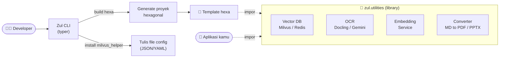
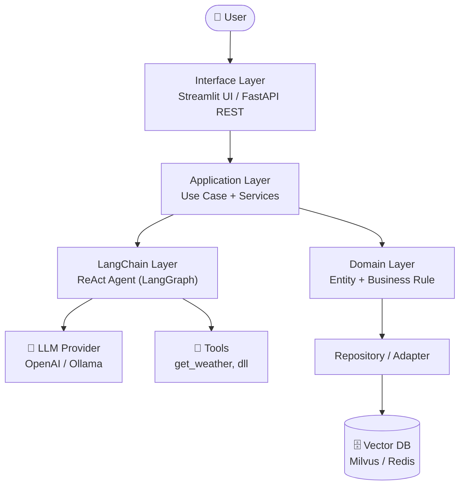
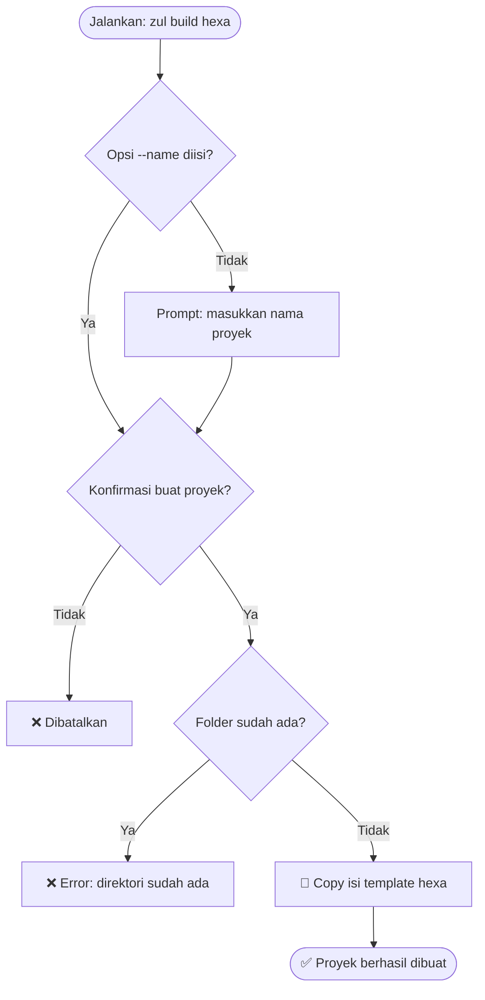
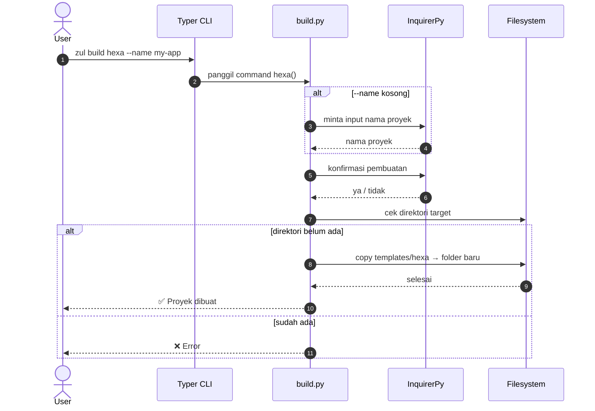
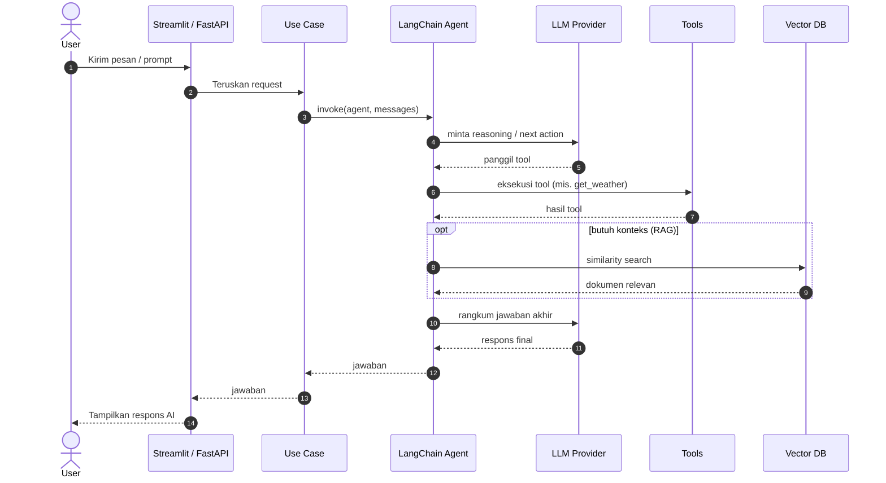
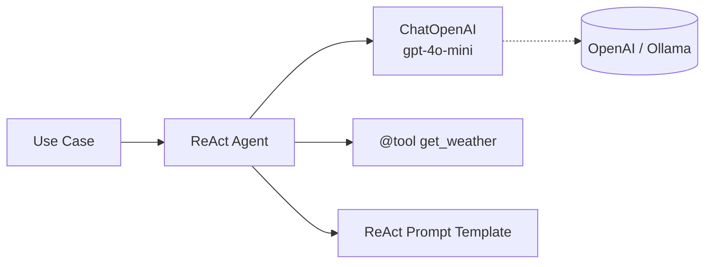
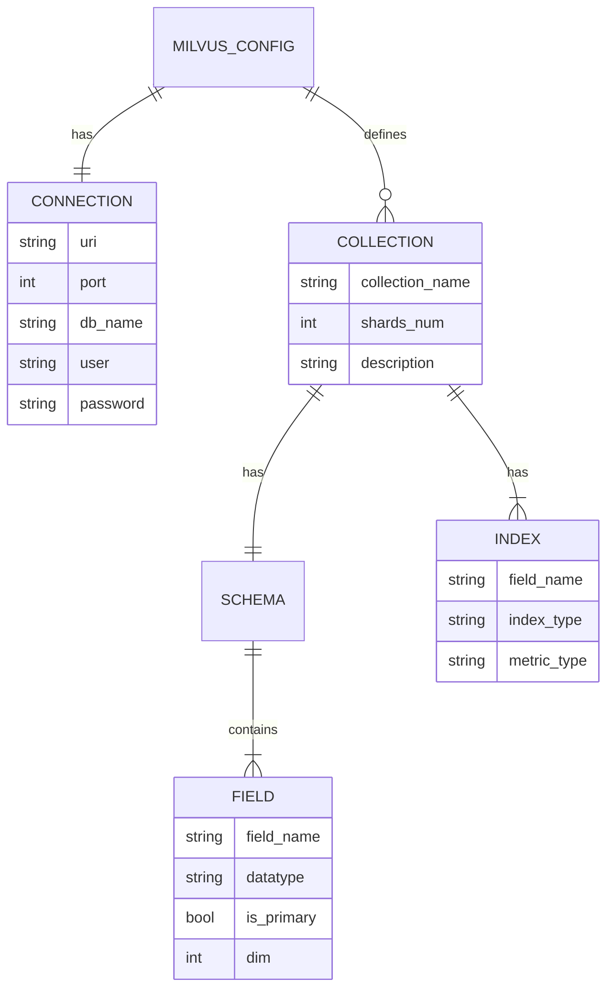

<div align="center">

# 🚀 Zul

**CLI generator boilerplate + toolkit utilities untuk aplikasi AI & data engineering berbasis Python.**

Buat struktur proyek AI production-ready dalam satu perintah, lalu pakai kembali helper siap-pakai untuk Vector DB, OCR, LLM, dan konversi dokumen.

[](https://www.python.org/downloads/)
[](https://opensource.org/licenses/MIT)
[](https://github.com/astral-sh/uv)
[](https://github.com/psf/black)
[](https://docs.langchain.com/)

</div>

---

## 📖 Apa itu Zul?

**Zul** adalah *command-line tool* sekaligus *library* yang membantu kamu:

1. **🏗️ Generate proyek** — cukup jalankan `zul build hexa` untuk membuat kerangka aplikasi AI dengan **hexagonal (onion) architecture** yang sudah terstruktur rapi (FastAPI + LangChain + Streamlit).
2. **🧰 Pakai utilities siap-pakai** — impor helper `zul.utilities.*` untuk Milvus, Redis Vector, OCR (Docling/Gemini), embedding, dan konversi Markdown → PDF/PPTX tanpa menulis ulang dari nol.
3. **📚 Belajar dari contoh** — folder `tutorial/` berisi notebook interaktif untuk tiap utilitas.

> Tujuannya sederhana: **berhenti menyalin-tempel boilerplate**. Biarkan Zul yang menyiapkan strukturnya.

---

## 📚 Dokumentasi

Dokumentasi lengkap ada di folder [`docs/`](docs/index.md) dan bisa dibaca langsung di GitHub. Untuk membukanya sebagai situs dengan menu, pencarian, dan **playground** interaktif, jalankan:

```bash
uv sync
uv run mkdocs serve      # buka http://127.0.0.1:8001
```

Dokumentasi mengikuti [Diátaxis](https://diataxis.fr): satu halaman hanya berisi satu jenis tulisan.

| Bagian | Untuk apa | Mulai dari |
|--------|-----------|------------|
| [Tutorial](docs/tutorial/index.md) | Belajar sambil mengerjakan | [Membuat agent pertamamu](docs/tutorial/agent-pertama.md) |
| [Panduan](docs/panduan/index.md) | Mengerjakan satu tugas tertentu | [Menambah tool](docs/panduan/menambah-tool.md), [Milvus](docs/panduan/memakai-milvus.md) |
| [Referensi](docs/referensi/index.md) | Mencari fakta saat bekerja | [Perintah zul](docs/referensi/cli.md), [HTTP API](docs/referensi/http-api.md) |
| [Konsep](docs/konsep/index.md) | Memahami alasannya | [Arsitektur hexagonal](docs/konsep/arsitektur-hexagonal.md) |

Halaman tutorial dan panduan punya panel **Playground**: kirim pesan ke agent di proyekmu, lalu lihat setiap langkahnya dan setujui aksi yang menunggu. Lihat [Mencoba fitur di playground](docs/panduan/mencoba-di-playground.md).

Setiap modul di `src/zul/` dan di template juga diawali docstring **Gunanya / Cara pakai / Contoh**, jadi petunjuknya muncul langsung di editor.

---

## ✨ Fitur Utama

| Fitur | Keterangan |
|-------|------------|
| 🎨 **Interactive CLI** | Prompt ramah pengguna dengan InquirerPy + Typer |
| 🏛️ **Hexagonal Template** | Scaffold arsitektur bersih: `domain`, `application`, `infrastructure`, `interface` |
| 🤖 **AI-Ready** | Sudah tertanam LangChain, LangGraph (ReAct agent), tool calling |
| 🗄️ **Vector DB Helpers** | Helper konfigurasi-driven untuk **Milvus** & **Redis** (termasuk hybrid search) |
| 👁️ **OCR Toolkit** | Ekstraksi dokumen via **Docling VLM** dan **Google Gemini** |
| 📄 **Doc Converters** | Konversi Markdown → PDF & PPTX |
| 🧩 **Agent Skills** | Kumpulan skill untuk agent AI di `research/agentic/algorithms/skills/` (mind map, slide, poster, dokumen, transcript YouTube), sudah diuji dengan model lokal 4B (`gemma3:4b`) |
| 🎯 **Type-Safe** | Validasi & settings berbasis Pydantic v2 |

---

## 🧰 Tech Stack

| Layer | Teknologi |
|-------|-----------|
| **CLI Framework** | [Typer](https://typer.tiangolo.com/) · [InquirerPy](https://inquirerpy.readthedocs.io/) |
| **AI / LLM** | [LangChain](https://docs.langchain.com/) · [LangGraph](https://langchain-ai.github.io/langgraph/) · `langchain-openai` · `langchain-ollama` |
| **Backend (template)** | [FastAPI](https://fastapi.tiangolo.com/) |
| **Frontend (template)** | [Streamlit](https://streamlit.io/) |
| **Vector DB** | [Milvus](https://milvus.io/) (`pymilvus`) · [Redis](https://redis.io/) (`redisvl`) |
| **OCR / Dokumen** | [Docling](https://github.com/DS4SD/docling) · Google Gemini · `python-pptx` · `xhtml2pdf` |
| **Validasi & Config** | [Pydantic](https://docs.pydantic.dev/) · `pydantic-settings` · Jinja2 |
| **Tooling** | [uv](https://github.com/astral-sh/uv) · Black · Ruff · mypy · pytest |

---

## 🏗️ Arsitektur Sistem

Zul punya dua peran: **(1)** sebagai CLI yang *menghasilkan* proyek & meng-*install* config, dan **(2)** sebagai *library* utilitas yang diimpor aplikasi lain. Diagram berikut menunjukkan kedua peran tersebut beserta template `hexa` yang dihasilkan.


```mermaid
flowchart LR
    Dev([👩‍💻 Developer]) --> CLI["Zul CLI<br/>(typer)"]

    CLI -->|build hexa| Gen["Generate proyek<br/>hexagonal"]
    CLI -->|install milvus_helper| Cfg["Tulis file config<br/>(JSON/YAML)"]

    Gen --> Tpl["📁 Template hexa"]

    subgraph Lib["🧰 zul.utilities (library)"]
        VDB["Vector DB<br/>Milvus / Redis"]
        OCR["OCR<br/>Docling / Gemini"]
        EMB["Embedding<br/>Service"]
        CONV["Converter<br/>MD to PDF / PPTX"]
    end

    Tpl -. impor .-> Lib
    App([🚀 Aplikasi kamu]) -. impor .-> Lib
```

### Arsitektur runtime template `hexa`

Template yang dihasilkan mengikuti pola **hexagonal**: `interface` (FastAPI / Streamlit) memanggil `application` (use case + LangChain agent), yang bergantung pada `domain` murni dan `infrastructure` (LLM, Vector DB) melalui port/adapter.


```mermaid
flowchart TD
    User([👤 User]) --> UI["Interface Layer<br/>Streamlit UI / FastAPI REST"]
    UI --> APP["Application Layer<br/>Use Case + Services"]
    APP --> AGENT["LangChain Layer<br/>ReAct Agent (LangGraph)"]

    AGENT --> LLM["🧠 LLM Provider<br/>OpenAI / Ollama"]
    AGENT --> TOOLS["🔧 Tools<br/>get_weather, dll"]
    APP --> DOMAIN["Domain Layer<br/>Entity + Business Rule"]
    DOMAIN --> REPO["Repository / Adapter"]
    REPO --> VDB[("🗄️ Vector DB<br/>Milvus / Redis")]
```

---

## 📁 Struktur Folder

```text
boilerplate/
├── src/zul/                      # 📦 Package utama Zul
│   ├── cli.py                    # Entry point CLI (typer app)
│   ├── commands/                 # Sub-command CLI
│   │   ├── build.py              #   → zul build hexa
│   │   └── install.py            #   → zul install milvus-helper / redis-helper
│   ├── utilities/                # 🧰 Toolkit yang bisa diimpor
│   │   ├── vector_DB/            #   Milvus & Redis helper + config schema
│   │   ├── OCR/                  #   Docling VLM & Gemini OCR
│   │   ├── markdown_converter/   #   MD → PDF / PPTX
│   │   ├── script_helper/        #   JSON, save file, timer, PDF reader, dll
│   │   ├── embedding_service.py  #   LLM & embedding config (Pydantic)
│   │   ├── fake_embedding.py     #   Embedding palsu yang deterministik (untuk test)
│   │   ├── analysis.py           #   ChartGenerator + uji statistik
│   │   ├── logger.py             #   Logger console + rotating file
│   │   └── react_graph.py        #   Contoh LangGraph StateGraph
│   └── templates/
│       └── hexa/                 # 🏛️ Blueprint proyek hexagonal
│           ├── README.md, requirements.txt, .env.example
│           ├── data/ dockerfile/ logs/ notebooks/ test/
│           └── src/
│               ├── domain/       #   Entity, exceptions, prompt templates
│               ├── application/  #   Use case, AI agents (ReAct), DTO
│               ├── infrastructure/ # LLM, tools, database, logging
│               └── interface/    #   http (FastAPI), streamlit, cli, discord
├── tests/                        # 🧪 Test untuk CLI, utilities, dan template
├── tutorial/                     # 📚 Notebook contoh per-utilitas
├── pyproject.toml                # Metadata & dependencies
└── README.md
```

### Penjelasan Layer Template `hexa`

| Folder | Layer | Tanggung Jawab |
|--------|-------|----------------|
| `src/domain` | **Domain** | Entity, exception, dan *prompt template* — logika inti tanpa dependensi eksternal |
| `src/application` | **Application** | Use case, service, DTO/mapper, dan **LangChain agent** (ReAct) |
| `src/infrastructure` | **Infrastructure** | Adapter keluar: LLM (OpenAI), tools, database, koneksi, logging |
| `src/interface` | **Interface (Inbound)** | Titik masuk: `http` (FastAPI), `streamlit`, `cli`, `discord` |

### Penjelasan Modul `utilities`

| Modul | Isi | Contoh Impor | Extra |
|-------|-----|--------------|-------|
| `vector_DB` | `MilvusHelper` (config-based) | `from zul.utilities.vector_DB.milvus_helper import MilvusHelper` | `zul[milvus]` |
| `vector_DB` | `RedisHelper` (config-based), `RedisVectorDB` | `from zul.utilities.vector_DB.redis_helper import RedisHelper` | `zul[redis]` |
| `OCR` | `DoclingVLMConverter`, `gemini_ocr` | `from zul.utilities.OCR.docling_OCR import DoclingVLMConverter` | `zul[gemini]` untuk Gemini |
| `markdown_converter` | `MarkdownToPDFConverter`, `DynamicMarkdownToPPTXService` | `from zul.utilities.markdown_converter.md_to_pdf import MarkdownToPDFConverter` | `zul[converter]` |
| `embedding_service` | `AIService`, `AIConfig`, `LLMConfig`, `EmbeddingConfig` | `from zul.utilities.embedding_service import AIConfig` | — |
| `analysis` | `ChartGenerator` | `from zul.utilities.analysis import ChartGenerator` | `zul[analysis]` |
| `script_helper` | `PDFProcessor`, `TimerDecorator`, `save_file`, `json_helper` | `from zul.utilities.script_helper.read_pdf2 import PDFProcessor` | `zul[pdf]` untuk PDF |

> Path impor lama (`zul.utilities.docling_OCR`, `zul.utilities.redis_vector_helper`, `zul.utilities.md_to_pdf`, `zul.utilities.md_to_ppt`, `zul.utilities.time`) tetap bisa dipakai; isinya kini hanya meneruskan ke modul di atas.

---

## 🔄 Flow Diagram

### 1. `zul build hexa` — User Flow

Perspektif pengguna saat men-*generate* proyek baru dari CLI.


```mermaid
flowchart TD
    Start(["Jalankan: zul build hexa"]) --> Q{"Opsi --name diisi?"}
    Q -->|Tidak| Ask["Prompt: masukkan nama proyek"]
    Q -->|Ya| Confirm
    Ask --> Confirm{"Konfirmasi buat proyek?"}
    Confirm -->|Tidak| Cancel["❌ Dibatalkan"]
    Confirm -->|Ya| Exist{"Folder sudah ada?"}
    Exist -->|Ya| Err["❌ Error: direktori sudah ada"]
    Exist -->|Tidak| Copy["📁 Copy isi template hexa"]
    Copy --> Done(["✅ Proyek berhasil dibuat"])
```

### 2. `zul build hexa` — System Flow

Perspektif internal: bagaimana komponen CLI berinteraksi saat perintah dijalankan.


```mermaid
sequenceDiagram
    autonumber
    actor U as User
    participant CLI as Typer CLI
    participant BUILD as build.py
    participant IQ as InquirerPy
    participant FS as Filesystem

    U->>CLI: zul build hexa --name my-app
    CLI->>BUILD: panggil command hexa()
    alt --name kosong
        BUILD->>IQ: minta input nama proyek
        IQ-->>BUILD: nama proyek
    end
    BUILD->>IQ: konfirmasi pembuatan
    IQ-->>BUILD: ya / tidak
    BUILD->>FS: cek direktori target
    alt direktori belum ada
        BUILD->>FS: copy templates/hexa → folder baru
        FS-->>BUILD: selesai
        BUILD-->>U: ✅ Proyek dibuat
    else sudah ada
        BUILD-->>U: ❌ Error
    end
```

### 3. Runtime Aplikasi Hexa — System Flow (fitur AI/chat)

Perspektif internal saat user berinteraksi dengan aplikasi hasil generate (endpoint berbasis LangChain agent).


```mermaid
sequenceDiagram
    autonumber
    actor U as User
    participant UI as Streamlit / FastAPI
    participant UC as Use Case
    participant AG as LangChain Agent
    participant LLM as LLM Provider
    participant TL as Tools
    participant DB as Vector DB

    U->>UI: Kirim pesan / prompt
    UI->>UC: Teruskan request
    UC->>AG: invoke(agent, messages)
    AG->>LLM: minta reasoning / next action
    LLM-->>AG: panggil tool
    AG->>TL: eksekusi tool (mis. get_weather)
    TL-->>AG: hasil tool
    opt butuh konteks (RAG)
        AG->>DB: similarity search
        DB-->>AG: dokumen relevan
    end
    AG->>LLM: rangkum jawaban akhir
    LLM-->>AG: respons final
    AG-->>UC: jawaban
    UC-->>UI: jawaban
    UI-->>U: Tampilkan respons AI
```

---

## 🧠 LangChain Component Map

Template `hexa` dan utilitas menyertakan komponen LangChain berikut:

| Komponen | Implementasi | Lokasi |
|----------|--------------|--------|
| **Agent** | ReAct agent (tool-calling) via LangGraph Graph API (`StateGraph` + `ToolNode`) | `application/AI/agents/react/` |
| **Human-in-the-loop** | ReAct + node `human_review` yang memanggil `interrupt()`; keputusan approve / edit / reject | `application/AI/agents/human_in_the_loop/` |
| **Subagents** | Supervisor yang memanggil subagent spesialis sebagai tool | `application/AI/agents/subagents/` |
| **State** | `AgentState`: `messages` (reducer `add_messages`) + `remaining_steps` | `domain/entities/agents/react/` |
| **Memory** | Checkpointer `InMemorySaver`, percakapan per `thread_id` | `infrastructure/AI/memory/checkpointer.py` |
| **Graph** | `StateGraph` (contoh state machine LangGraph) | `utilities/react_graph.py` |
| **Tools** | `get_weather`, `send_email` (`@tool`) — placeholder siap diganti | `infrastructure/AI/tools/` |
| **LLM** | `ChatOpenAI` (`gpt-4o-mini`) via factory | `infrastructure/AI/llm/openai.py` |
| **Prompt** | Template prompt ReAct | `domain/templates/prompt/react/` |


```mermaid
flowchart LR
    UC["Use Case"] --> AGENT["ReAct Agent"]
    AGENT --> LLM["ChatOpenAI<br/>gpt-4o-mini"]
    AGENT --> TOOLS["@tool get_weather"]
    AGENT --> PROMPT["ReAct Prompt Template"]
    LLM -.-> PROVIDER[("OpenAI / Ollama")]
```

---

## 🗄️ Skema Vector Store

Zul tidak memakai database relasional; penyimpanan berbasis **vector store** yang dikonfigurasi lewat file JSON/YAML. Skema divalidasi oleh Pydantic (`vector_DB/config`).

### Milvus — struktur collection


```mermaid
erDiagram
    MILVUS_CONFIG ||--|| CONNECTION : has
    MILVUS_CONFIG ||--o{ COLLECTION : defines
    COLLECTION ||--|| SCHEMA : has
    SCHEMA ||--|{ FIELD : contains
    COLLECTION ||--|{ INDEX : has

    CONNECTION {
        string uri
        int port
        string db_name
        string user
        string password
    }
    COLLECTION {
        string collection_name
        int shards_num
        string description
    }
    FIELD {
        string field_name
        string datatype
        bool is_primary
        int dim
    }
    INDEX {
        string field_name
        string index_type
        string metric_type
    }
```

**Tipe yang didukung**

| Kategori | Nilai |
|----------|-------|
| Datatype | `VARCHAR`, `INT64`, `FLOAT`, `FLOAT_VECTOR`, `SPARSE_FLOAT_VECTOR`, `BOOL`, `JSON` |
| Index | `FLAT`, `IVF_FLAT`, `HNSW`, `IVF_PQ`, `SPARSE_INVERTED_INDEX` |
| Metric | `COSINE`, `L2`, `IP`, `BM25` |

### Redis — struktur index

| Field / Setting | Nilai yang didukung |
|-----------------|---------------------|
| Field type | `text`, `tag`, `numeric`, `vector`, `geo` |
| Vector algorithm | `flat`, `hnsw` |
| Distance metric | `cosine`, `l2`, `ip` |
| Storage type | `hash`, `json` |
| Hybrid search scorer | `BM25`, `TFIDF`, `DISMAX`, `BM25STD`, dll |

---

## 🚀 Instalasi

**Prasyarat:** Python **3.11+** dan (disarankan) [uv](https://github.com/astral-sh/uv).

<details open>
<summary><b>Opsi 1 — Install dari GitHub (paling cepat)</b></summary>

```bash
# via uv (disarankan) — install sebagai tool global
uv tool install git+https://github.com/kazuma313/zul_utilities.git

# via pip
pip install git+https://github.com/kazuma313/zul_utilities.git
```

Instalasi dasar sudah cukup untuk CLI. Dependency tiap utilitas dipasang lewat *extra* — pilih yang dipakai saja:

```bash
pip install "zul[milvus,redis] @ git+https://github.com/kazuma313/zul_utilities.git"
pip install "zul[all] @ git+https://github.com/kazuma313/zul_utilities.git"
```

| Extra | Untuk |
|-------|-------|
| `milvus` | `MilvusHelper` |
| `redis` | `RedisHelper`, `RedisVectorDB` |
| `converter` | Markdown → PDF / PPTX |
| `analysis` | `ChartGenerator` |
| `pdf` | `PDFProcessor` |
| `gemini` | OCR dengan Gemini |
| `all` | Semua di atas |
</details>

<details>
<summary><b>Opsi 2 — Install dari source (untuk development)</b></summary>

```bash
git clone https://github.com/kazuma313/zul_utilities.git
cd zul_utilities

uv sync              # buat virtual env + install zul (editable), semua extra, dan dev tools
```
</details>

<details>
<summary><b>Opsi 3 — Tambah ke requirements.txt</b></summary>

```txt
zul @ git+https://github.com/kazuma313/zul_utilities.git
```
</details>

---

## ▶️ Cara Menjalankan

### Generate proyek hexagonal

```bash
# Mode interaktif (akan menanyakan nama)
zul build hexa

# Langsung dengan nama
zul build hexa --name my-ai-app

# Tanpa konfirmasi (untuk script / CI)
zul build hexa --name my-ai-app --yes
```

Proyek yang dihasilkan langsung bisa dijalankan:

```bash
cd my-ai-app
pip install -r requirements.txt
cp .env.example .env                              # isi OPENAI_API_KEY
uvicorn src.interface.http.main:app --reload
```

| Endpoint | Template agent |
|----------|----------------|
| `POST /chat` | ReAct |
| `POST /hitl/chat`, `POST /hitl/review` | Human-in-the-loop (persetujuan manusia sebelum tool tertentu jalan) |
| `POST /subagents/chat` | Supervisor + subagents |
| `GET /health` | — |

### Setup config utilitas

```bash
# Buat milvus_config.json di folder proyek saat ini (siap dipakai MilvusHelper)
zul install milvus-helper

# Buat redis_config.yaml (siap dipakai RedisHelper)
zul install redis-helper

# Nama file & format bisa diganti; --force menimpa file yang sudah ada
zul install milvus-helper --config-name milvus.yaml --force
```

### Cek versi & bantuan

```bash
zul --version
zul --help
zul build --help
```

### Contoh pakai utilitas di kode

```python
from zul.utilities.vector_DB.milvus_helper import MilvusHelper

# Inisialisasi dari file config (JSON / YAML)
client = MilvusHelper(config_path="milvus_config.json")
```

---

## 🔑 Environment Variables

Simpan kredensial di file `.env` (jangan pernah di-commit). Berikut variabel yang dibaca oleh kode:

| Variable | Dipakai untuk | Contoh |
|----------|---------------|--------|
| `OPENAI_API_KEY` | LLM OpenAI di template hexa & Streamlit | `sk-xxxxxxxx...` |
| `GOOGLE_API_KEY` | OCR berbasis Gemini | `AIza...` |
| `LLM_BASE_URL` | Endpoint LLM (mis. self-hosted/proxy) | `https://api.openai.com/v1` |
| `LLM_API_KEY` | API key LLM untuk `embedding_service` | `sk-xxxxxxxx...` |
| `LLM_MODEL` | Nama model LLM | `gpt-4o-mini` |
| `LLM_TEMPERATURE` · `LLM_MAX_TOKENS` · `LLM_TIMEOUT` | Parameter generasi | `0.1` · `4096` · `60` |
| `EMBEDDING_BASE_URL` | Endpoint embedding | `https://api.openai.com/v1` |
| `EMBEDDING_API_KEY` | API key embedding | `sk-xxxxxxxx...` |
| `EMBEDDING_MODEL` · `EMBEDDING_TIMEOUT` | Config embedding | `text-embedding-3-small` · `60` |

> 🔐 **Keamanan:** semua contoh key di dokumentasi & notebook sudah **disamarkan** (`sk-xxxx...`). Gunakan `SecretStr` / env var — jangan hardcode key asli. Kredensial Vector DB (host, port, password) diatur lewat file config JSON/YAML, bukan hardcode.

Contoh file `.env`:

```env
OPENAI_API_KEY=sk-xxxxxxxxxxxxxxxxxxxxxx
GOOGLE_API_KEY=AIzaxxxxxxxxxxxxxxxxxxxxxx
LLM_BASE_URL=https://api.openai.com/v1
LLM_API_KEY=sk-xxxxxxxxxxxxxxxxxxxxxx
LLM_MODEL=gpt-4o-mini
EMBEDDING_API_KEY=sk-xxxxxxxxxxxxxxxxxxxxxx
EMBEDDING_MODEL=text-embedding-3-small
```

---

## 🧪 Development

```bash
uv sync                  # install dependency + dev tools

pytest tests             # test CLI, utilities, dan template (tanpa server eksternal)
pytest tests --cov=zul   # test + coverage

black src tests scripts                              # format
ruff check src tests scripts                         # lint
python scripts/comment_style.py src tests scripts    # bentuk komentar

mkdocs serve             # pratinjau dokumentasi di http://127.0.0.1:8001
mkdocs build --strict    # pastikan tidak ada tautan/anchor rusak
```

Panduan lengkap: [Berkontribusi ke Zul](docs/panduan/berkontribusi.md).

---

## 🤝 Contributing

Kontribusi sangat diterima!

1. **Fork** repository ini
2. Buat branch: `git checkout -b feature/nama-fitur`
3. Commit: `git commit -m "Add: nama fitur"`
4. Push: `git push origin feature/nama-fitur`
5. Buka **Pull Request**

Ikuti gaya kode yang ada (Black + Ruff), tambahkan test untuk fitur baru, dan perbarui dokumentasi bila perlu.

---

## 📄 License

Dirilis di bawah lisensi **MIT** — lihat file [LICENSE](LICENSE).

## 👨‍💻 Author

**Kurnia Zulda Matondang** ([@kazuma313](https://github.com/kazuma313))

---

<div align="center">

⭐ Kalau project ini membantu, jangan lupa kasih star di GitHub!

Made with ❤️ using Python & uv

</div>
