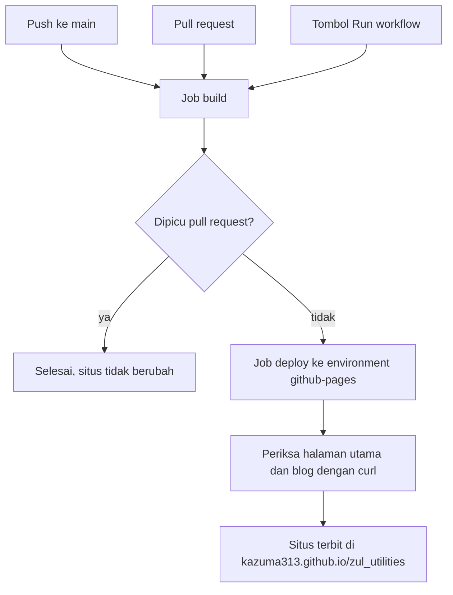
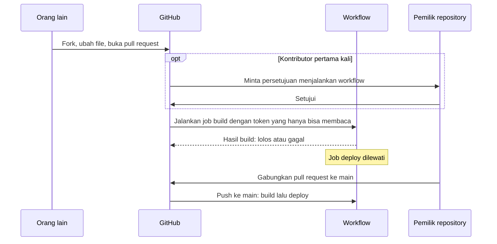

---
date:
  created: 2026-10-07
categories:
  - "CI/CD"
  - "GitHub"
authors:
  - kurnia
---

# CI/CD dokumentasi di GitHub dan siapa yang boleh menerbitkan

Situs dokumentasi dan blog Zul terbit otomatis lewat GitHub Actions setiap ada push ke `main`. Hanya pemilik repository dan kolaborator yang bisa push ke `main`. Orang lain hanya bisa mengusulkan perubahan lewat pull request, dan usulan itu baru terbit setelah saya menggabungkannya.

<!-- more -->

## Alur dari commit sampai situs terbit

Workflow [`.github/workflows/docs.yml`](https://github.com/kazuma313/zul_utilities/blob/main/.github/workflows/docs.yml) punya dua job. Job `build` berjalan untuk setiap pemicu. Job `deploy` hanya berjalan untuk push ke `main` dan untuk tombol **Run workflow**:

Workflow hanya berjalan jika push atau pull request mengubah salah satu path berikut: `docs/**`, `mkdocs.yml`, `pyproject.toml`, `uv.lock`, `.python-version`, dan `.github/workflows/docs.yml`. Perubahan yang hanya menyentuh `src/` tidak menerbitkan ulang situs.

### Job build

| Langkah | Isinya |
|---|---|
| `actions/checkout` | Mengambil kode tanpa menyimpan kredensial git di runner (`persist-credentials: false`). |
| `astral-sh/setup-uv` | Memasang uv 0.12.3 dan Python 3.11, dengan cache yang kuncinya `uv.lock`. |
| Pasang dependency dokumentasi | `uv sync --frozen --only-group docs` memasang grup `docs` saja, dengan versi persis dari `uv.lock`. |
| Bangun situs | `mkdocs build --strict` gagal jika ada tautan atau anchor yang rusak, atau tulisan blog tanpa tanggal. |
| Periksa hasil build | `index.html`, `404.html`, dan `blog/index.html` harus ada dan tidak kosong. |
| `actions/upload-pages-artifact` | Menyimpan folder `site/` sebagai artifact selama 7 hari, supaya job deploy bisa diulang tanpa build ulang. |

Runner-nya `ubuntu-24.04`, dan setiap job dibatasi 15 menit.

### Job deploy

Job ini memakai environment `github-pages` dan hanya ia yang mendapat izin `pages: write` dan `id-token: write`. Bagian lain workflow hanya punya `contents: read`. Action `actions/deploy-pages` menerbitkan artifact dari job build. Setelah itu `curl` membuka halaman utama dan `blog/`, diulang sampai 5 kali dengan jeda 10 detik, karena CDN GitHub Pages bisa perlu beberapa detik sebelum versi baru tersedia.

Penerbitan berjalan satu per satu dalam grup concurrency `pages` dan tidak pernah dibatalkan di tengah jalan. Jika ada beberapa push berdekatan, run yang masih menunggu digantikan oleh run terbaru. Build pull request dikelompokkan per pull request dan dibatalkan begitu ada commit baru.

## File yang berhubungan dengan penerbitan

| File | Isinya |
|---|---|
| `.github/workflows/docs.yml` | Job build dan deploy. Setiap action dikunci ke commit SHA, dan versinya tertulis di komentar. |
| `.github/dependabot.yml` | Dependabot membuka satu pull request sebulan sekali jika ada versi action baru, dengan awalan commit `ci`. |
| `mkdocs.yml` | Pengaturan situs: `site_url`, menu, tema, plugin `search` dan `blog`, file yang dikecualikan, dan tombol sunting (`edit_uri` dan `content.action.edit`). |
| `pyproject.toml` | Grup dependency `docs`: `mkdocs`, `mkdocs-material`, dan `markdown-callouts`. |
| `uv.lock` | Versi persis setiap paket, sehingga build di GitHub dan di komputer saya memakai versi yang sama. |
| `.python-version` | Versi Python, yaitu 3.11. |
| `docs/` | Isi situs, termasuk CSS dan JavaScript di `docs/assets/`. |
| `docs/blog/posts/` | Tulisan blog, satu file per tulisan. Setiap tulisan wajib punya `date.created`. |
| `docs/blog/resources/` | Gambar dan file pendukung, satu folder per tulisan. |
| `docs/blog/_template.md` | Template tulisan. File ini dikecualikan dari situs. |
| `docs/blog/.authors.yml` | Data penulis yang tampil di setiap tulisan. |
| `scripts/new_post.py` | Membuat tulisan baru dari template beserta tanggalnya. Skrip ini diuji di `tests/test_new_post.py`. |
| `.gitignore` | Folder `site/` hasil build lokal tidak ikut di-commit. |

## Pengaturan di GitHub yang tidak ada di file

Sebagian pengaturan hanya ada di halaman **Settings** repository, jadi tidak terlihat di riwayat git. Nilainya per 7 Oktober 2026:

| Pengaturan | Letak | Nilai |
|---|---|---|
| Sumber GitHub Pages | Settings → Pages | GitHub Actions |
| Branch yang boleh deploy | Settings → Environments → `github-pages` | Hanya `main` |
| Required reviewers untuk deploy | Settings → Environments → `github-pages` | Tidak dipakai |
| Persetujuan workflow dari fork | Settings → Actions → General | Wajib untuk kontributor pertama kali (bawaan GitHub) |
| Izin bawaan `GITHUB_TOKEN` | Settings → Actions → General | Hanya baca, untuk `contents` dan `packages` |
| GitHub Actions membuat dan menyetujui pull request | Settings → Actions → General | Tidak diizinkan |
| Action yang boleh dipakai | Settings → Actions → General | Semua action |
| Ruleset untuk `main` | Settings → Rules | Belum ada |

Orang yang bisa push ke `main` tercantum di Settings → Collaborators. Setiap orang di daftar itu bisa menerbitkan situs sama seperti pemilik.

## Siapa boleh melakukan apa

Kolaborator adalah orang yang diundang pemilik ke repository. Di repository milik akun pribadi, kolaborator punya hak tulis, tetapi tidak bisa mengundang kolaborator lain, mengubah visibilitas repository, atau mengubah pengaturan keamanan:

| Tindakan | Pemilik | Kolaborator | Orang lain |
|---|---|---|---|
| Push ke `main`, sehingga situs terbit | Bisa | Bisa | Tidak bisa |
| Membuka pull request | Bisa | Bisa | Bisa, dari fork |
| Build berjalan di pull request-nya | Langsung | Langsung | Langsung, kecuali kontributor pertama kali yang perlu persetujuan |
| Menggabungkan pull request | Bisa | Bisa | Tidak bisa |
| Menekan **Run workflow** | Bisa | Bisa | Tidak bisa |
| Mengundang kolaborator, mengubah visibilitas dan pengaturan keamanan | Bisa | Tidak bisa | Tidak bisa |

Dependabot hanya membuka pull request untuk versi action baru. Pull request itu baru masuk ke `main` setelah digabungkan oleh orang yang punya hak tulis.

## Kenapa pull request orang lain tidak bisa menerbitkan

Pull request dari fork berjalan seperti ini:

Ada tiga penghalang yang masing-masing cukup untuk mencegah pull request menerbitkan situs:

- **Kondisi di job deploy.** `if: github.event_name != 'pull_request' && github.ref == 'refs/heads/main'` membuat job deploy dilewati untuk pull request.
- **Token yang hanya bisa membaca.** Pull request memakai file workflow versi pull request itu sendiri, jadi orang lain bisa menghapus kondisi tadi. Namun `GITHUB_TOKEN` untuk pull request dari fork hanya bisa membaca, dan secret repository tidak dikirim ke runner. Izin `pages: write` tidak pernah didapat.
- **Aturan branch di environment.** Environment `github-pages` hanya menerima deploy dari `main`. Pull request berjalan di ref `refs/pull/NOMOR/merge`, yang tidak cocok dengan aturan itu. Penghalang ini juga berlaku untuk tombol **Run workflow** yang dijalankan dari branch selain `main`.

Workflow ini juga tidak memakai event `pull_request_target`. Event itu menjalankan workflow dengan konteks dan izin repository tujuan, dan GitHub memperingatkan bahwa menjalankan kode yang tidak dipercaya lewat event itu bisa memberi akses tulis atau membocorkan secret.

## Yang masih bisa diperketat

- **Persetujuan untuk semua kontributor luar.** Opsi "Require approval for all external contributors" di Settings → Actions → General membuat build dari pull request orang luar selalu menunggu persetujuan, bukan hanya untuk yang pertama kali.
- **Ruleset untuk `main`.** Ruleset yang melarang force push dan penghapusan branch melindungi riwayat `main` dari penimpaan, termasuk yang tidak disengaja. Push langsung ke `main` tetap bisa.
- **Tombol sunting di setiap halaman.** Bagi orang lain, tombol itu membuat fork dan usulan perubahan, dan tidak ada yang berubah tanpa persetujuan pemilik. Namun di blog pribadi, tombol itu bisa disangka undangan untuk menyunting. Menghapus `content.action.edit` dari `mkdocs.yml` menghilangkan tombolnya.
- **Required reviewers.** Dengan opsi ini, setiap deploy menunggu persetujuan. Selama hanya pemilik yang push ke `main`, opsi ini hanya menambah satu klik di setiap penerbitan tanpa menambah keamanan.

## Sumber

- [Events that trigger workflows](https://docs.github.com/en/actions/reference/workflows-and-actions/events-that-trigger-workflows), bagian `pull_request` dan `pull_request_target`: token untuk fork, secret, dan ref `refs/pull/NOMOR/merge`.
- [Deployments and environments](https://docs.github.com/en/actions/reference/workflows-and-actions/deployments-and-environments): aturan branch dan required reviewers.
- [Managing GitHub Actions settings for a repository](https://docs.github.com/en/repositories/managing-your-repositorys-settings-and-features/enabling-features-for-your-repository/managing-github-actions-settings-for-a-repository): persetujuan workflow dari fork dan izin bawaan `GITHUB_TOKEN`.
- [Manually running a workflow](https://docs.github.com/en/actions/how-tos/manage-workflow-runs/manually-run-a-workflow): tombol **Run workflow** butuh hak tulis.
- [Permission levels for a personal account repository](https://docs.github.com/en/account-and-profile/reference/permission-levels-for-a-personal-account-repository): hak pemilik dan kolaborator.
- [Using custom workflows with GitHub Pages](https://docs.github.com/en/pages/getting-started-with-github-pages/using-custom-workflows-with-github-pages): izin job deploy dan environment `github-pages`.
- [Workflow dokumentasi](../../referensi/workflow-dokumentasi.md), [Menerbitkan dokumentasi](../../panduan/menerbitkan-dokumentasi.md), dan [Penerbitan dokumentasi](../../konsep/penerbitan-dokumentasi.md) di situs ini.
