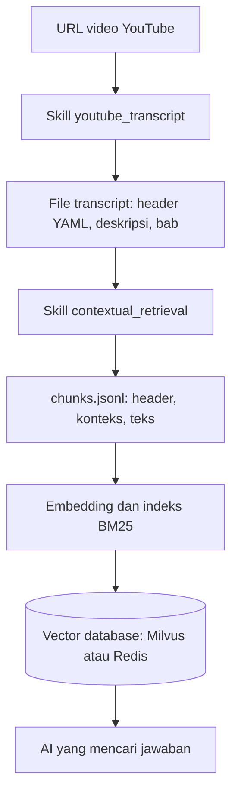
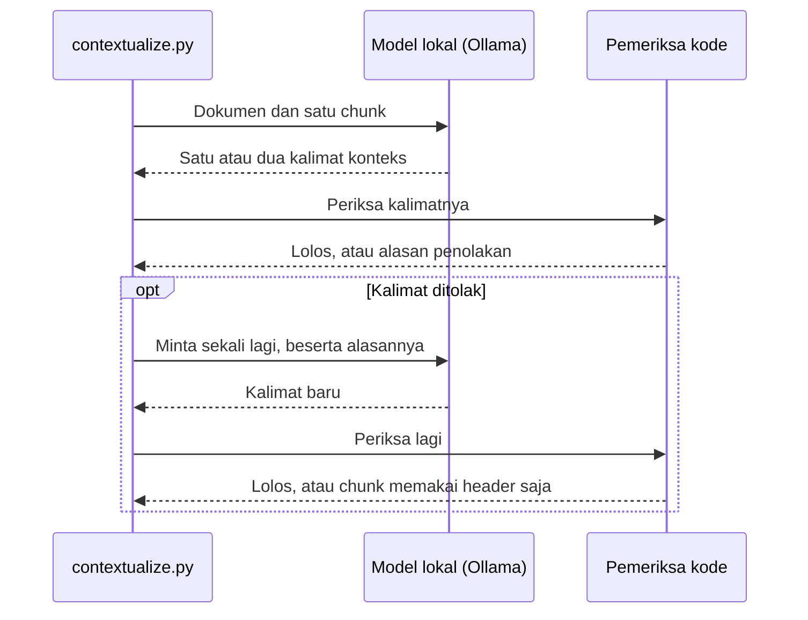

---
date:
  created: 2026-10-07
categories:
  - "Sistem"
  - "RAG"
authors:
  - kurnia
---

# Dari video YouTube sampai bisa dicari AI

Catatan tentang sistem kecil yang saya bangun di Zul: mengambil transcript video YouTube, memotongnya menjadi chunk berkonteks dengan model lokal, lalu menyimpannya supaya bisa dicari AI. Pelajaran terbesarnya, setiap tahap yang bisa dikerjakan kode sebaiknya tidak diserahkan ke model.

<!-- more -->

## Gambaran sistem

Sistemnya terdiri dari dua skill dan satu vector database. Setiap tahap menghasilkan file yang bisa dibaca dan diperiksa sebelum lanjut ke tahap berikutnya:



Hanya satu langkah yang memakai model bahasa, yaitu menulis kalimat konteks di skill `contextual_retrieval`. Langkah lainnya dikerjakan kode, jadi hasilnya selalu sama untuk masukan yang sama.

## Tahap 1: mengambil transcript tanpa model AI

Skill `youtube_transcript` mengambil metadata video dengan `yt-dlp` dan caption dengan `youtube-transcript-api`. Hasilnya satu file teks dengan header YAML (judul, kanal, tanggal unggah, durasi, bahasa caption), deskripsi video, lalu isi transcript. Jika video punya bab, setiap bab menjadi heading `###` dengan stempel waktunya.

YouTube memblokir alamat IP yang terlalu sering meminta caption. Jika `SUPADATA_API_KEY` diisi di `.env`, skill ini beralih ke layanan Supadata begitu YouTube memblokir, untuk sisa video dalam batch itu. Tanpa key itu, skill berhenti setelah dua video berturut-turut diblokir, karena permintaan berikutnya hanya memperpanjang blokirnya.

## Tahap 2: menulis konteks dengan model lokal

Skill `contextual_retrieval` memotong transcript menjadi chunk sekitar 1.000 karakter, tanpa melewati batas bab. Kode menulis header setiap chunk: judul dokumen, sumber, dan bagian. Model lokal hanya menulis satu atau dua kalimat konteks, dan setiap kalimat diperiksa kode sebelum dipakai:



Pemeriksa menolak kalimat yang memuat nama atau angka yang tidak ada di dokumen, menyalin chunk, atau ditulis dalam bahasa yang salah. Jadi chunk di index selalu punya konteks yang sudah diperiksa, atau tidak punya konteks sama sekali.

Satu record hasilnya, untuk chunk dari halaman dokumentasi Milvus, bisa kamu [unduh sebagai JSON](../resources/2026-10-07-dari-video-youtube-sampai-bisa-dicari-ai/contoh-record.json). Bagian terpentingnya:

```json
{
  "id": "6c14acc799cc#5",
  "header": "Dokumen: Menyimpan dan mencari vektor di Milvus. Sumber: memakai-milvus.md. Bagian: Mencari vektor termirip.",
  "context": "Dokumen menjelaskan cara mencari vektor termirip menggunakan MilvusHelper, termasuk contoh kode dan penjelasan penggunaan filter untuk mempersempit pencarian.",
  "context_source": "model",
  "model": "qwen3:8b"
}
```

Yang di-embed dan diindeks adalah `contextualized_text`, yaitu header, konteks, dan teks chunk yang digabung. Teks chunk aslinya tetap disimpan di `text`, untuk dikutip AI.

## Tahap 3: menyimpan dan mencari

Saya mengukur tiga cara mencari pada 102 chunk dan 83 pertanyaan, dengan chunk tanpa konteks:


BM25 menemukan jawaban di lima hasil teratas untuk 95% pertanyaan, sedangkan embedding dari `nomic-embed-text` hanya 67%. Model embedding itu lemah untuk bahasa Indonesia, dan kelemahannya ikut menurunkan pencarian hybrid. Jadi untuk teks berbahasa Indonesia, indeks BM25 wajib ada, dan model embedding multibahasa perlu dicoba.

## Yang saya pelajari

- **Bagian yang pasti, kerjakan dengan kode.** Judul, sumber, bagian, dan potongan chunk selalu benar karena ditulis kode. Model hanya mengisi bagian yang memang butuh bahasa.
- **Setiap tahap menyimpan file.** File transcript dan `chunks.jsonl` bisa dibuka dan diperiksa, jadi kesalahan ketahuan di tahap tempat ia muncul.
- **Ukur sebelum percaya.** Embedding sering dianggap cara mencari yang paling canggih. Pada dokumen berbahasa Indonesia ini, BM25 justru yang paling sering menemukan jawabannya.

## Sumber

- [Mengambil transcript YouTube](../../panduan/mengambil-transcript-youtube.md) untuk skill `youtube_transcript`.
- [Menyiapkan dokumen untuk RAG](../../panduan/menyiapkan-dokumen-untuk-rag.md) untuk skill `contextual_retrieval`.
- [Menyimpan dan mencari vektor di Milvus](../../panduan/memakai-milvus.md) untuk tahap penyimpanan.
- [Laporan penilaian model](https://github.com/kazuma313/zul_utilities/tree/main/research/contextual_retrieval_assessment) untuk data lengkap pengukurannya.
