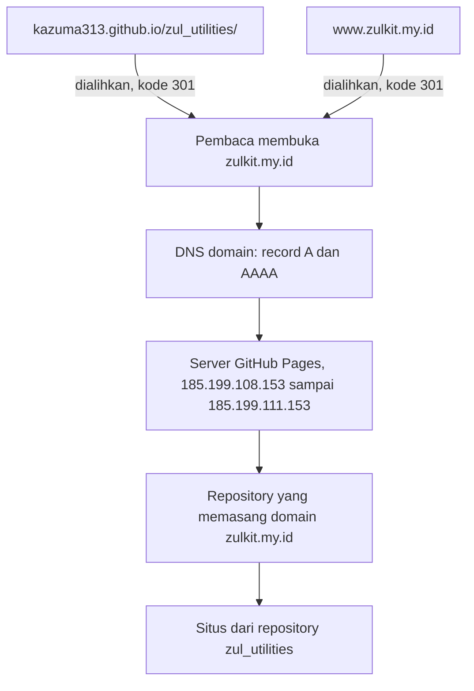

---
date:
  created: 2026-10-08
categories:
  - "GitHub"
  - "Domain"
authors:
  - kurnia
---

# Mengganti domain situs GitHub Pages ke domain sendiri

Situs ini pindah dari `kazuma313.github.io/zul_utilities/` ke `zulkit.my.id`. Pindahnya butuh tiga tempat: panel domain untuk DNS, pengaturan GitHub untuk domain dan HTTPS, dan `mkdocs.yml` untuk alamat situs. Alamat lama tidak mati, karena GitHub mengalihkannya ke domain baru, termasuk path halamannya.

<!-- more -->

## Cara pembaca sampai ke situs

GitHub Pages melayani banyak situs dari alamat IP yang sama. DNS domain mengarahkan pembaca ke server GitHub, lalu GitHub memilih situs dari repository yang memasang domain itu di **Settings → Pages**:



## Memilih domain

`zul.com` sudah terdaftar atas nama orang lain sejak 1996, begitu juga `zul.dev` dan `zul.app`. Pilihan saya jatuh ke `zulkit.my.id`. "Kit" sesuai isi proyeknya, yaitu CLI generator dan kumpulan utilities. `.my.id` adalah domain tingkat dua di bawah `.id` yang diperuntukkan bagi perorangan.

| Domain | Tahun pertama | Perpanjangan per tahun |
|---|---|---|
| `zulkit.my.id` | Rp 3.500 | Rp 15.500 |
| `zulkit.web.id` | Rp 3.500 | Rp 55.000 |
| `zulkit.biz.id` | Rp 3.500 | Rp 65.000 |

Ketiganya sama murah di tahun pertama, jadi yang menentukan adalah biaya perpanjangannya.

Ketersediaan nama bisa dicek sebelum membuka situs penjual domain, lewat RDAP milik pengelola `.id`. Jawaban `404` berarti nama itu belum terdaftar:

```bash
curl -s -o /dev/null -w "%{http_code}\n" https://rdap.pandi.id/rdap/domain/zulkit.my.id
```

## Langkah memasang domain

Urutannya mengikuti saran GitHub: domain dipasang di repository dulu, baru DNS diarahkan ke GitHub. Dengan urutan ini, tidak ada saat ketika DNS sudah mengarah ke GitHub tetapi belum ada repository yang memakai domain itu. Di saat seperti itu, akun lain bisa memasang domain yang sama di repository mereka.

1. **Daftarkan domain itu di akun GitHub.** Di **Settings** akun, bukan Settings repository, buka **Pages**, klik **Add a domain**, isi `zulkit.my.id`, lalu klik **Add domain**. GitHub menampilkan nama dan kode untuk satu record TXT.

2. **Pasang domain di repository.** Di **Settings → Pages** repository, isi **Custom domain** dengan `zulkit.my.id`, lalu klik **Save**. Statusnya berubah menjadi **DNS Check in Progress**, dan opsi **Enforce HTTPS** belum bisa dicentang.

3. **Isi DNS di panel tempat membeli domain.** Saya mengisi record berikut di menu DNS Management:

    | Tipe | Nama | Nilai |
    |---|---|---|
    | TXT | `_github-pages-challenge-kazuma313` | Kode dari langkah 1 |
    | A | `@` | `185.199.108.153` |
    | A | `@` | `185.199.109.153` |
    | A | `@` | `185.199.110.153` |
    | A | `@` | `185.199.111.153` |
    | AAAA | `@` | `2606:50c0:8000::153` |
    | AAAA | `@` | `2606:50c0:8001::153` |
    | AAAA | `@` | `2606:50c0:8002::153` |
    | AAAA | `@` | `2606:50c0:8003::153` |
    | CNAME | `www` | `kazuma313.github.io` |

    `@` berarti domain utamanya, `zulkit.my.id`. Panel menambahkan `.zulkit.my.id` di belakang setiap nama, jadi kolom nama cukup diisi bagian depannya. Record wildcard (`*`) tidak dipakai, karena GitHub memperingatkan bahwa record seperti itu membuat subdomain bisa diambil alih walaupun domainnya sudah diverifikasi.

4. **Periksa DNS-nya.** Pemeriksaan dari jaringan rumah saya dengan `nslookup` sering kehabisan waktu atau memberi jawaban lama. DNS-over-HTTPS milik Google dan Cloudflare memberi jawaban yang sama dengan yang dilihat GitHub:

    ```bash
    curl -s "https://dns.google/resolve?name=zulkit.my.id&type=A"
    curl -s "https://dns.google/resolve?name=_github-pages-challenge-kazuma313.zulkit.my.id&type=TXT"
    ```

5. **Verifikasi domain.** Di **Settings → Pages** akun, klik **Verify** pada domainnya. Statusnya menjadi **Verified**, dan sejak itu hanya akun saya yang bisa memasang `zulkit.my.id` di GitHub Pages.

6. **Nyalakan HTTPS.** Setelah GitHub selesai membuat sertifikat, opsi **Enforce HTTPS** di Settings repository bisa dicentang. Di situs ini sertifikatnya siap beberapa menit setelah DNS benar, walaupun GitHub menyebut prosesnya bisa sampai 24 jam. Sekitar satu menit setelah opsi itu dicentang, `http://` mulai dialihkan ke `https://`.

7. **Ganti alamat situs di repository.** `site_url` di `mkdocs.yml` diganti ke domain baru, begitu juga alamat yang tertulis di README dan halaman dokumentasi:

    ```yaml title="mkdocs.yml"
    site_url: https://zulkit.my.id/
    ```

    Commit ini baru saya push setelah DNS-nya benar. Workflow dokumentasi membuka situs yang baru terbit sebagai pemeriksaan terakhir, dan pemeriksaan itu gagal selama domainnya belum mengarah ke GitHub.

File `CNAME` tidak diperlukan. Situs ini terbit lewat workflow GitHub Actions, dan untuk situs seperti itu GitHub mengabaikan file `CNAME` dan memakai isian **Custom domain** di Settings.

## Memeriksa hasilnya

Kode status dan tujuan pengalihan setiap alamat bisa dilihat dengan `curl`:

```bash
curl -s -o /dev/null -w "%{http_code} %{redirect_url}\n" http://zulkit.my.id/
```

| Alamat | Hasil |
|---|---|
| `https://zulkit.my.id/` | `200` |
| `http://zulkit.my.id/` | `301` ke `https://zulkit.my.id/` |
| `http://www.zulkit.my.id/` | `301` ke `https://zulkit.my.id/` |
| `https://kazuma313.github.io/zul_utilities/referensi/` | `301` ke `https://zulkit.my.id/referensi/` |

Baris terakhir menunjukkan bahwa tautan lama yang sudah tersebar tetap membuka halaman yang sama di domain baru.

## Yang saya pelajari

- **Situs sempat tidak bisa dibuka.** Begitu **Custom domain** disimpan, GitHub langsung mengalihkan alamat lama ke domain baru, padahal DNS-nya belum ada. Situsnya baru bisa dibuka lagi setelah DNS diisi, jadi langkah 2 dan 3 sebaiknya dikerjakan berurutan tanpa jeda.
- **Satu record A sudah cukup supaya situs jalan, tapi tidak cukup aman.** Awalnya hanya satu record A dan satu record AAAA yang terisi. Situsnya bisa dibuka, tetapi kalau server GitHub di alamat itu bermasalah, situsnya ikut tidak bisa dibuka. Keempat alamat dipakai supaya ada cadangan.
- **Jawaban DNS dari jaringan rumah bisa menyesatkan.** Setelah keempat record ditambahkan, `nslookup` dari komputer saya masih menampilkan satu alamat, sementara Google dan Cloudflare sudah menampilkan empat. Record lama di jaringan rumah baru diperbarui setelah masa simpannya (TTL) habis, di sini satu jam.
- **Verifikasi domain melindungi dari pengambilalihan.** Tanpa verifikasi, akun lain bisa memasang `zulkit.my.id` di repository mereka saat domain itu sedang tidak dipakai repository saya.

## Sumber

- [Managing a custom domain for your GitHub Pages site](https://docs.github.com/en/pages/configuring-a-custom-domain-for-your-github-pages-site/managing-a-custom-domain-for-your-github-pages-site): alamat IP, record `www`, file `CNAME` untuk situs dari workflow, dan peringatan wildcard.
- [Verifying your custom domain for GitHub Pages](https://docs.github.com/en/pages/configuring-a-custom-domain-for-your-github-pages-site/verifying-your-custom-domain-for-github-pages): record TXT `_github-pages-challenge-NAMA_AKUN`.
- [Securing your GitHub Pages site with HTTPS](https://docs.github.com/en/pages/getting-started-with-github-pages/securing-your-github-pages-site-with-https): Enforce HTTPS dan sertifikatnya.
- [Menerbitkan dokumentasi](../../panduan/menerbitkan-dokumentasi.md#memakai-domain-sendiri), bagian "Memakai domain sendiri", untuk langkah yang sama dalam bentuk panduan.
- [CI/CD dokumentasi di GitHub dan siapa yang boleh menerbitkan](2026-10-07-ci-cd-dokumentasi-di-github-dan-siapa-yang-boleh-menerbitkan.md), untuk workflow yang menerbitkan situs ini.
