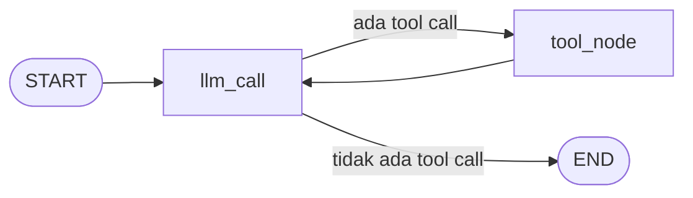

# Cara kerja agent ReAct

Agent ReAct (*Reason + Act*) adalah agent dasar di template, dan dua agent lainnya dibangun di atasnya.

Kodenya ada di `src/application/AI/agents/react/`. Agent ini ditulis dengan [LangGraph Graph API](https://docs.langchain.com/oss/python/langgraph/graph-api) dan mengikuti pola di [quickstart LangGraph](https://docs.langchain.com/oss/python/langgraph/quickstart).

## Putaran berpikir dan bertindak

Agent ReAct bekerja dalam putaran: LLM membaca percakapan, memutuskan apakah perlu memanggil tool, membaca hasil tool, lalu mengulang sampai bisa menjawab. Diagram berikut menunjukkan putaran itu sebagai graph:



Satu hal yang sering disalahpahami: LLM tidak menjalankan tool. Ia hanya menulis permintaan berisi nama tool dan argumennya. Graph yang menjalankan fungsinya, lalu mengirim hasilnya kembali ke LLM sebagai pesan baru. Pembagian kerja ini yang membuat agent bisa dikendalikan: semua yang "dilakukan" model melewati kode yang kamu tulis.

## State dan reducer

State adalah data yang dibawa graph dari satu node ke node berikutnya. Semua agent di template memakai state yang sama:

```python title="src/domain/entities/agents/react/react.py"
class AgentState(TypedDict):
    messages: Annotated[list[AnyMessage], add_messages]
    remaining_steps: RemainingSteps
```

Node tidak mengembalikan state utuh. Ia mengembalikan perubahan, dan LangGraph menggabungkan perubahan itu ke state. Cara menggabungkannya ditentukan oleh *reducer*, yaitu anotasi pada field.

Untuk `messages`, reducer-nya adalah `add_messages`. Akibatnya ada dua:

- Pesan yang dikembalikan node ditambahkan ke daftar, bukan menggantikan isinya. Karena itu node hanya mengembalikan pesan barunya, dan riwayat tumbuh dengan sendirinya.
- Pesan dengan `id` yang sama menggantikan versi lamanya. Agent human-in-the-loop memakai sifat ini untuk mengganti tool call yang diubah manusia tanpa menambah pesan kedua ke riwayat.

`remaining_steps` berbeda: tidak ada node yang menulisnya. LangGraph mengisinya dengan sisa langkah sebelum `recursion_limit` tercapai, dan node `llm_call` membacanya untuk tahu kapan harus berhenti meminta tool.

## Dua node dan satu keputusan

### `llm_call`

Node ini memanggil LLM dengan system prompt diikuti seluruh riwayat percakapan. Intinya adalah tiga baris berikut:

```python title="src/application/AI/agents/react/nodes/react_nodes.py"
messages = [SystemMessage(content=system_prompt), *state["messages"]]
response = model_with_tools.invoke(messages)
...
return {"messages": [response]}
```

System prompt tidak disimpan di state. Node menaruhnya di depan pada setiap pemanggilan. Pilihan ini punya akibat yang berguna: saat kamu mengubah prompt, perubahan itu langsung berlaku untuk percakapan yang sudah berjalan, karena tidak ada salinan prompt lama di riwayat.

Node dibuat oleh fungsi `make_llm_call(model_with_tools, system_prompt, steps_per_tool_round)`, bukan ditulis sebagai fungsi biasa. Node hanya boleh menerima `state`, sedangkan ia butuh model dan prompt. Fungsi pembuat menyimpan keduanya, dan agent human-in-the-loop memakai pembuat yang sama dengan nilai `steps_per_tool_round` yang berbeda.

### `tool_node`

Node ini adalah `ToolNode` bawaan LangGraph. Ia menjalankan seluruh tool call di pesan terakhir, secara paralel jika lebih dari satu, lalu menaruh hasilnya ke state sebagai `ToolMessage`.

### `should_continue`

Setelah `llm_call`, fungsi routing ini memilih langkah berikutnya dengan melihat satu hal, yaitu apakah pesan terakhir berisi tool call:

```python title="src/application/AI/agents/react/nodes/react_nodes.py"
def should_continue(state: AgentState) -> Literal["tool_node", END]:
    """Pilih langkah berikutnya: jalankan tool, atau selesai dan jawab user."""
    last_message = state["messages"][-1]

    if last_message.tool_calls:
        return "tool_node"

    return END
```

Perakit graph menyambungkan ketiganya:

```python title="src/application/AI/agents/react/react.py"
agent_builder = StateGraph(AgentState)

agent_builder.add_node("llm_call", make_llm_call(model_with_tools, system_prompt))
agent_builder.add_node("tool_node", ToolNode(tools))

agent_builder.add_edge(START, "llm_call")
agent_builder.add_conditional_edges("llm_call", should_continue, ["tool_node", END])
agent_builder.add_edge("tool_node", "llm_call")

return agent_builder.compile(checkpointer=checkpointer)
```

## Kenapa graph ditulis manual

LangChain menyediakan `create_agent`, yang merakit putaran ReAct yang sama dalam satu pemanggilan:

```python
from langchain.agents import create_agent

agent = create_agent(model=llm, tools=tools, system_prompt=REACT_SYSTEM_PROMPT)
```

Hasilnya dipanggil dengan cara yang sama, sehingga bisa langsung diberikan ke `ChatUseCase`. Lalu kenapa template menulis graph-nya sendiri?

Karena template adalah titik awal untuk diubah. Dengan graph yang ditulis manual, setiap node dan edge terlihat di kode proyekmu, dan menyisipkan langkah berarti menambah satu fungsi dan satu edge. Agent human-in-the-loop adalah buktinya: ia memakai `make_llm_call` yang sama, menyisipkan node `human_review` di antara LLM dan tool, dan mengganti `tool_node` dengan versinya sendiri.

Harganya juga nyata. Kamu memelihara kode graph sendiri, dan ada satu angka, `STEPS_PER_TOOL_ROUND`, yang harus tetap cocok dengan bentuk graph. Maka pedomannya begini: pakai `create_agent` saat putaran ReAct standar sudah memenuhi kebutuhanmu, dan pakai graph manual saat kamu butuh node atau routing sendiri.

## Kenapa ada batas langkah

Setiap node yang dijalankan dihitung sebagai satu langkah. LangGraph menghentikan graph dengan `GraphRecursionError` saat jumlah langkah melewati `recursion_limit`. Nilai bawaan LangGraph adalah 1000 langkah.

Angka itu terlalu longgar untuk agent di belakang API. Model yang terus-menerus memanggil tool akan menghabiskan token dan waktu jauh sebelum mencapai 1000 langkah. Karena itu `ChatUseCase` memasang batasnya sendiri:

```python title="src/application/usecases/chat.py"
MAX_AGENT_STEPS = 25
```

Batas ini dipasang di use case, bukan di graph, supaya berlaku untuk semua pintu masuk. Siapa pun yang memanggil agent lewat use case mendapat batas yang sama.

Tetapi batas saja belum menyelesaikan masalah. Agent yang menabrak `recursion_limit` berakhir dengan exception, dan lewat REST API client menerima HTTP 500 tanpa penjelasan. Template memilih akhir yang lebih baik: sebelum langkah habis, agent menutup percakapan dengan jawaban.

## Kenapa `remaining_steps <= steps_per_tool_round`

Penutupan itu dilakukan `llm_call` dengan dua baris:

```python title="src/application/AI/agents/react/nodes/react_nodes.py"
out_of_steps = state["remaining_steps"] <= steps_per_tool_round
if response.tool_calls and out_of_steps:
    response = AIMessage(id=response.id, content=STEP_LIMIT_MESSAGE)
```

Perbandingannya paling jelas dari sudut `llm_call` yang baru saja menerima tool call dari model. Jika tool call itu diteruskan, graph harus menjalankan satu putaran tool: `tool_node`, lalu `llm_call` berikutnya. Itu dua langkah, dan angka itulah isi `STEPS_PER_TOOL_ROUND`. Pemanggilan LLM berikutnya juga harus masih punya sedikitnya satu langkah tersisa. Jika tidak, graph berakhir dengan `GraphRecursionError` walaupun model sudah siap menjawab.

Jadi tool call hanya aman diteruskan jika sisa langkah lebih besar daripada biaya satu putaran. Jika sisa langkah sama dengan atau lebih kecil daripada biaya itu, putaran berikutnya akan menghabiskan semuanya, dan percakapan harus ditutup sekarang.

Tabel berikut menelusuri agent yang modelnya selalu meminta tool, dengan `recursion_limit` 6:

| Node | `remaining_steps` | Yang terjadi |
|---|---|---|
| `llm_call` | 5 | 5 lebih besar dari 2, tool call diteruskan. |
| `tool_node` | 4 | Tool dijalankan. |
| `llm_call` | 3 | 3 lebih besar dari 2, tool call diteruskan. |
| `tool_node` | 2 | Tool dijalankan. |
| `llm_call` | 1 | 1 tidak lebih besar dari 2, tool call diganti jawaban penutup. |

Tanda `<=`, bukan `<`, menjadi penting saat batasnya ganjil. Dengan `recursion_limit` 7, `llm_call` melihat nilai 6, 4, lalu 2. Pada nilai 2, perbandingan `<` akan meneruskan tool call: `tool_node` berjalan dengan sisa 1, dan `llm_call` berikutnya berjalan dengan sisa 0. Graph lalu berakhir dengan `GraphRecursionError`. Dengan `<=`, percakapan ditutup pada nilai 2 itu.

Ada tiga akibat dari rancangan ini.

**Tool call terakhir dibuang, bukan ditunda.** Respons model diganti sebelum masuk ke state, sehingga riwayat tidak menyimpan tool call tanpa hasil. User menerima teks `STEP_LIMIT_MESSAGE` dan bisa mengirim pesan berikutnya di thread yang sama.

**Jumlah putaran tool bisa dihitung.** Dengan 25 langkah dan dua langkah per putaran, agent ReAct mendapat 11 putaran tool; pada pemanggilan LLM ke-12 ia harus menjawab.

**Angka putaran harus mengikuti bentuk graph.** Jika kamu menambah node ke putaran tool, satu putaran memakan lebih banyak langkah, dan `STEPS_PER_TOOL_ROUND` harus dinaikkan. Agent human-in-the-loop melewati `human_review`, `tool_node`, lalu `llm_call`, sehingga ia memakai nilai 3 dan mendapat 7 putaran tool dari 25 langkah. Jika angka itu lebih kecil daripada jumlah node yang sebenarnya, agent yang kehabisan langkah berakhir dengan `GraphRecursionError`, bukan dengan jawaban penutup.

## Saat tool gagal

`ToolNode` membedakan tiga jenis kegagalan, dan perbedaannya menentukan siapa yang harus menanganinya:

| Kejadian | Akibat |
|---|---|
| LLM memanggil tool yang tidak ada | LLM menerima pesan error berisi daftar tool yang tersedia, lalu bisa mencoba lagi. |
| Argumen dari LLM tidak sesuai skema tool | LLM menerima pesan error validasi, lalu bisa memperbaiki argumennya. |
| Fungsi tool melempar exception | Exception diteruskan ke pemanggil. Lewat REST API, client menerima HTTP 500. |

Dua yang pertama adalah kesalahan model, dan model bisa memperbaikinya sendiri setelah diberi tahu. Pesan error itu masuk ke riwayat sebagai hasil tool, lalu putaran berlanjut. Setiap percobaan ulang memakan satu putaran tool, sehingga batas langkah juga membatasi berapa kali model boleh salah.

Yang ketiga berbeda. Exception di dalam fungsi tool tidak diubah menjadi pesan untuk model; ia menghentikan seluruh request. Akibatnya, tanggung jawab ada di penulis tool: kegagalan yang bisa diperkirakan, seperti layanan luar yang tidak menjawab atau data yang tidak ditemukan, sebaiknya ditangkap di dalam tool dan dikembalikan sebagai teks. Dengan begitu model bisa menjelaskan masalahnya ke user alih-alih request gagal.

> [!NOTE]
> Agent human-in-the-loop tidak memakai `ToolNode`. Node tool-nya ditulis sendiri dan meniru ketiga perilaku di atas. Penjelasannya ada di [Cara kerja human-in-the-loop](human-in-the-loop.md).

## Kapan agent ini cocok

Agent ReAct cocok saat satu agent dengan beberapa tool sudah memenuhi kebutuhan. Agent human-in-the-loop cocok saat ada tool yang harus disetujui manusia sebelum dijalankan. Subagents cocok saat pekerjaannya terbagi ke beberapa bidang yang masing-masing butuh instruksi sendiri.

## Halaman terkait

- [Konsep: Cara kerja human-in-the-loop](human-in-the-loop.md)
- [Konsep: Cara kerja subagents](subagents.md)
- [Konsep: Memory dan thread](memory.md)
- [Referensi: API agent](../referensi/agent.md)
- [Panduan: Menambah node ke graph](../panduan/menambah-node.md)
- [Panduan: Mengatur batas langkah](../panduan/mengatur-batas-langkah.md)
- [Panduan: Menambah tool](../panduan/menambah-tool.md)
- [Panduan: Mengubah system prompt](../panduan/mengubah-system-prompt.md)
- [Tutorial: Membuat agent pertamamu](../tutorial/agent-pertama.md)
