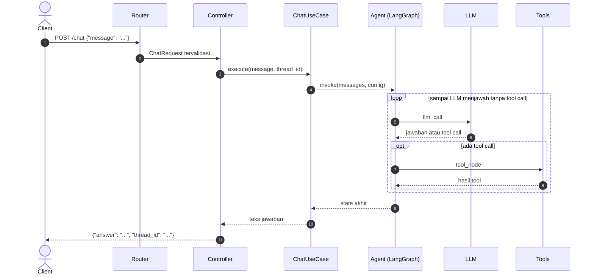
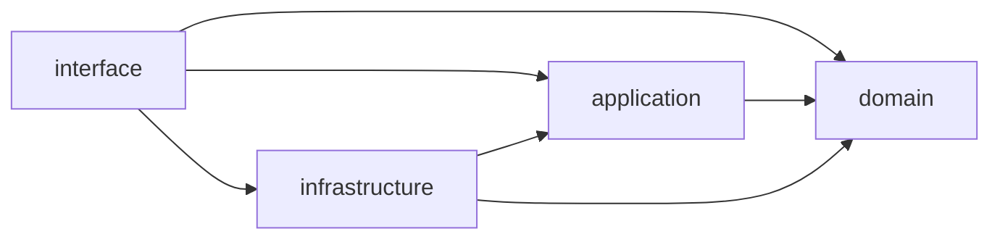

# Perjalanan sebuah request

Halaman ini menjawab tiga pertanyaan. Apa yang terjadi di antara request HTTP masuk dan jawaban keluar? Kenapa kode dipisah menjadi empat layer dengan arah impor yang ketat? Dan kenapa objek-objek aplikasi dirakit di controller, bukan di tempat lain?

Contoh yang diikuti adalah satu request `POST /chat` ke proyek hasil `zul build hexa`. Endpoint lain menempuh jalur yang sama dengan perakit dan use case yang berbeda.

## Gambaran umum

Request melewati empat perhentian, lalu jawabannya kembali lewat jalur yang sama. Diagram berikut menunjukkan urutannya:



Setiap perhentian punya satu tanggung jawab, dan tanggung jawab itu tidak tumpang tindih. Bagian-bagian berikut membahasnya satu per satu.

## Sebelum request pertama

Saat server mulai, `src/interface/http/main.py` diimpor. File itu memasang logging, membuat aplikasi FastAPI, mendaftarkan router `chat`, `hitl`, dan `subagents`, lalu memasang handler untuk `DomainError`. Jika `PLAYGROUND_ENABLED` bernilai benar, router playground dan aturan CORS ikut dipasang.

Yang tidak terjadi pada tahap ini sama pentingnya: belum ada agent yang dirakit dan belum ada chat model yang dibuat. Akibatnya server bisa hidup tanpa API key, dan `GET /health` menjawab walaupun konfigurasi LLM belum benar. Kesalahan konfigurasi baru terlihat pada request chat pertama.

## Router memeriksa bentuk

`src/interface/http/routers/chat.py` mencocokkan `POST /chat` dan menyerahkan body ke model `ChatRequest`. FastAPI memeriksa bentuknya: `message` harus ada dan berisi minimal satu karakter. Body yang tidak lolos dijawab HTTP 422 tanpa menyentuh use case.

Router sengaja tidak berisi logika. Tugasnya hanya menyatakan path, method, dan model, lalu meneruskan ke controller:

```python title="src/interface/http/routers/chat.py"
@router.post("", response_model=ChatResponse)
def chat(
    request: ChatRequest,
    usecase: ChatUseCase = Depends(chat_controller.get_chat_usecase),
) -> ChatResponse:
    """Kirim pesan ke ReAct agent."""
    return chat_controller.chat(request, usecase)
```

Perhatikan `Depends(chat_controller.get_chat_usecase)`. Router tidak membuat use case sendiri; ia memintanya. Dari sinilah perakitan dependensi dimulai.

## Dependensi dirakit satu kali

Pada request pertama, FastAPI memanggil `get_chat_usecase`, yang memanggil `get_react_agent`. Fungsi kedua inilah yang membuat chat model, mengambil daftar tool, membuat checkpointer, dan merakit graph agent. Hasil keduanya disimpan oleh `@lru_cache`, sehingga request berikutnya menerima objek yang sama.

Tempat perakitan ini disebut composition root, dan dibahas di [bagian tersendiri](#composition-root).

## Controller menyiapkan thread

Handler `chat_controller.chat` melakukan satu hal yang bersifat HTTP: menentukan `thread_id`. Jika client mengirimnya, nilai itu dipakai. Jika tidak, controller membuat ID baru. ID itu dikembalikan di respons supaya client bisa melanjutkan percakapan.

Potongan berikut adalah seluruh isi handler:

```python title="src/interface/http/controllers/chat_controller.py"
def chat(request: ChatRequest, usecase: ChatUseCase) -> ChatResponse:
    thread_id = request.thread_id or uuid4().hex
    answer = usecase.execute(request.message, thread_id)

    return ChatResponse(answer=answer, thread_id=thread_id)
```

Controller menerjemahkan dua arah: dari model request ke argumen use case, dan dari hasil use case ke model respons. Ia tidak tahu apa pun tentang graph atau LLM.

## Use case menjaga aturan

`ChatUseCase.execute` di `src/application/usecases/chat.py` adalah satu-satunya pintu dari layer interface ke agent. Ia melakukan dua hal sebelum agent berjalan.

Pertama, ia menolak pesan yang hanya berisi spasi dengan `EmptyMessageError`. Pemeriksaan ini berbeda dari pemeriksaan router: router memeriksa bentuk data, use case memeriksa aturan bisnis. Pesan `"   "` lolos dari router karena panjangnya tiga karakter, tetapi tidak punya arti bagi agent.

Kedua, ia memasang dua pengaturan pada pemanggilan agent: `thread_id` untuk memory dan `recursion_limit` untuk membatasi jumlah langkah. Dengan begitu tidak ada pintu masuk, entah REST API, bot, atau CLI, yang bisa memanggil agent tanpa batas langkah.

## Agent menjalankan putarannya

Graph di `src/application/AI/agents/react/react.py` mengambil alih. Checkpointer memuat riwayat percakapan untuk `thread_id` itu. Node `llm_call` mengirim system prompt dan riwayat ke LLM. Jika jawaban LLM berisi tool call, `tool_node` menjalankan tool dan hasilnya kembali ke `llm_call`. Putaran itu berulang sampai LLM menjawab tanpa tool call, lalu checkpointer menyimpan riwayat terbaru.

Rincian putaran ini ada di [Cara kerja agent ReAct](agent-react.md), dan rincian penyimpanannya ada di [Memory dan thread](memory.md).

## Jawaban pulang

Use case mengambil teks dari pesan terakhir di state. Controller membungkusnya dalam `ChatResponse` bersama `thread_id`, dan FastAPI mengirimnya sebagai JSON.

## Tiga jenis kegagalan

Setiap perhentian punya cara gagal sendiri, dan client bisa membedakannya dari kode status.

Body yang bentuknya salah berhenti di router dan menjadi HTTP 422. Pelanggaran aturan bisnis dilempar use case sebagai turunan `DomainError`, lalu diubah menjadi HTTP 400 oleh satu handler di `main.py`. Karena handler itu menangkap kelas dasarnya, exception domain baru yang kamu tambahkan otomatis ikut tertangani, dan controller tidak perlu `try/except`. Semua kegagalan lain, misalnya LLM yang tidak bisa dihubungi atau tool yang melempar exception, menjadi HTTP 500.

Pembagian ini memberi makna pada kode status: 422 dan 400 berarti client perlu memperbaiki request-nya, 500 berarti masalahnya ada di server.

## Aturan arah dependensi

Empat layer di `src/` tidak bebas saling mengimpor. Diagram berikut menunjukkan arah impor yang diizinkan:



`domain` tidak mengimpor layer lain. `application` hanya mengimpor `domain`. `infrastructure` boleh mengimpor `domain` dan `application`, tetapi tidak diimpor oleh keduanya. `interface` boleh mengimpor semuanya, dan tidak diimpor siapa pun.

Akibat terpenting aturan ini: `application` tidak tahu provider LLM mana yang dipakai. Perakit agent tidak mengimpor `ChatOpenAI`; ia menerima chat model, daftar tool, dan checkpointer lewat parameter:

```python title="src/application/AI/agents/react/react.py"
def build_react_agent(
    llm: BaseChatModel,
    tools: Sequence[BaseTool],
    system_prompt: str = REACT_SYSTEM_PROMPT,
    checkpointer: BaseCheckpointSaver | None = None,
):
```

Tipe parameternya adalah tipe abstrak dari LangChain dan LangGraph, bukan kelas milik satu provider. Itulah yang membuat agent bisa diberi model OpenAI di produksi dan model palsu di test.

> [!NOTE]
> `AgentState` berada di `domain`, tetapi mengimpor tipe dari LangGraph. Ini pengecualian yang disengaja: state adalah bentuk data yang dipakai bersama oleh node, routing, dan perakit graph, sehingga ditaruh di tempat yang bisa diimpor semuanya.

## Composition root

Jika `application` tidak boleh membuat chat model, harus ada satu tempat yang membuatnya dan menyambungkannya ke agent. Tempat itu disebut composition root. Di template, tempat itu adalah sepasang fungsi di setiap controller:

```python title="src/interface/http/controllers/chat_controller.py"
@lru_cache
def get_react_agent():
    """Agent ReAct yang dilayani `POST /chat` dan dicoba di playground."""
    return build_react_agent(
        llm=get_llm_model(),
        tools=tools,
        checkpointer=get_checkpointer(),
    )


@lru_cache
def get_chat_usecase() -> ChatUseCase:
    return ChatUseCase(get_react_agent())
```

### Kenapa di controller

Aturan dependensi menyisakan satu pilihan. Fungsi perakit harus mengimpor `build_react_agent` dari `application` dan `get_llm_model` dari `infrastructure` sekaligus. Hanya layer `interface` yang boleh melihat keduanya.

Ada alasan kedua: FastAPI. Router meminta use case lewat `Depends(get_chat_usecase)`, dan FastAPI mengizinkan fungsi itu diganti lewat `app.dependency_overrides`. Test endpoint memakai celah ini untuk menyuntikkan use case ber-LLM palsu tanpa mengubah kode aplikasi.

### Kenapa agent dan use case dirakit terpisah

`get_react_agent` dan `get_chat_usecase` dipisah karena agent punya dua pemakai. REST API memakainya lewat use case. Playground memakainya langsung, karena ia perlu mengalirkan setiap langkah agent, bukan hanya jawaban akhirnya. Daftar fitur playground menunjuk ke fungsi perakit yang sama:

```python title="src/interface/playground/features.py"
Feature(
    name="ReAct",
    description="Agent dasar dengan tool cuaca. Sama dengan `POST /chat`.",
    build_agent=chat_controller.get_react_agent,
    examples=("What is the weather in sf?",),
),
```

Karena keduanya memanggil fungsi ber-`@lru_cache` yang sama, yang kamu coba di playground adalah objek agent yang sama dengan yang melayani client.

### Kenapa memakai `@lru_cache`

`get_checkpointer()` mengembalikan penyimpan percakapan baru setiap kali dipanggil. Tanpa `@lru_cache`, setiap request merakit agent baru dengan penyimpan kosong, dan percakapan sebelumnya tidak ditemukan lagi. Dengan `@lru_cache`, agent dan checkpointer dibuat sekali lalu dipakai ulang oleh semua request.

### Apa yang kamu dapat

Untuk mengganti model, tool, atau penyimpanan percakapan, kamu mengubah fungsi perakit. Use case dan graph tidak disentuh. Controller `hitl_controller.py` dan `subagents_controller.py` mengikuti pola yang sama dengan perakit masing-masing.

## Untung dan ruginya

Pemisahan ini punya tiga akibat praktis.

- **Test tidak butuh LLM asli.** Agent menerima chat model lewat parameter, sehingga test memberinya model palsu yang menjawab sesuai naskah. Lihat [Menguji tanpa LLM asli](pengujian.md).
- **Mengganti teknologi mengubah sedikit file.** Pindah dari OpenAI ke provider lain, atau dari memory proses ke database, hanya menyentuh `infrastructure` dan composition root.
- **Pintu masuk bisa bertambah.** Bot Discord atau perintah CLI memanggil use case yang sama dengan REST API, tanpa menyalin logika validasi dan batas langkah.

Harganya adalah lebih banyak file dan satu lapis pemanggilan tambahan. Untuk fitur kecil, jalur router, controller, use case, lalu agent terasa panjang. Template memilih membayar harga itu sejak awal, karena memisahkan layer belakangan, setelah kode provider tersebar di mana-mana, jauh lebih mahal.

## Lihat juga

- [Konsep: Arsitektur hexagonal](arsitektur-hexagonal.md)
- [Konsep: Cara kerja agent ReAct](agent-react.md)
- [Konsep: Memory dan thread](memory.md)
- [Referensi: HTTP API](../referensi/http-api.md)
- [Referensi: Struktur proyek hexa](../referensi/struktur-proyek.md)
- [Referensi: API agent](../referensi/agent.md)
- [Panduan: Menambah endpoint](../panduan/menambah-endpoint.md)
