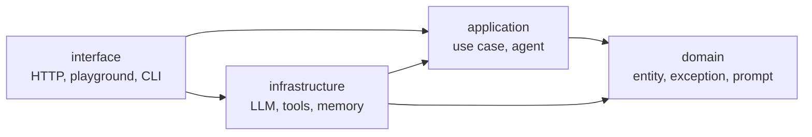

# Arsitektur hexagonal

Proyek hasil `zul build hexa` dibagi menjadi empat layer: `domain`, `application`, `infrastructure`, dan `interface`.

## Masalah yang diselesaikan

Aplikasi berbasis LLM cepat berubah di tepinya. Provider model berganti, tool bertambah, penyimpan percakapan pindah dari memori ke database, dan pintu masuknya bertambah dari REST API ke bot. Jika semua itu bercampur dengan alur kerja agent, setiap pergantian menyentuh banyak file, dan test hanya bisa berjalan dengan memanggil model sungguhan.

Arsitektur hexagonal, yang juga disebut *ports and adapters*, memisahkan hal yang jarang berubah dari hal yang sering berubah. Aturan dan alur kerja ditaruh di tengah. Teknologi ditaruh di tepi, sebagai adapter yang bisa diganti.

## Empat layer



| Layer | Tugasnya | Contoh di template |
|---|---|---|
| `domain` | Hal yang tetap benar apa pun teknologinya. | `AgentState`, `DomainError` dan turunannya, system prompt. |
| `application` | Alur kerja: menerima permintaan, menjalankan agent, mengembalikan hasil. | `ChatUseCase`, `build_react_agent`, node dan routing graph. |
| `infrastructure` | Adapter keluar: kode yang bergantung pada provider atau layanan tertentu. | `get_llm_model`, `get_weather`, `get_checkpointer`. |
| `interface` | Adapter masuk: pintu yang dipakai dunia luar untuk mencapai aplikasi. | Router dan controller FastAPI, endpoint playground. |

## Arah dependensi

Satu aturan menjaga pembagian ini tetap berarti: setiap layer hanya boleh mengimpor layer yang lebih dalam.

| Layer | Boleh mengimpor | Tidak boleh mengimpor |
|---|---|---|
| `domain` | Tidak ada layer lain | `application`, `infrastructure`, `interface` |
| `application` | `domain` | `infrastructure`, `interface` |
| `infrastructure` | `domain`, `application` | `interface` |
| `interface` | Semua layer | Tidak ada |

Akibat terpentingnya ada di baris kedua. Karena `application` tidak mengimpor `infrastructure`, agent tidak tahu provider model mana yang dipakai. Ia menerima chat model, daftar tool, dan penyimpan percakapan lewat parameter:

```python
def build_react_agent(llm, tools, system_prompt=REACT_SYSTEM_PROMPT, checkpointer=None):
    ...
```

Use case memperlakukan agent dengan cara yang sama. `ChatUseCase` tidak meminta graph LangGraph. Ia meminta "sesuatu yang punya method `invoke`", yang ditulis sebagai `Protocol` bernama `ChatAgent`. Di arsitektur ini, kontrak seperti itu disebut *port*, dan objek yang memenuhinya disebut *adapter*.

## Tempat semuanya disambungkan

Jika `application` tidak boleh membuat chat model sendiri, harus ada satu tempat yang membuatnya dan menyerahkannya. Tempat itu disebut *composition root*, dan di template letaknya di controller, di layer `interface`. Layer itu boleh mengimpor semua layer lain, jadi di sanalah adapter dari `infrastructure` disambungkan ke agent dan use case dari `application`.

[Perjalanan sebuah request](alur-request.md) mengikuti satu request melewati keempat layer dan menunjukkan composition root bekerja.

## Pengecualian yang disengaja

`AgentState` tinggal di `domain`, tetapi mengimpor tipe dari LangGraph. Menurut aturan yang ketat, `domain` tidak boleh bergantung pada framework.

Pengecualian ini dipilih karena state adalah bentuk data yang dipakai bersama oleh node, routing, dan perakit graph, dan anotasi reducer-nya tidak bisa dipisahkan dari definisi state itu. Menaruhnya di `application` akan membuat node dan perakit graph saling mengimpor dengan cara yang lebih rumit. Selain state agent, `domain` tetap bebas dari framework.

## Yang kamu dapat dan yang kamu bayar

Pembagian ini memberi tiga hal:

- **Test tidak butuh model sungguhan.** Karena agent menerima chat model lewat parameter, test memberinya model palsu yang menjawab sesuai naskah. Penjelasannya ada di [Menguji tanpa LLM asli](pengujian.md).
- **Mengganti teknologi mengubah sedikit file.** Pindah provider model atau pindah penyimpan percakapan hanya menyentuh `infrastructure` dan composition root.
- **Pintu masuk bisa bertambah.** Endpoint playground, bot, atau perintah CLI memakai agent dan use case yang sama dengan REST API, tanpa menyalin logikanya.

Harganya adalah lebih banyak file, dan satu lapis pemanggilan tambahan bahkan untuk fitur yang sederhana. Untuk skrip sekali jalan atau prototipe yang akan dibuang, struktur ini berlebihan. Struktur ini mulai terbayar saat proyek punya lebih dari satu pintu masuk, lebih dari satu agent, atau perlu diuji tanpa memanggil model.

## Halaman terkait

- [Perjalanan sebuah request](alur-request.md) untuk melihat keempat layer bekerja pada satu request.
- [Struktur proyek](../referensi/struktur-proyek.md) untuk isi setiap folder di tiap layer.
- [Hexagonal dari nol](../hexagonal.md) untuk penjelasan panjang bagi pemula, dengan contoh aplikasi toko online.
- [Menambah endpoint](../panduan/menambah-endpoint.md) untuk mempraktikkan pembagian ini pada fitur baru.
