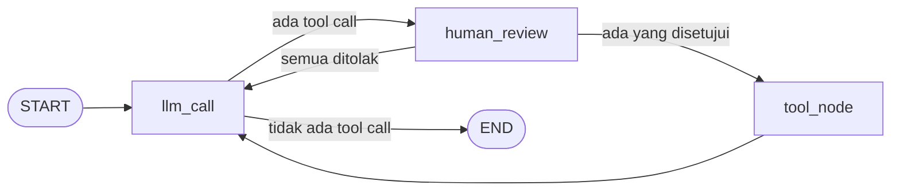
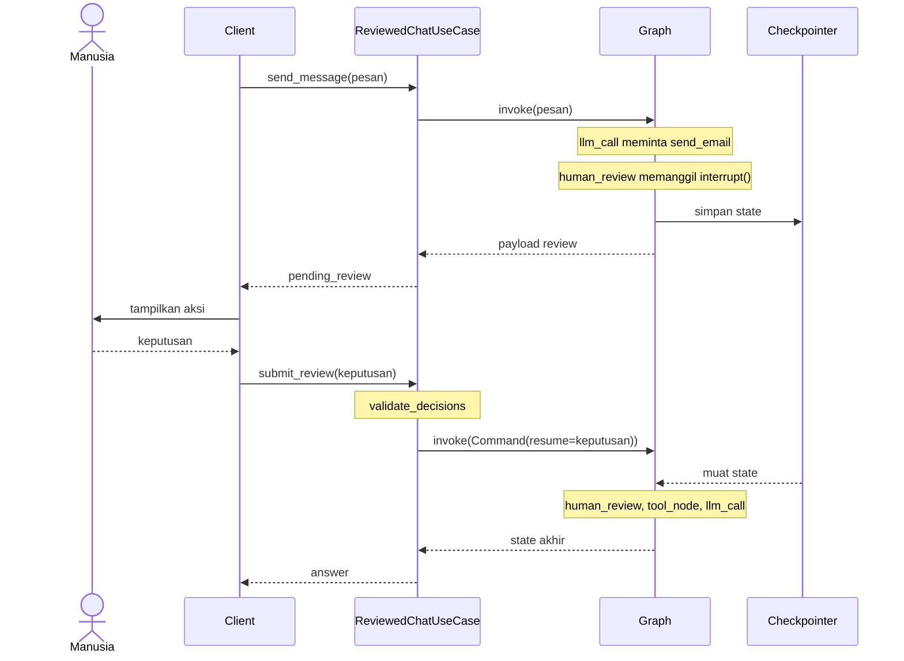

# Cara kerja human-in-the-loop

Sebagian aksi terlalu berisiko untuk dijalankan hanya atas keputusan model: mengirim email, menghapus data, melakukan pembayaran. Agent human-in-the-loop adalah agent ReAct yang berhenti sebelum menjalankan tool seperti itu dan menunggu manusia menyetujui, mengubah, atau menolaknya.

Halaman ini menjelaskan bagaimana agent bisa berhenti di tengah jalan lalu melanjutkan, dan kenapa template memasang beberapa penjagaan di sekitarnya. Kodenya ada di `src/application/AI/agents/human_in_the_loop/` dan `src/application/usecases/reviewed_chat.py`. Mekanisme berhentinya memakai [interrupt dari LangGraph](https://docs.langchain.com/oss/python/langgraph/interrupts).

## Bentuk graph

Graph-nya sama dengan agent ReAct, ditambah satu node `human_review` di antara LLM dan tool:



Setiap tool call melewati `human_review`, tetapi tidak semuanya membuat graph berhenti. Node itu hanya berhenti untuk tool yang namanya ada di `tools_requiring_approval`. Tool yang hanya membaca data, seperti cuaca, langsung diteruskan ke `tool_node` supaya manusia tidak diminta menyetujui hal yang tidak berisiko.

Dua panah keluar dari `human_review` tidak ditulis sebagai edge di perakit graph. Node itu memilih tujuannya sendiri dengan mengembalikan `Command(goto=...)`, karena tujuannya baru diketahui setelah keputusan manusia diterapkan.

## Dua request untuk satu aksi

Dari sisi client, percakapan dengan aksi yang direview berjalan dalam dua request. Diagram berikut menunjukkan apa yang terjadi di antara keduanya:



Di antara request pertama dan kedua tidak ada yang berjalan. Graph tidak menunggu sebagai proses yang tertahan; seluruh keadaannya tersimpan di checkpointer. Itu sebabnya manusia boleh memutuskan kapan saja, dan itu juga sebabnya review tidak punya batas waktu.

## Bagaimana `interrupt()` dan checkpoint bekerja

Node `human_review` berhenti dengan satu baris:

```python title="src/application/AI/agents/human_in_the_loop/nodes/human_in_the_loop_nodes.py"
response = interrupt(build_review_request(calls_to_review))
```

Saat baris itu dijalankan pertama kali, tiga hal terjadi:

- Graph berhenti di titik itu.
- Checkpointer menyimpan seluruh state, termasuk tool call yang belum dijalankan.
- Nilai yang diberikan ke `interrupt()` dikembalikan ke pemanggil di `result["__interrupt__"]`. Nilai itulah yang menjadi `pending_review`.

Untuk melanjutkan, graph dipanggil lagi dengan `Command(resume=...)` dan `thread_id` yang sama. Nilai `resume` menjadi nilai kembalian `interrupt()`, dan node meneruskan pekerjaannya dengan keputusan di tangan.

Mekanisme ini bergantung penuh pada checkpointer dan `thread_id`. Graph yang berhenti harus disimpan di suatu tempat, dan pemanggilan kedua harus bisa menemukannya. Karena itu parameter `checkpointer` pada `build_human_in_the_loop_agent` tidak punya nilai bawaan, berbeda dengan `build_react_agent` yang mengizinkan `None`.

## Kenapa node dijalankan ulang saat resume

Saat graph dilanjutkan, node `human_review` tidak meneruskan dari baris `interrupt()`. Node itu dijalankan lagi dari baris pertamanya. Bedanya, pada putaran kedua `interrupt()` tidak menghentikan graph, melainkan langsung mengembalikan nilai `resume`.

Akibatnya, kode sebelum `interrupt()` berjalan dua kali: sekali saat berhenti dan sekali saat dilanjutkan. Jika di sana ada efek samping, misalnya mencatat ke database atau mengirim notifikasi, efek itu terjadi dua kali.

Template menjaga bagian itu tetap bersih. Sebelum `interrupt()`, node hanya membaca state dan menyaring tool call:

```python title="src/application/AI/agents/human_in_the_loop/nodes/human_in_the_loop_nodes.py"
ai_message = state["messages"][-1]
calls_to_review = [
    tool_call
    for tool_call in ai_message.tool_calls
    if tool_call["name"] in tools_requiring_approval
]

if not calls_to_review:
    return Command(goto="tool_node")
```

Membaca dan menyaring boleh diulang berapa kali pun dengan hasil yang sama. Pertahankan sifat itu saat kamu mengubah node ini. Payload yang diberikan ke `interrupt()` juga harus bisa diubah menjadi JSON, karena ia dikirim ke client sebagai `pending_review`.

> [!WARNING]
> Jangan membungkus `interrupt()` dengan `try/except Exception`. Fungsi itu menghentikan graph dengan melempar exception khusus. Jika exception itu tertangkap, graph tidak berhenti dan tool berjalan tanpa persetujuan.

## Kenapa keputusan divalidasi sebelum resume

Nilai `resume` ikut tersimpan di checkpoint. Sifat ini berbahaya jika keputusan yang dikirim salah bentuk.

Bayangkan client mengirim keputusan `edit` tanpa `edited_action`, dan graph langsung dilanjutkan. Node `human_review` membaca `decision["edited_action"]` dan gagal. Kegagalan itu terjadi setelah `interrupt()`, sehingga percobaan berikutnya memakai nilai `resume` lama yang sama dan gagal lagi, walaupun keputusan yang dikirim kali ini benar. Thread itu macet.

Karena itu `submit_review` memeriksa keputusan sebelum menyentuh graph:

```python title="src/application/usecases/reviewed_chat.py"
# Nilai resume ikut tersimpan di checkpoint. Karena itu keputusan
# harus diperiksa sebelum agent dilanjutkan, sebab error yang
# muncul sesudah interrupt() akan terulang di setiap resume.
validate_decisions(decisions, pending_review)

result = self._agent.invoke(
    Command(resume={"decisions": list(decisions)}), config
)
```

`validate_decisions` melempar `InvalidReviewDecisionError` saat jumlah, jenis, atau isi keputusan tidak cocok dengan aksi yang menunggu. Graph tidak dipanggil, state tidak berubah, dan client bisa mengirim ulang keputusan yang benar.

Fungsi itu berdiri di tingkat modul, bukan sebagai method use case, karena playground juga melanjutkan agent dan harus melakukan pemeriksaan yang sama. Aturannya berlaku untuk siapa pun yang memanggil `Command(resume=...)`: periksa dulu, baru lanjutkan.

## Kenapa pesan baru ditolak saat review menunggu

Saat graph berhenti, pesan terakhir di riwayat adalah pesan model yang berisi tool call, dan tool call itu belum punya hasil. Jika thread itu menerima pesan user baru, pesan itu masuk ke riwayat tepat setelah tool call yang belum terjawab. Provider LLM menolak riwayat seperti itu: setiap tool call harus diikuti hasilnya.

`send_message` mencegahnya dengan memeriksa apakah thread masih punya interrupt yang menunggu:

```python title="src/application/usecases/reviewed_chat.py"
if self._pending_review(config) is not None:
    raise ReviewPendingError()
```

Template memilih menolak, bukan menebak. Pesan baru bisa saja ditafsirkan sebagai penolakan aksi yang menunggu, tetapi tafsiran itu mengubah keputusan manusia menjadi dugaan. Dengan menolak, client dipaksa mengirim keputusan yang jelas lebih dulu.

## Bagaimana keputusan diterapkan

Setelah `interrupt()` mengembalikan keputusan, node memasangkan setiap keputusan dengan tool call yang direview menurut urutannya, lalu menerapkannya:

- Untuk `approve`, tool call dibiarkan apa adanya.
- Untuk `edit`, nama dan argumen tool call diganti dengan isi `edited_action`.
- Untuk `reject`, node menambahkan `ToolMessage` berstatus `error` berisi alasan penolakan.

Dua rincian di sini menjaga riwayat percakapan tetap sah.

Pertama, penolakan disampaikan sebagai hasil tool, bukan dengan menghapus tool call-nya. Dengan begitu setiap tool call tetap punya `ToolMessage`, dan model tahu aksinya tidak berjalan beserta alasannya.

Kedua, pesan model yang sudah direvisi memakai `id` yang sama dengan pesan aslinya. Reducer `add_messages` lalu menggantikan pesan lama, bukan menambah pesan kedua. Riwayat mencatat argumen yang sungguh dijalankan, bukan argumen yang diusulkan model.

Setelah itu node memilih tujuan. Jika masih ada tool call yang belum punya hasil, graph lanjut ke `tool_node`. Jika semuanya ditolak, graph kembali ke `llm_call`, dan model menjawab berdasarkan penolakan itu.

System prompt agent ini berbeda dari prompt ReAct karena satu alasan: model yang menerima hasil tool berstatus error cenderung mencoba lagi tool yang sama. Prompt memintanya berhenti, menjelaskan apa yang tidak dilakukan, dan bertanya ke user.

## Kenapa node tool ditulis sendiri

Agent ReAct memakai `ToolNode` bawaan LangGraph, yang menjalankan semua tool call di pesan terakhir. Di sini perilaku itu salah: setelah review, sebagian tool call sudah ditolak dan sudah punya `ToolMessage` penolakannya. Menjalankan semuanya berarti menjalankan aksi yang baru saja ditolak manusia.

Node tool milik template hanya menjalankan tool call yang belum punya hasil:

```python title="src/application/AI/agents/human_in_the_loop/nodes/human_in_the_loop_nodes.py"
def tool_node(state: AgentState) -> dict:
    """Jalankan tool call yang tidak ditolak."""
    calls_to_run = unanswered_tool_calls(state["messages"])

    return {"messages": [run_tool(tool_call) for tool_call in calls_to_run]}
```

Pilihan ini punya harga. Perilaku `ToolNode` tidak ikut terbawa, sehingga yang dibutuhkan harus ditulis ulang. Node ini meniru dua perilaku `ToolNode` yang paling dibutuhkan: tool yang tidak dikenal dan argumen yang tidak sesuai skema tool dikembalikan ke model sebagai hasil tool berstatus `error`, sehingga model bisa memperbaikinya. Yang kedua berlaku juga untuk argumen hasil suntingan manusia. Bedanya dengan `ToolNode`, node ini menjalankan tool satu per satu, bukan secara paralel.

## Kenapa aksi tanpa keputusan dianggap ditolak

Node `human_review` memakai dua nilai bawaan yang berlawanan arah:

```python title="src/application/AI/agents/human_in_the_loop/nodes/human_in_the_loop_nodes.py"
for tool_call in ai_message.tool_calls:
    if tool_call["id"] in reviewed_call_ids:
        decision = decision_by_call_id.get(tool_call["id"], NO_DECISION)
    else:
        decision = APPROVE
```

Tool call yang tidak butuh review langsung disetujui, karena memang tidak pernah butuh keputusan. Tool call yang butuh review tetapi tidak mendapat keputusan diperlakukan sebagai ditolak.

Alasannya adalah arah kegagalan. Jika keputusan hilang, entah karena bug di client atau karena daftar keputusan lebih pendek daripada daftar aksi, ada dua kemungkinan salah: aksi yang seharusnya berjalan tidak berjalan, atau aksi yang seharusnya ditahan malah berjalan. Yang pertama bisa diperbaiki dengan meminta lagi. Yang kedua mungkin tidak bisa dibatalkan. Seluruh tujuan agent ini adalah mencegah yang kedua, jadi tanpa persetujuan, aksi tidak boleh berjalan.

Lewat `ReviewedChatUseCase`, keadaan ini tidak terjadi, karena `validate_decisions` sudah menolak jumlah keputusan yang tidak sama dengan jumlah aksi. Aturan di node adalah lapis kedua untuk pemanggil yang melanjutkan graph secara langsung.

Prinsip yang sama terlihat saat agent dirakit. Jika `tools_requiring_approval` berisi nama yang bukan salah satu `tools`, `build_human_in_the_loop_agent` melempar `ValueError`. Salah ketik nama tool ketahuan saat agent dirakit, bukan saat tool itu diam-diam berjalan tanpa review.

## Batas langkah

Agent ini memakai penjagaan langkah yang sama dengan agent ReAct, dengan satu perbedaan: satu putaran tool melewati tiga node (`human_review`, `tool_node`, `llm_call`), sehingga `STEPS_PER_TOOL_ROUND` di sini bernilai 3. Penjelasan lengkapnya ada di [Cara kerja agent ReAct](agent-react.md).

## Batasan rancangan ini

Template ini adalah titik awal, dan beberapa hal sengaja tidak diselesaikannya:

- Review yang menunggu disimpan oleh checkpointer. Dengan `InMemorySaver` bawaan, review itu hilang saat server dimulai ulang. Lihat [Memory dan thread](memory.md).
- Template tidak memeriksa siapa yang mengirim keputusan. Siapa pun yang mengetahui `thread_id` bisa menyetujui aksinya.
- Review tidak punya batas waktu. Aksi menunggu sampai ada keputusan.
- Persetujuan ditentukan per nama tool, bukan per isi argumen. Aturan seperti "hanya email ke luar perusahaan yang direview" berarti mengubah penyaringan `calls_to_review` di `make_human_review`.
- Argumen hasil `edit` tidak dicocokkan dengan skema tool sebelum graph dilanjutkan. Argumen yang salah baru ketahuan saat tool dijalankan: tool tidak berjalan, dan model menerima pesan error berisi field yang bermasalah.

Jika agent dirakit dengan `langchain.agents.create_agent`, perilaku serupa tersedia lewat `HumanInTheLoopMiddleware`. Template menulis node-nya sendiri dengan alasan yang sama seperti graph ReAct: supaya setiap langkahnya terlihat dan bisa kamu ubah.

## Lihat juga

- [Konsep: Cara kerja agent ReAct](agent-react.md)
- [Konsep: Memory dan thread](memory.md)
- [Referensi: Format review human-in-the-loop](../referensi/format-review.md)
- [Referensi: HTTP API](../referensi/http-api.md)
- [Referensi: API agent](../referensi/agent.md)
- [Panduan: Mewajibkan persetujuan untuk sebuah tool](../panduan/mewajibkan-persetujuan.md)
- [Tutorial: Meminta persetujuan manusia](../tutorial/persetujuan-manusia.md)
