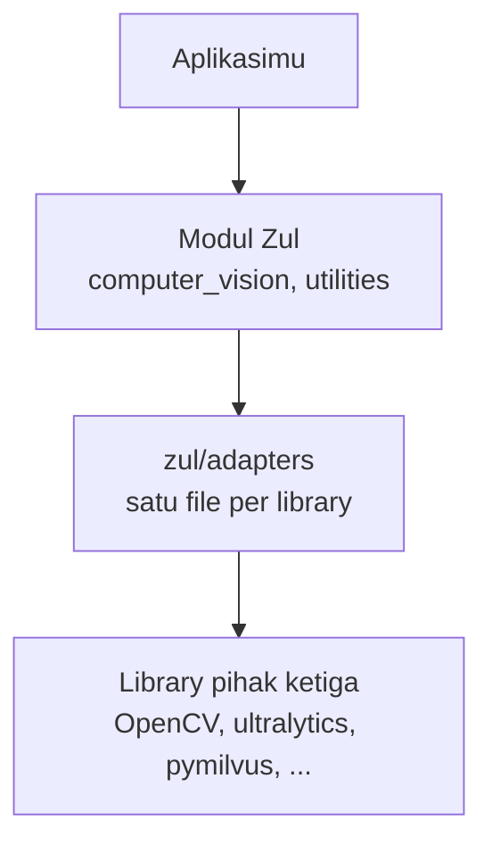

# Lapisan adapter

Zul memakai banyak library pihak ketiga: OpenCV untuk gambar, ultralytics untuk model YOLO, pymilvus untuk vector database, dan lainnya. Halaman ini menjelaskan bagaimana Zul memakai library itu, dan kenapa: setiap library hanya diimpor di satu file di `src/zul/adapters/`, dan modul Zul lain memakai library itu lewat file tersebut.

## Library sebagai induk, Zul sebagai anak

Kode Zul tersusun dalam tiga lapisan:

- **Library pihak ketiga** adalah lapisan induk. Zul tidak pernah mengubah kodenya di tempat ia ter-install.
- **Adapter** adalah satu-satunya kode Zul yang mengimpor library. Setiap adapter menerjemahkan antara library dan tipe yang dipakai Zul: tipe Python biasa dan array NumPy.
- **Modul Zul**, seperti `computer_vision` dan `utilities`, adalah lapisan anak. Modul ini merangkai fungsi dari adapter menjadi alat yang siap dipakai, dan tidak pernah mengimpor library sendiri.

Aplikasimu hanya memakai modul Zul. Contohnya, `draw.draw_corner_text` menulis teks di sudut frame lewat `zul.adapters.opencv`, jadi aplikasi tidak perlu tahu nama konstanta OpenCV seperti `LINE_AA`.

## Kenapa ada lapisan adapter

Tanpa lapisan ini, setiap modul Zul mengimpor library sendiri-sendiri. Mengubah satu perilaku library berarti mencari dan mengubah semua tempat yang memakainya, dan setiap kolaborator bisa mengubahnya dengan cara berbeda.

Dengan lapisan adapter:

- **Satu tempat untuk mengubah perilaku library.** Perilaku yang perlu diubah ditulis sebagai kelas turunan di adapter. Contohnya, semua tracker Zul dibuat dari `ZulBYTETracker`, turunan `BYTETracker` milik ultralytics. Mengubah cara tracker mencocokkan deteksi cukup dengan menurunkan satu method di kelas itu.
- **Mengganti library tanpa mengubah aplikasi.** Jika OpenCV diganti library gambar lain, yang ditulis ulang hanya `zul/adapters/opencv.py`. Modul `draw`, `masks`, dan `video`, serta aplikasi yang memakainya, tidak berubah.
- **Bagian internal library terlihat dan teruji.** Zul memakai dua bagian internal ultralytics: `BYTETracker` dan `attempt_download_asset`. Keduanya hanya dipakai di satu adapter, versi ultralytics dikunci ke `>=8.4.120,<8.5`, dan satu test gagal lebih dulu jika bagian itu berubah.
- **Kolaborator mendapat perubahan yang sama.** Perubahan perilaku library hidup di repository Zul, jadi ditinjau lewat pull request, diuji, dan sampai ke semua orang lewat versi Zul yang sama.

## Aturan adapter

Aturan berikut diperiksa oleh `tests/test_architecture.py` setiap kali test dijalankan:

1. Library pihak ketiga hanya diimpor di `zul/adapters/`, termasuk import di dalam fungsi. Pengecualiannya hanya library di daftar [yang dipakai langsung](#library-yang-dipakai-langsung).
2. Satu file adapter per library, dinamai sesuai library-nya. Daftar adapter dan library yang boleh diimpornya ada di `ADAPTERS` di test itu.
3. Adapter hanya mengimpor library miliknya, NumPy, dan adapter lain, tidak pernah modul Zul di luar `zul/adapters/`. Lapisan induk tidak bergantung pada lapisan anak.
4. Salinan kode library di `zul/adapters/_vendor/` wajib menyertakan file lisensi aslinya.

Jika sebuah modul melanggar aturan pertama, pesan test-nya menyebut modul dan library yang diimpor langsung.

## Daftar adapter

| Adapter | Library | Dipakai oleh | Extra |
|---|---|---|---|
| `yaml` | PyYAML | `computer_vision.config`, `commands.install`, config vector database, `AIService` | Tidak ada |
| `opencv` | OpenCV (`cv2`) | `computer_vision.draw`, `masks`, `video`, `detection` | `vision` |
| `ultralytics` | ultralytics | `computer_vision.detection`, `weights` | `yolo` |
| `milvus` | pymilvus | `MilvusHelper` | `milvus` |
| `redis` | redis, redisvl | `RedisVectorDB`, `RedisHelper` | `redis` |
| `docling` | Docling | `DoclingVLMConverter` | `ocr` |
| `gemini` | google-genai (`google`) | OCR dengan Gemini | `gemini` |
| `langchain_openai` | langchain-openai | `AIService`, `script_helper.ai_models` | `llm` |
| `langgraph` | LangGraph | `react_graph` | `llm` |
| `pypdf` | pypdf, dengan PyPDF2 sebagai cadangan | `PDFProcessor` | `pdf` |
| `langchain_text_splitters` | langchain-text-splitters, langchain-core | `PDFProcessor` | `pdf` |
| `markdown` | Markdown | `MarkdownToPDFConverter` | `converter` |
| `xhtml2pdf` | xhtml2pdf | `MarkdownToPDFConverter` | `converter` |
| `pptx` | python-pptx | `DynamicMarkdownToPPTXService` | `converter` |
| `matplotlib` | Matplotlib | `ChartGenerator` | `analysis` |
| `scipy` | SciPy | `ChartGenerator` | `analysis` |
| `pandas` | pandas | `create_chart_from_csv`, `save_latency_to_csv` | `analysis` |

## Library yang dipakai langsung

Beberapa library tetap dipakai langsung di luar adapter, karena library itu bagian dari bahasa Zul sendiri, bukan alat yang bisa diganti di balik satu adapter:

| Library | Dipakai di | Alasan |
|---|---|---|
| NumPy | `computer_vision`, `ChartGenerator`, `FakeEmbeddingModel`, `RedisVectorDB` | Tipe data untuk kotak, titik, frame, dan vektor. Membungkusnya berarti membuat tipe array sendiri. |
| pydantic | Config vector database, `AIService`, state `react_graph` | Kelas config dan respons Zul sendiri adalah model pydantic. |
| Typer | `zul.cli`, `zul.commands` | Perintah `zul` dibangun dengan Typer. CLI adalah aplikasinya sendiri. |
| InquirerPy | `zul.commands.build` | Pertanyaan interaktif `zul build`, bagian dari CLI. |

## Objek library yang tetap terlihat

Di beberapa tempat, modul Zul bekerja dengan objek yang dibuat library, walaupun library-nya hanya diimpor di adapter:

| Modul | Objek | Alasan |
|---|---|---|
| `computer_vision.detection` | Model dari `load_model` | Hanya untuk diteruskan ke `detect`. Aplikasi tidak perlu memanggil method-nya. |
| `MilvusHelper` | `client` berupa `MilvusClient`, hasil `insert`, `search`, dan `delete` | `client` sengaja dibuka untuk operasi yang tidak dibungkus helper. Hasil pymilvus berupa dict dan list biasa. |
| `RedisVectorDB`, `RedisHelper` | `client` berupa `redis.Redis`, `index` berupa `SearchIndex` | Dibuka sejak awal untuk operasi yang tidak dibungkus helper. |
| `DoclingVLMConverter` | Hasil `convert()` dan `RESPONSE_FORMATS` | `convert()` mengembalikan dokumen Docling utuh. Untuk teks biasa, pakai `convert_to_text` atau `convert_to_markdown`. |
| OCR dengan Gemini | Hasil `create_gemini_client` | Client Gemini diteruskan ke `process_pdf_with_gemini`. |
| `script_helper.ai_models` | Atribut `llm` dan `embedding` | Model LangChain yang dibuka sejak awal. `AIService` di `embedding_service` tidak membukanya. |
| `react_graph` | `builder` dan `graph` | Modul ini contoh LangGraph, jadi graph-nya memang objek LangGraph. |
| `PDFProcessor` | Hasil `chunk_per_page` dan `chunk_recursive_character_splitter` | Berupa `Document` LangChain, karena dipakai langsung oleh vector store LangChain. |
| `DynamicMarkdownToPPTXService` | Slide, shape, dan paragraf python-pptx, `RGBColor` di gaya bawaan | Penyusunan slide bekerja langsung dengan objek python-pptx di seluruh class. Warna juga boleh ditulis sebagai tuple atau `"#RRGGBB"`. |
| `ChartGenerator` | `current_fig` dan `current_ax`, objek Figure dan Axes | Grafik digambar dengan banyak method Axes. Membungkus semuanya sama saja dengan menulis ulang Matplotlib. |

Library-nya tetap hanya diimpor di adapter. Yang lewat hanya objek yang dibuat adapter, jadi mengganti versi atau perilaku library tetap dimulai dari satu file.

## Halaman terkait

- [Mengubah perilaku library pihak ketiga](../panduan/mengubah-perilaku-library.md) untuk langkah mengubah library lewat parameter, kelas turunan, salinan, atau fork.
- [Berkontribusi](../panduan/berkontribusi.md) untuk menjalankan test arsitektur bersama test lainnya.
