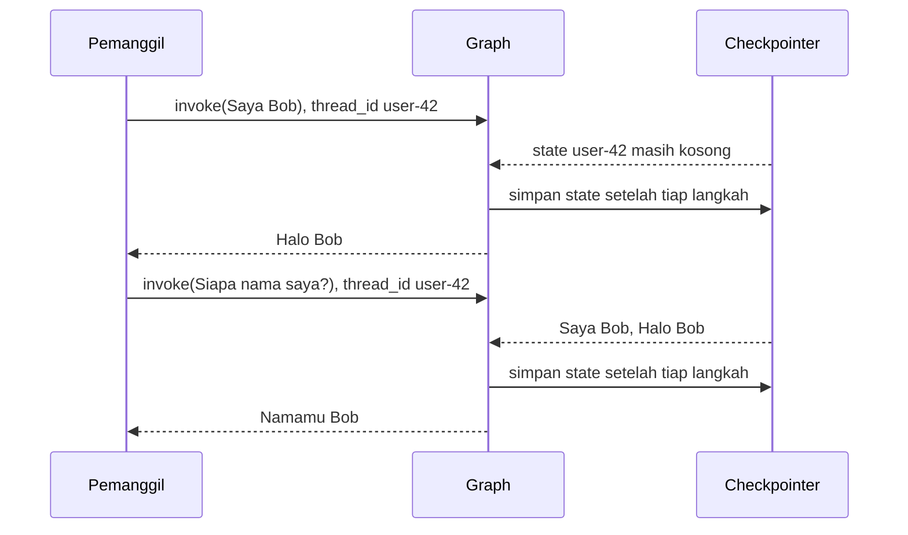

# Memory dan thread

Tanpa memory, agent melupakan semuanya setelah satu jawaban. Template memakai *short-term memory* dari LangGraph: state percakapan disimpan selama agent berjalan dan dimuat lagi saat percakapan dilanjutkan.

Kodenya ada di `src/infrastructure/AI/memory/checkpointer.py`.

## Checkpointer dan thread

Memory dibentuk oleh dua hal yang bekerja berpasangan.

**Checkpointer** adalah penyimpan state. Setelah setiap langkah graph, ia menyimpan state terbaru. Checkpointer diberikan sekali, saat agent dirakit.

**`thread_id`** adalah kunci percakapan. Ia dikirim pada setiap pemanggilan. Pemanggilan dengan `thread_id` yang sama memuat state yang tersimpan; `thread_id` baru memulai percakapan kosong.

Diagram berikut menunjukkan dua pemanggilan di thread yang sama:



Pada pemanggilan kedua, pemanggil hanya mengirim pesan baru. Checkpointer yang melengkapinya dengan riwayat, sehingga LLM menerima seluruh percakapan: pesan pertama, jawabannya, lalu pesan baru.

Dalam kode, pasangan itu terlihat seperti ini:

```python
from langgraph.checkpoint.memory import InMemorySaver

agent = build_react_agent(llm=llm, tools=tools, checkpointer=InMemorySaver())

config = {"configurable": {"thread_id": "user-42"}}

agent.invoke({"messages": [{"role": "user", "content": "Saya Bob"}]}, config)
agent.invoke({"messages": [{"role": "user", "content": "Siapa nama saya?"}]}, config)
```

Agent yang dirakit dengan checkpointer menuntut `thread_id` pada setiap pemanggilan. Tanpa kunci itu, LangGraph melempar `ValueError`, karena ia tidak tahu percakapan mana yang harus dimuat.

## Apa yang tersimpan

Yang disimpan adalah state graph, yaitu `AgentState`. Isinya yang bertahan antar pemanggilan adalah `messages`: pesan user, jawaban model beserta tool call-nya, dan hasil setiap tool.

Beberapa hal yang mungkin kamu kira tersimpan ternyata tidak ada di sana:

- **System prompt tidak tersimpan.** Node `llm_call` menaruhnya di depan riwayat pada setiap pemanggilan. Karena itu perubahan prompt langsung berlaku untuk percakapan lama.
- **Sisa langkah tidak diwariskan.** `remaining_steps` dihitung dari `recursion_limit` pemanggilan yang sedang berjalan. Setiap pesan mendapat jatah langkahnya sendiri.
- **Konteks subagent tidak tersimpan.** Subagent dirakit tanpa checkpointer. Riwayat supervisor hanya memuat query yang ia kirim dan jawaban akhir yang ia terima.

Satu hal lagi ikut tersimpan: graph yang sedang berhenti di `interrupt()`.

Karena seluruh `messages` dikirim ke LLM pada setiap giliran, riwayat yang tumbuh membuat percakapan panjang makin mahal dan pada akhirnya melewati batas konteks model. Template belum memangkas atau merangkum riwayat.

Untuk melihat isi sebuah thread, misalnya saat debugging, baca state-nya dengan `get_state`:

```python
snapshot = agent.get_state({"configurable": {"thread_id": "user-42"}})

for message in snapshot.values["messages"]:
    print(type(message).__name__, message.content)
```

Untuk thread yang belum pernah dipakai, `snapshot.values` berupa dict kosong.

## Dari mana `thread_id` berasal

Di REST API, `thread_id` ditentukan di controller. Jika client mengirimnya, nilai itu dipakai. Jika tidak, controller membuat ID acak dan mengembalikannya di respons supaya client bisa melanjutkan percakapan. Use case lalu meneruskannya ke agent bersama batas langkah:

```python title="src/application/usecases/chat.py"
config = {
    "recursion_limit": self._max_agent_steps,
    "configurable": {"thread_id": thread_id},
}
```

`thread_id` boleh berupa teks apa saja. Karena ia hanya kunci, kamu bisa mengikatnya ke sesuatu yang sudah kamu punya:

| Kebutuhan | Contoh `thread_id` |
|---|---|
| Satu percakapan panjang per user | `user-42` |
| Beberapa percakapan per user | `user-42:chat-7` |
| Satu percakapan per channel Discord | ID channel |
| Satu percakapan per tiket | `ticket-1042` |

Kebebasan itu juga sebuah risiko. Template tidak memeriksa kepemilikan thread, karena ia tidak tahu siapa user-mu.

> [!WARNING]
> Siapa pun yang mengetahui sebuah `thread_id` bisa melanjutkan dan membaca percakapan itu lewat API. Jika API-mu dipakai banyak user, bentuk `thread_id` di server dari identitas user yang sudah terautentikasi, bukan dari nilai yang dikirim client.

## Satu penyimpan per agent

`get_checkpointer()` mengembalikan penyimpan baru setiap kali dipanggil:

```python title="src/infrastructure/AI/memory/checkpointer.py"
def get_checkpointer() -> InMemorySaver:
    """
    Checkpointer untuk development.

    InMemorySaver menyimpan percakapan di memori proses, jadi hilang saat
    aplikasi restart dan tidak terbagi antar worker. Untuk produksi ganti
    dengan checkpointer berbasis database, misalnya PostgresSaver dari
    package `langgraph-checkpoint-postgres`.
    """
    return InMemorySaver()
```

Setiap perakit agent di controller memanggilnya sendiri. Akibatnya ada dua.

Pertama, ketiga agent punya penyimpan yang terpisah. `thread_id` yang dipakai di `POST /chat` tidak dikenal oleh `POST /hitl/chat` maupun `POST /subagents/chat`. Percakapan milik satu agent tidak bisa dilanjutkan di agent lain.

Kedua, perakit agent harus dipanggil satu kali saja. Itulah tugas `@lru_cache` di controller. Tanpa dekorator itu, setiap request membuat agent baru dengan penyimpan kosong, dan percakapan sebelumnya tidak ditemukan lagi.

## Kenapa `InMemorySaver` hanya untuk development

`InMemorySaver` menyimpan percakapan di memori proses. Ia tidak butuh layanan lain, sehingga proyek baru bisa langsung dicoba. Sifat yang sama membuatnya tidak layak untuk produksi, karena dua alasan:

- **Percakapan hilang saat server berhenti atau dimulai ulang.** Isinya hanya ada di memori proses.
- **Percakapan tidak dibagi antar proses.** Jika server dijalankan dengan beberapa worker, request berikutnya bisa mendarat di worker yang tidak punya percakapannya.

Untuk produksi, penyimpan diganti dengan checkpointer berbasis database, misalnya `PostgresSaver` dari package `langgraph-checkpoint-postgres`, seperti dijelaskan di [dokumentasi LangGraph](https://docs.langchain.com/oss/python/langgraph/add-memory).

Penggantian itu tidak menyentuh agent maupun use case. Perakit agent menerima checkpointer lewat parameter, dan satu-satunya kode yang tahu jenis penyimpannya adalah `get_checkpointer()` di layer `infrastructure`. Inilah keuntungan aturan dependensi yang dibahas di [Perjalanan sebuah request](alur-request.md). Langkah penggantiannya ada di [panduan menyimpan percakapan di database](../panduan/menyimpan-percakapan.md).

## Agent tanpa memory

Checkpointer bersifat opsional di `build_react_agent`. Jika tidak diberikan, agent bersifat *stateless*: setiap pemanggilan berdiri sendiri dan `thread_id` diabaikan.

Sifat ini cocok untuk tugas satu kali jalan, seperti merangkum dokumen. Template juga memakainya dengan sengaja: setiap subagent dirakit tanpa checkpointer supaya setiap delegasi mulai dari konteks kosong. Alasannya dibahas di [Cara kerja subagents](subagents.md).

## Hubungan dengan human-in-the-loop

Untuk agent ReAct, memory adalah kenyamanan: tanpa memory, agent tetap bisa menjawab satu pesan. Untuk agent human-in-the-loop, memory adalah syarat.

Saat node `human_review` memanggil `interrupt()`, graph berhenti dan seluruh state-nya, termasuk tool call yang belum dijalankan, disimpan oleh checkpointer. Request berikutnya, yang membawa keputusan manusia, menemukan graph yang berhenti itu lewat `thread_id`. Tanpa checkpointer tidak ada tempat untuk menyimpannya, sehingga `build_human_in_the_loop_agent` mewajibkan parameter `checkpointer`.

Use case juga membaca penyimpan itu untuk mengetahui keadaan thread:

```python title="src/application/usecases/reviewed_chat.py"
def _pending_review(self, config: dict[str, Any]) -> dict[str, Any] | None:
    """Payload interrupt yang sedang menunggu di thread ini, atau None."""
    interrupts = self._agent.get_state(config).interrupts

    return interrupts[0].value if interrupts else None
```

Jadi di agent ini checkpointer mengerjakan dua hal: mengingat percakapan dan menahan pekerjaan yang sedang menunggu. Kehilangan yang kedua lebih terasa. Dengan `InMemorySaver`, aksi yang menunggu keputusan ikut hilang saat server dimulai ulang. Manusia yang kemudian mengirim keputusannya menerima HTTP 400 karena tidak ada lagi aksi yang menunggu di thread itu. Ini alasan tambahan untuk memakai penyimpan berbasis database sebelum agent human-in-the-loop dipakai sungguhan.

## Halaman terkait

- [Konsep: Cara kerja agent ReAct](agent-react.md)
- [Konsep: Cara kerja human-in-the-loop](human-in-the-loop.md)
- [Konsep: Cara kerja subagents](subagents.md)
- [Konsep: Perjalanan sebuah request](alur-request.md)
- [Referensi: API agent](../referensi/agent.md)
- [Referensi: HTTP API](../referensi/http-api.md)
- [Panduan: Menyimpan percakapan di database](../panduan/menyimpan-percakapan.md)
