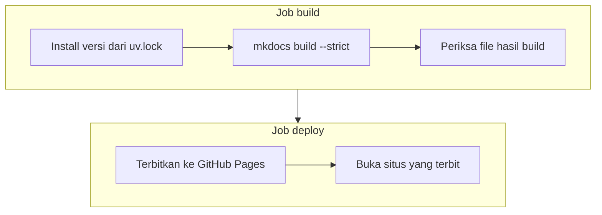

# Cara situs dokumentasi diterbitkan

Situs ini terbit ke GitHub Pages lewat workflow GitHub Actions yang mengunci semua versi dan memeriksa hasilnya berlapis. Rincian setiap langkah ada di [Workflow dokumentasi](../referensi/workflow-dokumentasi.md).

## Dari push sampai situs terbit

Setiap push ke `main` yang mengubah dokumentasi melewati urutan yang sama:

Setiap kotak bisa menghentikan penerbitan. Jika satu langkah gagal, situs yang sedang terbit tidak berubah, jadi pembaca tetap melihat versi terakhir yang lolos.

Pull request hanya menjalankan job build. Kesalahan di pull request ketahuan sebelum digabung, tanpa menyentuh situs yang terbit.

## Masalah yang dicegah

Penerbitan dokumentasi bisa gagal walaupun isi halamannya tidak berubah, karena lingkungan build-nya berubah di luar repository. Workflow ini dirancang untuk enam masalah berikut:

| Masalah | Pencegahnya |
|---|---|
| Situs di CI berbeda dengan yang kamu lihat di komputermu | Versi paket diambil dari `uv.lock` yang sama |
| Kode sebuah action berubah tanpa kamu tahu | Action dikunci ke commit SHA |
| Image runner berganti, misalnya `ubuntu-latest` pindah ke versi Ubuntu baru | Runner, uv, dan Python ditulis dengan versi persis |
| Penerbitan berhenti di tengah karena ada push baru | Run penerbitan tidak pernah dibatalkan |
| Tautan rusak atau tulisan tanpa tanggal baru ketahuan setelah terbit | Build `--strict`, juga di pull request |
| Penerbitan dilaporkan sukses, tetapi situsnya tidak bisa dibuka | Situs dibuka setelah terbit, dan run gagal jika tidak ada jawaban |

## Satu sumber versi

Jika versi tool dokumentasi ditulis di dua tempat, misalnya di `pyproject.toml` untuk komputermu dan di file requirements terpisah untuk CI, keduanya lama-lama berbeda. Batas yang longgar seperti `mkdocs-material>=9.7` juga membuat CI meng-install rilis baru yang belum pernah kamu coba.

Karena itu tool dokumentasi ditulis sekali, sebagai grup `docs` di `pyproject.toml`, dan versi persisnya tercatat di `uv.lock`. Grup `dev` memuat grup `docs`, sehingga `uv sync` di komputermu dan `uv sync --only-group docs` di CI meng-install paket yang sama, sampai ke hash file-nya. Versi baru hanya masuk saat kamu menjalankan `uv lock` dan meng-commit hasilnya.

Workflow memakai `--frozen`, bukan `--locked`. `--locked` menolak bekerja jika `uv.lock` tidak cocok dengan `pyproject.toml`, termasuk untuk paket yang tidak ada hubungannya dengan dokumentasi. Dengan `--frozen`, penerbitan dokumentasi tidak terhalang oleh perubahan dependency lain. Akibatnya, jika kamu menambah paket ke grup `docs` tanpa menjalankan `uv lock`, paket itu tidak ter-install di CI, dan build gagal dengan pesan bahwa plugin atau ekstensinya tidak ditemukan.

## Action yang dikunci ke commit

Tag seperti `v7` hanyalah penunjuk yang bisa dipindah oleh pemilik action ke commit lain. Workflow yang memakai `@v7` bisa menjalankan kode yang berbeda dari minggu lalu, walaupun file workflow-nya tidak berubah. Commit SHA tidak bisa dipindah, jadi `@3d3c42e...` selalu menjalankan kode yang sama.

Harga dari pengunci ini, perbaikan dari pemilik action tidak masuk dengan sendirinya. Dependabot menutupnya: sebulan sekali ia membuka pull request yang mengganti SHA ke rilis terbaru, dan job `build` berjalan di pull request itu. Versi baru masuk setelah terbukti bisa membangun situs, dan setelah kamu menggabungkannya. Komentar `# v7.0.1` di samping setiap SHA ada supaya kamu tahu versi mana yang sedang dipakai.

## Antrian penerbitan

GitHub Pages hanya menampilkan satu versi situs. Jika dua push datang berdekatan, penerbitan pertama tetap dibiarkan selesai, dan penerbitan kedua menunggu. Membatalkan penerbitan yang sedang berjalan bisa meninggalkan deployment yang tidak selesai. Run yang masih menunggu boleh digantikan oleh run yang lebih baru, karena hanya versi terakhir yang perlu terbit.

Build pull request diperlakukan berbeda: hasilnya tidak diterbitkan, jadi build lama boleh dibatalkan begitu ada commit baru di pull request yang sama.

## Pemeriksaan berlapis

Setiap pemeriksaan menangkap kesalahan yang tidak tertangkap oleh pemeriksaan sebelumnya:

- **`mkdocs build --strict`** menangkap kesalahan di isi: tautan atau anchor yang rusak, tulisan blog tanpa tanggal, tanpa ringkasan, atau dengan penulis yang tidak dikenal. Mode `--strict` mengubah setiap peringatan menjadi kegagalan.
- **Pemeriksaan hasil build** memastikan halaman utama, halaman 404, dan halaman blog benar-benar ada di folder `site/` sebelum diunggah. Contohnya, jika `site_dir` di `mkdocs.yml` diganti, build tetap sukses tetapi folder `site/` tidak terisi. Pemeriksaan ini menghentikan run dengan pesan yang menyebut file yang tidak ada.
- **Pemeriksaan situs yang terbit** menangkap masalah di GitHub Pages, misalnya pengaturan Source yang berubah. Permintaan diulang sampai lima kali, karena jaringan pengiriman GitHub Pages butuh beberapa detik untuk menyebarkan versi baru.

## Tanggal dan draf di blog

Plugin blog mengurutkan tulisan, menyusun arsip per bulan, dan membentuk alamat halaman dari tanggal tulisan. Karena itu tanggal wajib ada: tulisan tanpa tanggal tidak punya tempat di urutan, arsip, maupun alamatnya, dan build menolaknya. `scripts/new_post.py` mengisi tanggal ini otomatis.

Ringkasan di atas `<!-- more -->` juga diwajibkan, supaya halaman daftar tulisan tidak menampilkan seluruh isi tulisan yang panjang.

Draf memisahkan menulis dari menerbitkan. Tulisan dengan `draft: true` bisa dibaca di `mkdocs serve`, tetapi tidak ikut terbit, jadi tulisan bisa di-commit dan diperiksa sebelum siap dibaca orang lain.

## Yang tetap tidak dijamin

- **Tautan ke situs lain tidak diperiksa.** Situs lain bisa berubah atau sedang mati kapan saja. Memeriksanya membuat penerbitan gagal karena hal yang tidak bisa kamu perbaiki dari repository ini.
- **Tampilan tidak diperiksa.** Workflow memastikan halaman ada dan bisa dibuka, bukan bahwa tampilannya benar. Tampilan hanya terlihat lewat `uv run mkdocs serve` atau di situs yang sudah terbit.
- **Gangguan di GitHub tetap bisa menggagalkan run.** Run seperti itu bisa dijalankan ulang dari tab **Actions**. Artifact disimpan tujuh hari, jadi job `deploy` bisa diulang tanpa membangun ulang situsnya.
- **Versi paket Python tidak diperbarui otomatis.** Dependabot hanya memperbarui action. Tema dan plugin diperbarui saat kamu menjalankan `uv lock --upgrade-package`.
- **Pengaturan Pages ada di luar repository.** Jika Source di **Settings > Pages** diubah dari **GitHub Actions**, langkah penerbitan gagal sampai pengaturannya dikembalikan.

## Halaman terkait

- [Workflow dokumentasi](../referensi/workflow-dokumentasi.md) untuk rincian setiap langkah dan versi yang dikunci.
- [Menerbitkan dokumentasi](../panduan/menerbitkan-dokumentasi.md) untuk langkah menerbitkan dan memperbarui versi.
- [Menulis tulisan blog](../panduan/menulis-blog.md) untuk membuat tulisan bertanggal.
