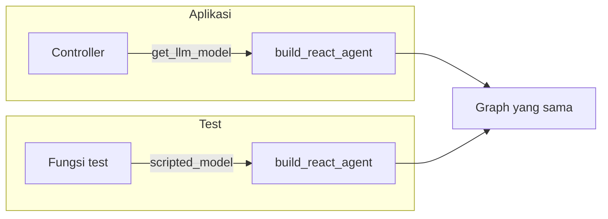

# Menguji tanpa LLM asli

Test di proyek hasil `zul build hexa` tidak pernah memanggil LLM sungguhan: LLM diganti model palsu yang menjawab sesuai naskah.

Kode yang dibahas ada di `test/conftest.py` dan `test/test_chat_usecase.py`. Polanya mengikuti [panduan unit testing LangChain](https://docs.langchain.com/oss/python/langchain/test/unit-testing).

## Masalah menguji dengan LLM asli

Agent bergantung pada LLM, dan LLM punya tiga sifat yang buruk untuk test:

- **Lambat.** Setiap pemanggilan memakan waktu, dan satu giliran agent bisa memanggil LLM beberapa kali.
- **Berbayar.** Setiap kali test dijalankan, ada token yang dibayar, dan test butuh API key.
- **Berubah-ubah.** Pertanyaan yang sama bisa dijawab dengan kalimat yang berbeda, sehingga pemeriksaan terhadap teks jawaban kadang lolos dan kadang gagal.

Test yang lambat dan berbayar jarang dijalankan. Test yang hasilnya berubah-ubah tidak dipercaya. Keduanya menghilangkan kegunaan test.

Template menyelesaikannya dengan mengganti LLM dengan model palsu yang menjawab sesuai naskah. Hasilnya, test berjalan dalam hitungan detik, tanpa API key, dan selalu memberi hasil yang sama.

## Model palsu yang menjawab sesuai naskah

Model palsu itu adalah kelas kecil di `conftest.py`, dibangun di atas `GenericFakeChatModel` milik LangChain:

```python title="test/conftest.py"
class FakeToolCallingModel(GenericFakeChatModel):
    """Model palsu yang bisa di-bind tools dan mencatat pesan yang diterimanya."""

    received: list = Field(default_factory=list)
    bound_tools: list = Field(default_factory=list)

    def bind_tools(self, tools, **_kwargs):
        self.bound_tools = list(tools)
        return self

    def _generate(self, messages, *args, **kwargs):
        self.received.append(messages)
        return super()._generate(messages, *args, **kwargs)


@pytest.fixture
def scripted_model():
    """Factory LLM palsu: `scripted_model("jawaban 1", "jawaban 2", ...)`."""

    def build(*responses) -> FakeToolCallingModel:
        return FakeToolCallingModel(messages=iter(responses))

    return build
```

Naskahnya adalah daftar respons: satu respons untuk setiap pemanggilan LLM, sesuai urutan. Respons berupa teks menjadi jawaban biasa. Respons berupa `AIMessage` berisi `tool_calls` membuat model seolah-olah meminta sebuah tool.

Dua method tambahannya mengubah model palsu ini menjadi pengamat:

- `bind_tools` dibutuhkan karena perakit agent memanggil `llm.bind_tools(tools)`. Versi palsunya mencatat tool yang diberikan agent ke `bound_tools`, lalu mengembalikan dirinya sendiri.
- `_generate` mencatat pesan yang diterima model ke `received`, satu entri per pemanggilan.

Lewat dua catatan itu, test bisa memeriksa bukan hanya jawaban agent, tetapi juga apa yang dikirim agent ke LLM.

## Hanya keputusan model yang dipalsukan

Hal terpenting dari pendekatan ini adalah seberapa sedikit yang diganti. Graph-nya asli. Tool-nya asli. Checkpointer-nya asli. Yang dinaskahkan hanya keputusan model: kapan ia meminta tool dan apa jawabannya.

Test contoh berikut menunjukkan akibatnya:

```python title="test/test_chat_usecase.py"
def test_agent_runs_the_tool_and_answers_with_its_result(scripted_model):
    llm = scripted_model(weather_tool_call(), "Cerah di San Francisco.")

    answer = build_usecase(llm).execute("cuaca di sf?", thread_id="t1")

    assert answer == "Cerah di San Francisco."
    tool_results = [m for m in llm.received[1] if isinstance(m, ToolMessage)]
    assert "sunny in San Francisco" in tool_results[0].content
```

Naskahnya berisi dua respons: permintaan tool, lalu jawaban akhir. Pemeriksaan terakhir membaca `llm.received[1]`, yaitu pesan pada pemanggilan LLM kedua, dan menemukan `ToolMessage` berisi hasil `get_weather` yang sungguh dijalankan. Jadi test ini membuktikan rantai yang nyata: routing mengirim tool call ke `tool_node`, tool berjalan, dan hasilnya sampai ke LLM.

Naskah punya satu syarat: jumlah responsnya harus sama dengan jumlah pemanggilan LLM. Agent yang memakai satu tool memanggil LLM dua kali. Jika naskah habis lebih dulu, test gagal dengan `RuntimeError: generator raised StopIteration`. Kegagalan itu berguna: ia memberi tahu bahwa agent memanggil LLM lebih sering daripada yang kamu perkirakan.

## Kenapa arsitekturnya memungkinkan

Model palsu itu bisa dipasang tanpa trik apa pun, dan itu bukan kebetulan. Tiga sifat arsitektur template membuka jalannya.

### LLM datang lewat parameter

Layer `application` tidak mengimpor `infrastructure`. Perakit agent tidak pernah membuat chat model sendiri; ia menerimanya:

```python title="test/test_chat_usecase.py"
def build_usecase(llm, checkpointer=None) -> ChatUseCase:
    agent = build_react_agent(llm=llm, tools=[get_weather], checkpointer=checkpointer)
    return ChatUseCase(agent)
```

Baris itu sama bentuknya dengan perakit di controller. Bedanya hanya nilai `llm`: controller memberi hasil `get_llm_model()`, test memberi hasil `scripted_model(...)`. Diagram berikut menunjukkan kedua jalur itu:



Bandingkan dengan rancangan yang tidak dipilih. Jika node `llm_call` membuat `ChatOpenAI` sendiri di dalamnya, test harus menambal isi modul itu supaya tidak memanggil OpenAI. Test seperti itu bergantung pada rincian dalam kode, dan rusak setiap kali rincian itu berubah.

### Use case menerima port, bukan kelas tertentu

`ChatUseCase` tidak menuntut graph LangGraph. Ia menerima apa pun yang punya method `invoke` dengan bentuk yang sesuai, yang dinyatakan sebagai protocol `ChatAgent`. Karena itu use case bisa diuji bahkan tanpa graph:

```python
class FakeAgent:
    def invoke(self, input, config=None):
        return {"messages": [AIMessage(content="Halo juga!")]}


assert ChatUseCase(FakeAgent()).execute("halo", "t1") == "Halo juga!"
```

Test seperti ini hanya memeriksa pekerjaan use case: validasi pesan dan pengambilan teks jawaban.

### Composition root bisa diganti

Router meminta use case lewat `Depends(get_chat_usecase)`, dan FastAPI mengizinkan fungsi itu diganti untuk sementara. Test endpoint memakai celah itu untuk menyuntikkan use case ber-LLM palsu:

```python
app.dependency_overrides[get_chat_usecase] = lambda: usecase
```

Dengan satu baris itu, request lewat `TestClient` menempuh router, validasi Pydantic, controller, use case, dan graph yang asli, dan hanya LLM-nya yang palsu.

## Apa yang dibuktikan

Test dengan model palsu memeriksa alur aplikasimu, yaitu semua hal yang perilakunya ditentukan oleh kodemu sendiri:

- Routing graph: tool call menuju `tool_node`, jawaban tanpa tool call mengakhiri graph.
- Pemanggilan tool: tool yang diminta sungguh dijalankan, dan hasilnya sampai ke LLM.
- Memory: `thread_id` yang sama melanjutkan percakapan, `thread_id` lain memulai yang baru.
- Validasi: pesan kosong ditolak sebelum mencapai LLM.
- Batas langkah: model yang terus meminta tool berakhir dengan jawaban penutup, bukan error.
- Alur review: tool tidak berjalan sebelum disetujui, dan keputusan yang salah bentuk ditolak.
- Endpoint: kode status dan bentuk respons.

Empat test contoh di `test/test_chat_usecase.py` mencakup jawaban langsung, pemanggilan tool, memory, dan validasi. Butir lain di daftar ini diuji dengan pola yang sama.

Semua itu bersifat pasti. Untuk naskah yang sama, kode yang benar selalu memberi hasil yang sama. Itulah jenis perilaku yang layak dijaga oleh test otomatis.

## Apa yang tidak dibuktikan

Naskah adalah anggapanmu tentang perilaku model. Test lolos selama kodemu benar untuk anggapan itu, walaupun model sungguhan tidak pernah berperilaku demikian. Karena itu test ini tidak memeriksa hal berikut:

- Apakah model sungguhan memilih tool yang tepat untuk sebuah pertanyaan.
- Apakah prompt menghasilkan jawaban yang baik.
- Apakah deskripsi dan skema tool dipahami model. Model palsu menerima tool apa pun tanpa memeriksanya.
- Apakah endpoint LLM dan API key-mu bekerja.

Untuk hal-hal itu kamu butuh test yang memanggil model sungguhan. Test seperti itu lambat, berbayar, dan hasilnya bisa berubah, jadi pisahkan dari test cepat, misalnya dengan marker pytest, dan jalankan hanya saat dibutuhkan.

Pembagian ini bukan kelemahan pendekatannya, melainkan batasnya. Test cepat menjaga bahwa aplikasimu melakukan hal yang benar untuk setiap keputusan model. Test dengan model asli menjaga bahwa model mengambil keputusan yang baik. Keduanya menjawab pertanyaan yang berbeda.

## Halaman terkait

- [Panduan: Menguji agent](../panduan/menguji-agent.md)
- [Konsep: Perjalanan sebuah request](alur-request.md)
- [Konsep: Arsitektur hexagonal](arsitektur-hexagonal.md)
- [Referensi: Struktur proyek hexa](../referensi/struktur-proyek.md)
- [Referensi: API agent](../referensi/agent.md)
