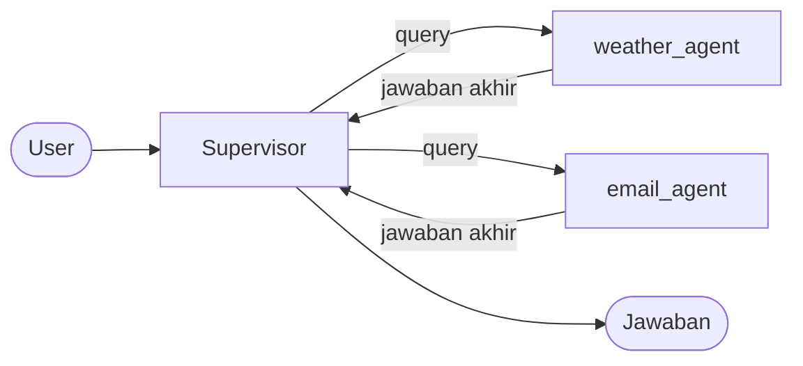

# Cara kerja subagents

Satu agent dengan banyak tool dari bidang yang berbeda cenderung bingung: prompt-nya panjang, dan model sering memilih tool yang salah. Pola subagents memecah pekerjaan itu. Satu agent utama, yang disebut supervisor, menerima permintaan user dan mendelegasikan tiap bagian ke subagent yang ahli di satu bidang.

Halaman ini menjelaskan bagaimana delegasi itu bekerja, kenapa subagent tidak punya memory, kenapa supervisor hanya melihat pesan terakhir subagent, dan kapan pola ini cocok. Kodenya ada di `src/application/AI/agents/subagents/subagents.py`. Polanya mengikuti [subagents dari LangChain](https://docs.langchain.com/oss/python/langchain/multi-agent/subagents).

## Pola tool per agent

Template tidak membuat jenis graph baru untuk supervisor. Supervisor adalah agent ReAct biasa. Yang membedakannya adalah tool-nya: setiap tool adalah satu subagent yang dibungkus. Diagram berikut menunjukkan hubungannya:



Dari sudut supervisor, memanggil subagent sama dengan memanggil tool apa pun: ia menulis nama tool dan satu argumen `query`, lalu menerima teks sebagai hasilnya. Ia tidak tahu bahwa di balik tool itu ada agent lain dengan LLM, prompt, dan tool sendiri.

Pembungkusnya adalah fungsi `build_subagent_tool`:

```python title="src/application/AI/agents/subagents/subagents.py"
subagent = build_react_agent(
    llm=spec.llm or default_llm,
    tools=spec.tools,
    system_prompt=spec.system_prompt,
)

@tool(spec.name, description=spec.description)
def call_subagent(query: str) -> str:
    result = subagent.invoke(
        {"messages": [{"role": "user", "content": query}]},
        {"recursion_limit": MAX_SUBAGENT_STEPS},
    )

    return str(result["messages"][-1].text)
```

Tiga keputusan rancangan terlihat di potongan itu: subagent dirakit tanpa checkpointer, ia menerima satu `query` sebagai satu-satunya masukan, dan yang dikembalikan hanya teks pesan terakhirnya. Bagian-bagian berikut membahas alasan dan akibat masing-masing.

`build_supervisor_agent` lalu mengubah setiap `SubagentSpec` menjadi tool dengan cara itu dan merakit supervisor dengan `build_react_agent`. Karena supervisor adalah agent ReAct, ia dipanggil lewat `ChatUseCase` yang sama dan mendapat memory, batas langkah, dan penanganan error yang sama.

## Bagaimana supervisor memilih

Supervisor memilih subagent hanya dari `name` dan `description`. Keduanya menjadi nama dan deskripsi tool yang dikirim ke LLM. Supervisor tidak melihat system prompt maupun tool milik subagent.

Akibatnya, dua field itu menentukan benar tidaknya delegasi. Deskripsi bawaan template menjawab tiga pertanyaan: tugas apa yang ditangani, masukan apa yang dibutuhkan, dan apa yang dikembalikan. Contohnya deskripsi `weather_agent`:

```python title="src/interface/http/controllers/subagents_controller.py"
description=(
    "Look up current weather for one or more locations. "
    "Give it the location names; it returns the weather for each."
),
```

Keuntungan sampingannya: menambah subagent tidak mengubah prompt supervisor. Prompt itu hanya berkata bahwa setiap tool adalah satu subagent; daftar dan deskripsinya datang dari tool yang terpasang.

## Kenapa subagent tanpa memory

Subagent dirakit tanpa checkpointer, sehingga setiap delegasi mulai dari percakapan kosong. Ia tidak mengingat delegasi sebelumnya, dan ia tidak melihat percakapan antara user dan supervisor. Yang ia terima hanya system prompt miliknya dan satu `query`.

Ada dua alasan untuk pilihan ini.

Pertama, hanya boleh ada satu pemilik riwayat percakapan. Supervisor menyimpannya per `thread_id` lewat checkpointer miliknya. Jika subagent juga menyimpan riwayat, ada dua versi percakapan yang bisa saling bertentangan, dan tidak jelas mana yang benar.

Kedua, konteks kosong membuat subagent bisa diperkirakan. Jawabannya hanya bergantung pada query yang ia terima, bukan pada sisa delegasi lama.

Harganya dibayar oleh supervisor: ia harus menulis query yang lengkap. Kalau user berkata "kirim itu ke Alice" dan supervisor meneruskan kalimat itu apa adanya, subagent email tidak tahu apa "itu". Karena itu prompt supervisor memintanya secara eksplisit:

```text
A subagent only sees the query you give it, not this conversation,
so write each query as a complete, self-contained instruction.
```

## Kenapa supervisor hanya melihat pesan terakhir

Fungsi pembungkus mengembalikan `result["messages"][-1].text`, yaitu teks pesan terakhir subagent. Tool call, hasil tool, dan langkah-langkah subagent yang lain tidak ikut dikirim ke supervisor.

Inilah inti pola ini: detail pekerjaan berhenti di konteks subagent. Riwayat supervisor hanya berisi pertanyaan user, query ke subagent, dan ringkasan hasilnya. Riwayat itu tetap pendek walaupun subagent bekerja dalam banyak langkah, sehingga setiap pemanggilan LLM supervisor lebih murah dan lebih terfokus.

Akibat buruknya juga jelas. Jika subagent menjalankan tool tetapi tidak menyebut hasilnya di jawaban akhir, hasil itu hilang; supervisor tidak punya cara untuk melihatnya. Template menutup celah ini dari sisi prompt. Setiap prompt subagent diakhiri aturan yang sama:

```python title="src/domain/templates/prompt/subagents/subagents_prompt_templates.py"
_SUBAGENT_OUTPUT_RULE = """
Your final message is the only thing the supervisor sees. Put every result it
needs (facts, confirmations, anything that failed) in that final message.
"""
```

Perhatikan bahwa aturan itu juga menyebut kegagalan. Supervisor hanya bisa memberi tahu user bahwa sesuatu gagal jika subagent menuliskannya.

## Batas langkah subagent

Setiap tugas subagent punya batas langkahnya sendiri, `MAX_SUBAGENT_STEPS`, yang bernilai 15. Batas ini terpisah dari batas supervisor.

Pemisahan itu disengaja. Dari sudut supervisor, satu delegasi adalah satu putaran tool: dua langkah, berapa pun langkah yang dipakai subagent di dalamnya. Subagent yang terus memanggil tool tidak menghabiskan jatah langkah supervisor, dan supervisor yang banyak mendelegasikan tidak mempersempit ruang kerja tiap subagent.

Subagent adalah agent ReAct, jadi ia memakai penjagaan langkah yang sama. Saat langkahnya hampir habis, ia menutup dengan jawaban penutup, dan teks itulah yang diterima supervisor sebagai hasil tool. Dengan dua langkah per putaran, 15 langkah memberi subagent enam putaran tool. Cara menghitungnya dijelaskan di [Cara kerja agent ReAct](agent-react.md).

## Model per subagent

Secara bawaan, semua subagent memakai chat model yang sama dengan supervisor. Field `llm` pada `SubagentSpec` mengizinkan satu subagent memakai model lain.

Kemungkinan ini muncul dari pemisahan konteks tadi. Karena subagent hanya menerima satu query dan mengembalikan satu teks, ia tidak perlu memakai model yang sama dengan pemanggilnya. Tugas sempit seperti mencari cuaca bisa memakai model yang lebih murah, sementara supervisor, yang harus memahami permintaan user dan membaginya, memakai model yang lebih kuat.

## Kapan pola ini cocok

Subagents menambah pemanggilan LLM. Setiap delegasi berarti minimal satu pemanggilan untuk subagent, di luar pemanggilan supervisor. Pola ini layak dipakai saat pemisahan bidang memang dibutuhkan.

| Situasi | Pilihan |
|---|---|
| Beberapa tool dari satu bidang | Agent ReAct |
| Tool dari bidang yang berbeda, masing-masing butuh instruksi sendiri | Subagents |
| Tugas panjang yang memenuhi riwayat percakapan dengan detail | Subagents, supaya detailnya berhenti di konteks subagent |
| Subagent perlu bercakap langsung dengan user | Bukan pola ini; subagent hanya menjawab ke supervisor |

## Batasan rancangan ini

Beberapa hal mengikuti langsung dari cara subagent dibungkus:

- Delegasi berjalan sinkron. Supervisor menunggu subagent selesai, sehingga tugas subagent yang lama membuat request ikut lama.
- State subagent tidak bisa dibaca lewat `get_state` milik supervisor, karena subagent dipanggil dari dalam fungsi tool.
- Subagent tidak punya langkah persetujuan manusia. Agent human-in-the-loop dan pola ini berdiri sendiri; menggabungkannya belum disediakan.

> [!WARNING]
> `email_agent` menjalankan `send_email` tanpa persetujuan manusia. Di template tool itu hanya placeholder, tetapi setelah kamu menyambungkannya ke layanan email sungguhan, setiap permintaan yang didelegasikan ke `email_agent` langsung terkirim.

## Lihat juga

- [Konsep: Cara kerja agent ReAct](agent-react.md)
- [Konsep: Cara kerja human-in-the-loop](human-in-the-loop.md)
- [Konsep: Memory dan thread](memory.md)
- [Referensi: API agent](../referensi/agent.md)
- [Referensi: HTTP API](../referensi/http-api.md)
- [Panduan: Menambah subagent](../panduan/menambah-subagent.md)
- [Tutorial: Membangun tim agent](../tutorial/tim-agent.md)
