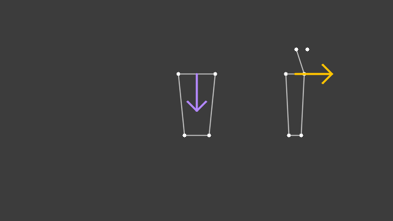
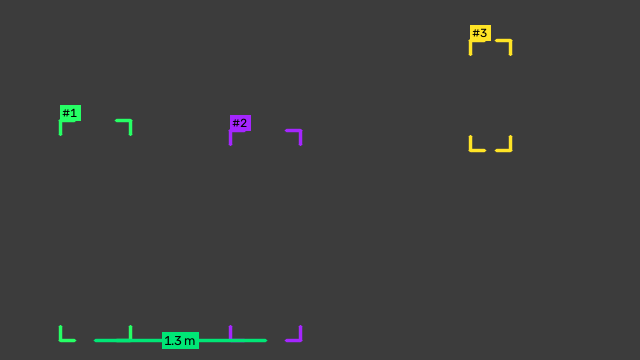

# Membaca arah hadap dan jarak

Dua kelompok fungsi untuk hubungan antara orang dan sekitarnya:

- `zul.computer_vision.pose` membaca ke mana seseorang menghadap dari keypoint model pose, lalu menguji apakah ia menghadap sebuah titik.
- `zul.computer_vision.distance` mengukur jarak antar orang dalam meter tanpa kalibrasi kamera, lalu mencatat berapa lama dua orang berdekatan.

Keduanya hanya butuh instalasi dasar Zul. Contoh yang menyimpan gambar butuh extra `vision`. Contoh di halaman ini memakai keypoint dan kotak buatan, jadi bisa dijalankan tanpa model.

## Membaca arah hadap

`facing_directions` membaca arah setiap orang dari keypoint COCO-17, yaitu `people.keypoints_xy` dan `people.keypoints_conf` dari model pose. Arahnya berupa vektor satuan di sistem koordinat gambar, dengan sumbernya:

- `"head"`: dari titik tengah telinga ke hidung, saat wajah terlihat.
- `"body"`: dari garis bahu yang diputar 90 derajat, saat wajah tidak terlihat, misalnya orang yang membelakangi kamera.
- `""`: tidak ada keypoint yang cukup.

Contoh berikut membaca dua orang: satu menghadap kamera dengan wajah tidak terbaca, satu menoleh ke kanan:

```python title="arah_hadap.py"
import cv2
import numpy as np

from zul.computer_vision import draw, pose

frame = np.full((360, 640, 3), 60, dtype=np.uint8)

keypoints_xy = np.zeros((2, 17, 2))
keypoints_conf = np.zeros((2, 17))
facing_camera = {5: (350, 120), 6: (290, 120), 11: (340, 220), 12: (300, 220)}
looking_right = {
    0: (500, 80), 3: (482, 80), 5: (495, 120), 6: (465, 120), 11: (490, 220), 12: (470, 220)
}
for row, points in enumerate([facing_camera, looking_right]):
    for index, xy in points.items():
        keypoints_xy[row, index] = xy
        keypoints_conf[row, index] = 0.9

directions, sources = pose.facing_directions(keypoints_xy, keypoints_conf)
print(sources)

draw.draw_skeleton(frame, keypoints_xy, keypoints_conf)
for row, direction in enumerate(directions):
    origin = keypoints_xy[row, 5:7].mean(axis=0)
    colour = "#FFC400" if sources[row] == "head" else "#B388FF"
    draw.draw_arrow(frame, origin, direction, colour, length=60)
cv2.imwrite("arah_hadap.png", frame)
```

Script itu mencetak `['body', 'head']`.



Orang yang menghadap kamera mendapat arah ke bawah gambar, ke arah kamera. Model pose memberi label bahu kiri dan kanan sesuai badan orangnya, jadi orang yang membelakangi kamera otomatis mendapat arah ke atas. Keypoint dengan confidence di bawah `min_confidence`, bawaannya 0,35, dianggap tidak terlihat.

## Menguji apakah seseorang menghadap sebuah titik

`facing_target` menguji arah setiap orang terhadap satu titik, misalnya pintu atau rak. Arahnya diukur dari titik kepala, 1/6 dari atas kotak orang itu. Orang dihitung menghadap titik itu jika selisih sudutnya paling banyak `cone_deg`:

```python
from zul.computer_vision import pose

directions, sources = pose.facing_directions(people.keypoints_xy, people.keypoints_conf)
facing = pose.facing_target(people.xyxy, directions, target=(320, 340), cone_deg=90)
```

`facing` berisi satu bool per orang. Kerucut 90 derajat berarti seluruh setengah bidang di depan orang itu. Untuk syarat yang lebih ketat, perkecil `cone_deg`, misalnya 60.

Untuk beberapa zona sekaligus, setiap orang diuji terhadap target zona tempat ia berada:

```python
targets = pose.zone_targets(polygons)            # titik tengah setiap poligon
membership = geometry.zone_membership(polygons, heads)
facing = pose.facing_zone_targets(people.xyxy, directions, membership, targets)
```

Hasil `facing` bisa langsung menjadi kondisi untuk [`ConditionTimer`](mengukur-durasi.md#mengukur-lama-sebuah-kondisi). Jika poligonmu menutupi lantai di depan rak, bukan raknya sendiri, isi `zone_targets(polygons, anchors)` dengan satu titik di rak untuk setiap poligon.

## Mengukur jarak dalam meter

Jarak piksel antar orang tidak bisa diubah ke meter dengan satu angka, karena orang yang jauh tampak kecil. `distance_m` memakai tinggi kotak setiap orang sebagai penggaris: orang dewasa sekitar 1,7 meter. Jaraknya diukur dari kaki ke kaki.

`pairs_within` mencari semua pasangan yang jaraknya dalam batas:

```python title="jarak_meter.py"
import cv2
import numpy as np

from zul.computer_vision import draw
from zul.computer_vision.distance import distance_m, pairs_within
from zul.computer_vision.geometry import foot_points

frame = np.full((360, 640, 3), 60, dtype=np.uint8)
boxes = np.array([[60, 120, 130, 340], [230, 130, 300, 340], [470, 40, 510, 150]])

print(f"{distance_m(boxes[0], boxes[1]):.2f} {distance_m(boxes[1], boxes[2]):.2f}")

feet = foot_points(boxes)
for track_id, box in enumerate(boxes, start=1):
    draw.draw_labelled_box(frame, box, f"#{track_id}", draw.track_color(track_id))
for a, b, metres in pairs_within(boxes, max_distance_m=2.0):
    draw.draw_link(frame, feet[a], feet[b], "#00E676", label=f"{metres:.1f} m")
cv2.imwrite("jarak_meter.png", frame)
```

Script itu mencetak `1.34 3.13`. Hanya pasangan pertama yang dalam 2 meter, jadi hanya pasangan itu yang digambar.



Orang ketiga lebih kecil karena lebih jauh dari kamera. Jarak pikselnya ke orang kedua hampir dua kali jarak orang pertama dan kedua, tetapi skala kedua orang itu juga berbeda, jadi jaraknya terbaca 3,13 meter. Orang yang jongkok atau terpotong tepi frame terbaca lebih jauh dari sebenarnya, karena kotaknya lebih pendek.

## Mencari pasangan dari dua kelompok

Untuk pasangan antara dua kelompok, misalnya staf dan pelanggan, isi `first` dan `second` dengan mask bool per orang. Setiap pasangan selalu berurutan: orang dari `first` di posisi pertama:

```python
staff = people.class_id == 1
pairs = pairs_within(people.xyxy, max_distance_m=2.0, first=staff, second=~staff)
```

Zul tidak menentukan siapa staf. Isi mask-nya dari sumber yang bisa dipercaya, misalnya model yang dilatih dengan seragam tempat itu.

## Mengukur lama dua orang berdekatan

`PairTimer` mengubah pasangan per frame menjadi kontak: dua orang yang berdekatan selama 60 frame berturut-turut adalah satu kontak berdurasi 2 detik, bukan 60 kontak:

```python title="lama_berdekatan.py"
from zul.computer_vision.distance import PairTimer

contacts = PairTimer(minimum_s=1.0, grace_s=1.0)

for frame_number in range(60):
    timestamp_s = frame_number / 30
    contacts.update(frame_number, timestamp_s, [7, 9], [(0, 1, 1.4)])
contacts.close_all()

for contact in contacts.completed:
    print(contact.first_id, contact.second_id, f"{contact.duration_s:.2f}", contact.closest_m)
```

Script itu mencetak `7 9 1.97 1.4`. Di video, isi argumen keempat dengan hasil `pairs_within` frame itu.

Kontak yang lebih pendek dari `minimum_s` tidak dicatat. Kontak tetap terbuka selama pasangan itu berpisah paling lama `grace_s` detik. Secara bawaan, pasangan (7, 9) dan (9, 7) adalah kontak yang sama. Untuk pasangan dari dua kelompok, pakai `PairTimer(ordered=True)`, supaya `first_id` selalu orang dari `first`.

## Halaman terkait

- [Mengukur durasi per orang](mengukur-durasi.md) untuk memakai hasil `facing` sebagai kondisi.
- [Cara kerja Computer Vision](../konsep/cara-kerja-computer-vision.md#membaca-arah-hadap) untuk alasan di balik arah dari bahu dan jarak dari tinggi kotak.
- [Referensi Computer Vision](../referensi/computer-vision.md#pose) untuk semua parameter `pose` dan `distance`.
