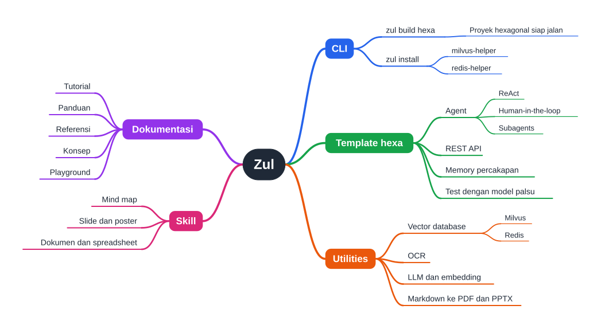

# Membuat mind map

Halaman ini menunjukkan cara mengubah topik, catatan, atau dokumen menjadi mind map dengan skill `mind_map`. Skill itu bisa dipakai dengan tiga cara: dari outline yang kamu tulis sendiri, dengan model lokal di laptop, atau sebagai tool di agent.



Gambar di atas dibuat dari outline `assets/examples/zul.md` di folder skill. Buka [versi interaktifnya](../assets/mindmap/zul.html) untuk menggeser dan memperbesar peta.

**Sebelum mulai:** `uv` atau Python 3.9 ke atas terpasang, dan kamu berada di root repository Zul. Skill `mind_map` ada di `research/agentic/algorithms/skills/mind_map/`. Perintah di halaman ini dijalankan dari folder itu:

```shell
cd research/agentic/algorithms/skills/mind_map
```

## Membuat mind map dari outline

1. Tulis outline di file Markdown. Judul `#` menjadi pusat peta, butir tanpa indentasi menjadi cabang utama, dan butir yang menjorok dua spasi menjadi rinciannya:

    ```markdown title="fotosintesis-mindmap.md"
    # Fotosintesis
    - Bahan
      - Cahaya matahari
      - Air
      - Karbon dioksida
    - Reaksi terang
      - Membran tilakoid
      - ATP dan NADPH
    - Siklus Calvin
      - Fiksasi karbon
      - Glukosa
    ```

2. Jalankan skrip skill pada file itu:

    ```shell
    uv run python scripts/build_mindmap.py fotosintesis-mindmap.md -o fotosintesis.html --also svg
    ```

    Skrip menjawab dengan satu baris hasil dan lokasi file yang ditulisnya:

    ```text
    OK: created C:\proyek\fotosintesis.html (11 nodes, 3 branches, depth 2, 1196x230 px, theme=rainbow)
    SVG: C:\proyek\fotosintesis.svg
    ```

3. Buka file HTML itu di browser. Halamannya berjalan tanpa internet, bisa digeser dan diperbesar, dan punya tombol **Save PNG**.

Skrip memperbaiki sendiri outline yang bentuknya kurang rapi, lalu mencantumkan setiap perbaikan di bawah `AUTO-FIXED / WARNINGS`. Baca daftar itu: jika sebuah perbaikan mengubah maksud petamu, ubah outline-nya dan jalankan lagi perintahnya.

## Membuat mind map dengan model lokal

Skrip `generate_mindmap.py` meminta model lokal menulis outline-nya, memperbaiki jawabannya, lalu menggambar petanya. Bawaannya memakai Ollama di `http://localhost:11434`.

1. Unduh model yang disarankan jika belum ada:

    ```shell
    ollama pull gemma3:4b
    ```

2. Untuk memetakan sebuah topik, jalankan:

    ```shell
    uv run python scripts/generate_mindmap.py "Arsitektur hexagonal untuk aplikasi AI" -o hexagonal.html
    ```

    Untuk memetakan isi sebuah file, ganti topiknya dengan path file:

    ```shell
    uv run python scripts/generate_mindmap.py NAMA_FILE -o peta.html
    ```

    Ganti `NAMA_FILE` dengan path file `.txt`, `.md`, `.pdf`, `.docx`, atau `.html`. File yang lebih panjang dari satu permintaan dibaca per bagian, jadi isi bagian akhirnya tetap masuk ke peta.

3. Buka file yang disebut di baris `OK: created`.

Kamu tidak perlu memilih model. Skrip memakai `gemma3:4b` jika sudah ada di server, lalu `qwen3:8b`, lalu `qwen3:4b`, dan mencetak model yang dipakai di baris `model:`. Untuk model lain, tambahkan `--model NAMA_MODEL`. Untuk server selain Ollama, tambahkan `--api openai --base-url`, misalnya `--api openai --base-url http://localhost:1234/v1` untuk LM Studio. Tanpa model sama sekali, tambahkan `--no-llm`: outline dibuat dengan aturan dari judul dan kalimat di file sumber.

Dua peta berikut ditulis `gemma3:4b`:

- [Arsitektur hexagonal untuk aplikasi AI](../assets/mindmap/gemma3-4b-topik.html), dari sebuah topik, dalam 9 detik.
- [Arsitektur hexagonal](../assets/mindmap/gemma3-4b-dokumen.html), dari halaman konsep sepanjang 5.000 karakter, dalam 24 detik.

## Memilih model lokal

Pakai `gemma3:4b` kecuali kamu punya alasan lain. Angka berikut diukur di laptop dengan GPU RTX 3060 6 GB dan Ollama 0.32.6:

| Model | Satu topik | Dokumen 5.000 karakter | Dokumen 13.700 karakter | Catatan |
|---|---|---|---|---|
| `gemma3:4b` | 8 sampai 10 detik | 10 sampai 24 detik | 16 sampai 98 detik | 16 dari 16 percobaan menghasilkan peta. Muat seluruhnya di GPU 6 GB. |
| `qwen3:4b` | 159 sampai 224 detik | 942 detik, lalu jatuh ke outline aturan | tidak dijalankan | Selalu menalar sebelum menjawab, dan dengan konteks 16k tidak lagi muat di GPU 6 GB. Tidak cocok untuk dokumen. |
| `qwen3:8b` | 87 detik | 181 detik | 389 detik | Diukur di CPU saat GPU tidak aktif, jadi waktunya tidak sebanding. |

Skrip memeriksa setiap jawaban model sebelum menggambarnya. Jika jawabannya bukan outline yang layak, skrip mencoba sekali lagi, lalu menyusun outline bertahap: nama cabang dulu, kemudian dua sampai empat butir untuk tiap cabang.

> [!NOTE]
> Di laptop dengan dua GPU, Ollama bisa memilih GPU terintegrasi, yang beberapa kali lebih lambat. Jalankan `ollama ps` saat model sedang dipakai dan baca kolom `PROCESSOR`. Jika model tidak berjalan di GPU NVIDIA, mulai ulang Ollama dengan variabel environment `OLLAMA_VULKAN=0`.

Untuk mengukur model lain dengan kasus yang sama:

```shell
uv run python evals/local_models.py NAMA_MODEL
```

## Memakai skill di agent

Skill ini menyediakan tool LangChain bernama `create_mind_map`. Pasang ke agent seperti tool lain:

```python title="contoh pemakaian di agent"
from skills.mind_map.mind_map_skill import create_mind_map

tools = [create_mind_map]
```

Model menulis outline sebagai argumen `outline`, dan tool mengembalikan baris hasil yang sama dengan skrip. Folder `research/agentic/algorithms/` harus ada di `sys.path` supaya `skills` bisa diimpor.

> [!WARNING]
> Ollama tidak menyediakan tool calling untuk `gemma3`, jadi `bind_tools` gagal dengan model itu. Minta model menjawab dengan satu objek JSON, dan kirim skema argumen tool sebagai `format` supaya server menjaga bentuknya. Dengan cara itu `gemma3:4b` memanggil `create_mind_map` dengan benar dalam 6 detik. Contohnya ada di `evals/small_model_check.py` di folder `skills/`.

## Memilih format keluaran

Ekstensi pada `-o` menentukan formatnya, dan `--also` menambah format lain:

| Format | Dipakai untuk | Kebutuhan |
|---|---|---|
| `.html` | Dibuka di browser, digeser, dan diperbesar. | Python saja |
| `.svg` | Ditempel sebagai gambar di dokumen atau slide. | Python saja |
| `.mmd` | Ditempel di dalam blok kode `mermaid`, misalnya di README GitHub. | Python saja |
| `.png`, `.pdf` | Dikirim sebagai gambar atau dicetak. | Edge, Chrome, atau Chromium |

## Lihat juga

- `SKILL.md` di folder skill untuk aturan outline, tema warna, dan tata letak.
- `references/small_models.md` di folder skill untuk hasil pengukuran tiap model secara lengkap.
- `REQUIREMENTS.md` di folder `skills/` untuk kebutuhan mesin dan model semua skill.
