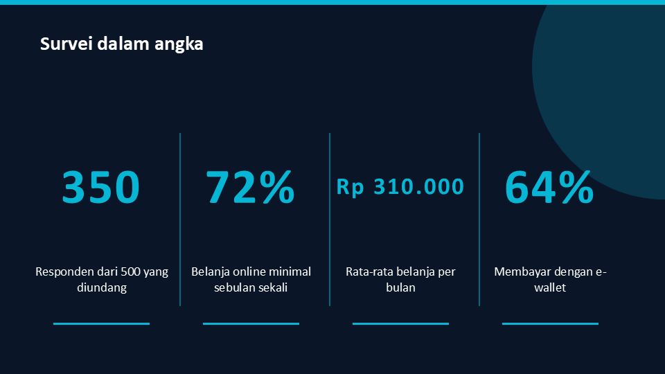

# Membuat silabus dan materi belajar

Skill `silabus_belajar` menyusun rencana belajar satu topik: kemampuan akhir, peta modul, kartu modul, jadwal mingguan, dan proyek akhir. Skill `materi_belajar` menulis materi satu modul: bab dengan kotak istilah dan diagram, demo yang bisa diklik, kuis, latihan, dan kamus istilah. Hasil keduanya berupa halaman HTML yang bisa dibuka di browser, juga di HP.

Keduanya bisa dibuat dari sebuah topik, atau dari bahan milikmu sendiri: PDF, foto catatan, slide, dokumen, atau link. Kedua skill bisa dijalankan dengan model lokal lewat Ollama. Model hanya menulis isinya dalam bentuk JSON; kode yang menghitung jam dan jadwal, menggambar diagram, menyusun kuis, memeriksa aturan skill, lalu membangun halamannya.

> [!WARNING]
> Kode tidak bisa memeriksa apakah fakta di dalam materi benar, dan hanya bisa memeriksa hitungan yang ditulis lengkap. Dalam perbandingan model, kesalahan paling sering ada di angka dan di konsep yang tertukar. Baca angka di bab, kuis, dan latihan sebelum materi dipakai belajar. Rinciannya ada di [Model lokal untuk skill belajar](../konsep/model-lokal-untuk-skill-belajar.md).

**Sebelum mulai:** `uv` ter-install, kamu berada di root repository Zul, dan Ollama berjalan dengan minimal satu model chat, misalnya `gemma3:4b` atau `qwen3:8b`. Kedua skill ada di `research/agentic/algorithms/skills/silabus_belajar/` dan `research/agentic/algorithms/skills/materi_belajar/`. Tidak ada package yang perlu di-install. Untuk membaca gambar dan PDF hasil scan, Ollama juga perlu `gemma3:4b` atau model vision lain.

## Membuat silabus dari terminal

1. Pindah ke folder skill silabus:

    ```shell
    cd research/agentic/algorithms/skills/silabus_belajar
    ```

2. Jalankan skripnya dengan topik, tujuan pelajar, dan jam belajar per minggu:

    ```shell
    uv run python scripts/generate_silabus.py "Reksa dana" --goal "bisa memilih reksa dana sendiri tanpa ikut-ikutan rekomendasi" --hours-per-week 3 -o silabus-reksa-dana.html --save-json jawaban-silabus.json
    ```

    Baris pertama menyebut model yang dipilih. Baris `peringatan` berisi aturan skill yang dilanggar jawaban model, lihat [Membaca peringatan](#membaca-peringatan). Contoh keluaran pada 8 Oktober 2026:

    ```text
    model: gemma3:4b (--model or SKILL_MODEL chooses another)
    OK: silabus-reksa-dana.html (6 modul, 3 tahap, ± 22 jam, 8 minggu)
         kontrak modul untuk materi_belajar: silabus-reksa-dana.json
         peringatan: module 3: objective changed to a checkable verb: 'Menjelaskan dampak biaya terhadap return investasi.'
         peringatan: module 4: objective changed to a checkable verb: 'Menjelaskan bagaimana risiko mempengaruhi potensi return.'
         peringatan: module 5: objective changed to a checkable verb: 'Menjelaskan peran komisioner dalam model bisnis reksa dana.'
         peringatan: module 6: objective changed to a checkable verb: 'Menjelaskan cara menilai profil risiko investor.'
         model gemma3:4b: 1522 token, 27.4 detik, percobaan ke-1
    ```

3. Buka `silabus-reksa-dana.html` di browser.

Skrip menulis tiga file:

| File | Isi |
|---|---|
| `silabus-reksa-dana.html` | Halaman silabus. |
| `silabus-reksa-dana.json` | Silabus yang sudah dirapikan kode, termasuk kartu setiap modul. Skill materi memakai file ini. |
| `jawaban-silabus.json` | Jawaban asli model, karena `--save-json` diisi. Dipakai untuk membangun ulang halaman tanpa memanggil model. |

## Memperbaiki isi lalu membangun ulang

Peringatan di log hanya mencakup aturan skill. Isinya tetap harus dibaca. Silabus contoh di atas punya tiga masalah yang tidak muncul di peringatan:

- Modul 3 menyebut "sharia fee", padahal itu bukan nama biaya reksa dana.
- Modul 5 menyebut "peran komisioner". Pihak yang dibayar komisi dari penjualan reksa dana adalah agen penjual.
- NAB, nilai yang dipakai untuk menghitung nilai investasi, tidak diajarkan di modul mana pun.

Perbaiki jawaban model, lalu bangun ulang halamannya tanpa memanggil model:

1. Buka `jawaban-silabus.json`. Ganti "sharia fee" dengan "subscription fee", dan "komisioner" dengan "agen penjual", di tujuan belajar (`objectives`) maupun di istilah (`terms`). Konsep yang hilang, seperti NAB, ditambahkan dengan cara yang sama: tulis tujuan belajar dan istilahnya di modul yang cocok.
2. Bangun ulang halamannya dari file itu, dengan topik dan jam per minggu yang sama:

    ```shell
    uv run python scripts/generate_silabus.py "Reksa dana" --hours-per-week 3 -o silabus-reksa-dana.html --from-json jawaban-silabus.json
    ```

    Pemeriksaan aturan berjalan lagi. Model tidak dipanggil, jadi tidak ada baris `model`:

    ```text
    OK: silabus-reksa-dana.html (6 modul, 3 tahap, ± 22 jam, 8 minggu)
         kontrak modul untuk materi_belajar: silabus-reksa-dana.json
         peringatan: module 3: objective changed to a checkable verb: 'Menjelaskan dampak biaya terhadap return investasi.'
         peringatan: module 4: objective changed to a checkable verb: 'Menjelaskan bagaimana risiko mempengaruhi potensi return.'
         peringatan: module 5: objective changed to a checkable verb: 'Menjelaskan peran agen penjual dalam model bisnis reksa dana.'
         peringatan: module 6: objective changed to a checkable verb: 'Menjelaskan cara menilai profil risiko investor.'
    ```

Halaman silabus setelah diperbaiki. Centang modul yang selesai; centangnya disimpan di browser:

<iframe src="../../assets/skill-belajar/silabus-reksa-dana.html" title="Contoh halaman silabus reksa dana" style="width: 100%; height: 640px; border: 1px solid var(--md-default-fg-color--lightest); border-radius: 6px;" loading="lazy"></iframe>

[Buka halaman silabus di tab baru](../assets/skill-belajar/silabus-reksa-dana.html){ target="_blank" }

Materi diperbaiki dengan cara yang sama: ubah file dari `--save-json`, lalu jalankan `generate_materi.py` dengan `--from-json`. Pemeriksaan hitungan juga berjalan lagi.

## Menulis materi satu modul

1. Pindah ke folder skill materi:

    ```shell
    cd ../materi_belajar
    ```

2. Jalankan skripnya dengan file JSON silabus dan nomor modulnya. Modul 3 berisi hitungan biaya:

    ```shell
    uv run python scripts/generate_materi.py --silabus ../silabus_belajar/silabus-reksa-dana.json --module 3 -o reksa-dana-modul-3.html --save-json jawaban-modul-3.json
    ```

    Contoh keluaran pada 8 Oktober 2026. Tidak ada peringatan, artinya semua aturan skill dipenuhi dan semua hitungan yang ditulis lengkap benar:

    ```text
    model: qwen3:8b (--model or SKILL_MODEL chooses another)
    OK: reksa-dana-modul-3.html (3 bab, 3 diagram, 1 demo, 4 soal, 2 latihan, 4 istilah)
         model qwen3:8b: 2167 token, 265.2 detik, percobaan ke-1
    ```

3. Buka `reksa-dana-modul-3.html` di browser.

Kartu modul dari silabus menjadi kontrak materinya. Judul, pertanyaan utama, dan tujuan belajar diambil dari kartu, bukan dari jawaban model. Model juga diberi judul dan istilah modul sebelum dan sesudahnya, supaya materi tidak memakai istilah yang baru diajarkan di modul berikutnya.

> [!CAUTION]
> Materi contoh di bawah tidak diperbaiki, supaya terlihat apa yang lolos dari pemeriksaan kode. Hitungannya benar, tetapi ada tiga kesalahan isi:
>
> - Subscription fee dan biaya transaksi dibayar sekali, saat membeli dan menjual. Materi ini menjumlahkannya dengan expense ratio sebagai biaya per tahun, sehingga return "8% − 3,5% = 4,5% per tahun" salah.
> - Custodian disebut pihak yang mengelola dana. Yang mengelola dana adalah manajer investasi; bank kustodian menyimpan dan mengadministrasikan aset reksa dana.
> - Return historis dihitung dari NAB, yang sudah dipotong biaya pengelolaan. Mengurangi return historis dengan expense ratio menghitung biaya itu dua kali.

Halaman materi dari perintah di atas. Coba klik demo dan jawab kuisnya:

<iframe src="../../assets/skill-belajar/reksa-dana-modul-3.html" title="Contoh halaman materi modul 3 reksa dana" style="width: 100%; height: 640px; border: 1px solid var(--md-default-fg-color--lightest); border-radius: 6px;" loading="lazy"></iframe>

[Buka halaman materi di tab baru](../assets/skill-belajar/reksa-dana-modul-3.html){ target="_blank" }

Materi juga bisa dibuat tanpa silabus. Tulis topiknya saja:

```shell
uv run python scripts/generate_materi.py "Cara kerja bunga majemuk" -o materi-bunga-majemuk.html
```

## Memakai bahan sendiri

Silabus dan materi bisa dibuat dari bahan milikmu: PDF, foto catatan, slide, dokumen, atau link. Tambahkan `--file` untuk setiap bahan. Model diminta hanya memakai fakta dari bahan itu, dan topiknya boleh dikosongkan; model menentukannya dari bahan.

Cara setiap bahan dibaca:

| Bahan | Cara dibaca |
|---|---|
| PDF berteks | Teksnya diambil dengan `pdftotext` jika ter-install, atau dengan `pypdf`. Cepat, dan teksnya persis. |
| PDF hasil scan | Halaman tanpa teks diubah menjadi gambar dengan `pypdfium2`, lalu dibaca model vision. Paling banyak 10 halaman. |
| Gambar: png, jpg, jpeg, webp, gif, bmp | Dibaca model vision lewat Ollama, bawaannya `gemma3:4b`. Format webp, gif, dan bmp butuh Pillow. |
| docx, pptx, xlsx | Teks diambil langsung dari isi file, tanpa package tambahan. File lama .doc dan .ppt harus disimpan ulang sebagai .docx atau .pptx. |
| html, txt, md, csv, json | Dibaca sebagai teks. |
| Folder | Semua file di atas yang ada di folder itu. |
| Link http atau https | Diunduh, lalu dibaca sesuai jenisnya: halaman web, PDF, atau gambar. |

Contoh silabus dari PDF 11 halaman tentang `[build-system]` di `pyproject.toml`, tanpa topik:

```shell
uv run python scripts/generate_silabus.py --file catatan-build-system.pdf --hours-per-week 3 -o silabus-build-system.html --save-json jawaban-build-system.json
```

Contoh keluaran pada 8 Oktober 2026:

```text
model: gemma3:4b (--model or SKILL_MODEL chooses another)
OK: silabus-build-system.html (4 modul, 2 tahap, ± 17 jam, 6 minggu)
     kontrak modul untuk materi_belajar: silabus-build-system.json
     peringatan: module 3: objective changed to a checkable verb: 'Menjelaskan peran dari build-backend dalam pyproject.toml.'
     peringatan: module 4: objective changed to a checkable verb: 'Menjelaskan peran dari pip dan UV dalam proses build.'
     model gemma3:4b: 1222 token, 30.3 detik, percobaan ke-1
```

[Buka halaman silabus dari PDF ini](../assets/skill-belajar/silabus-build-system.html){ target="_blank" }. Modul-modulnya mengikuti isi PDF, termasuk Hatchling, Setuptools, Flit, dan contoh proyek `my-agent`. Isinya tetap perlu dibaca: modul 2 hanya membahas analogi rumah dari PDF, dan beberapa tujuan belajar memakai "Menghitung" untuk hal yang bukan angka, seperti "Menghitung perbedaan antara setup.py dan pyproject.toml".

### Melihat teks yang dibaca dari bahan

Sebelum membuat silabus, periksa apa yang dibaca skill dari bahanmu dengan `read_material.py`. Skrip ini tidak memanggil model teks, hanya model vision untuk gambar:

```shell
uv run python scripts/read_material.py contoh-slide.png
```

Untuk gambar slide ini:



Keluarannya pada 8 Oktober 2026, 19 detik termasuk memuat model:

```text
catatan: contoh-slide.png: read by gemma3:4b from the image; check names and numbers
# contoh-slide.png
Survei dalam angka |
|
350 | 72% | Rp 310.000 | 64% |
|
Responden dari 500 yang diundang | Belanja online minimal sebulan sekali | Rata-rata belanja per bulan | Membayar dengan e-wallet |

**Deskripsi Grafik/Diagram:**

Grafik ini menampilkan hasil survei dalam angka. Ada empat kotak yang masing-masing berisi data statistik berbeda terkait perilaku belanja online. Kotak pertama menunjukkan jumlah responden, kotak kedua persentase responden yang melakukan belanja online minimal sebulan sekali, kotak ketiga rata-rata belanja per bulan dalam Rupiah (Rp), dan kotak terakhir persentase responden yang membayar dengan e-wallet.
```

Hasil baca gambar bisa salah. Pada run lain, gambar yang sama terbaca "minimal sebunyi sekali", dan model menyebut grafik batang yang tidak ada di slide. Karena itu setiap bahan yang dibaca model vision diberi baris `catatan` atau `peringatan`.

Model vision bisa diganti dengan environment variable `VISION_MODEL_ID`, misalnya `VISION_MODEL_ID=qwen2.5vl:7b`. Model teks seperti `qwen3` tidak bisa membaca gambar, jadi skill tidak pernah memilihnya untuk gambar.

Bahan yang panjang dipotong: model hanya menerima 12.000 karakter pertama, kira-kira 4 sampai 5 halaman buku. Jika bahan lebih panjang, log menampilkan `the material has ... characters; the model got the first 12,000`. Untuk buku, buat silabus dari daftar isi atau ringkasannya, lalu buat materi per bab dengan bab itu sebagai `--file`.

## Membaca peringatan

Setiap baris `peringatan` di log adalah aturan skill yang dilanggar jawaban model. Sebagian sudah diperbaiki kode, sebagian harus kamu periksa sendiri:

| Peringatan | Artinya | Yang perlu dilakukan |
|---|---|---|
| `arithmetic in ... does not add up: A = B (hasilnya N)` | Hitungan yang ditulis model salah. `N` adalah hasil yang benar. | Perbaiki angkanya, lihat [Memperbaiki isi lalu membangun ulang](#memperbaiki-isi-lalu-membangun-ulang). |
| `... reached its length limit and may be cut off` | Teks di kolom itu mencapai batas panjang dan mungkin terpotong di tengah kalimat. | Periksa kolom itu di halaman. |
| `objective ... is taught by no chapter` atau `is tested by no question or exercise` | Ada tujuan belajar yang tidak diajarkan atau tidak diuji. | Jalankan ulang, atau tambahkan bab atau soalnya di JSON. |
| `terms from the module card without a term box: ...` | Istilah dari kartu modul tidak dijelaskan di kotak istilah. | Tambahkan istilah itu di JSON jika pembaca butuh. |
| `term 'X' is taught in module N but already used in module M` | Sebuah istilah dipakai sebelum modul yang menjelaskannya. | Abaikan jika istilahnya umum, seperti "risiko". Jika tidak, pindahkan istilahnya. |
| `money topic without a module ...` | Topik uang tanpa modul risiko atau modul model bisnis. | Jalankan ulang, atau tambahkan modulnya di JSON. |
| `... read by gemma3:4b from the image; check names and numbers` | Bahan itu dibaca model vision, yang bisa salah baca. | Bandingkan nama dan angka di halaman dengan gambarnya. |
| `... page(s) without text (a scan?) skipped; install pypdfium2 ...` | PDF hasil scan, tetapi `pypdfium2` belum ter-install, jadi halaman itu dilewati. | Install `pypdfium2`, atau ubah PDF-nya menjadi gambar. |
| `the material has ... characters; the model got the first 12,000` | Bahan lebih panjang dari yang diterima model. | Pakai bagian bahan yang dibutuhkan saja, misalnya satu bab. |
| `objective changed to a checkable verb`, `result too short`, `prior was empty`, `... hours -> ...` | Kode sudah memperbaikinya, misalnya "Memahami" menjadi "Menjelaskan". | Tidak perlu apa-apa. |

## Memilih model

Dengan `--model auto` (bawaannya), skrip memakai model pertama dari daftar `RECOMMENDED` yang ada di server Ollama:

| Skill | Urutan | Alasannya |
|---|---|---|
| `silabus_belajar` | `gemma3:4b`, `qwen3:8b`, `qwen3:4b` | `gemma3:4b` selesai dalam 30-40 detik, dan model yang lebih besar tidak menulis silabus yang lebih lengkap. |
| `materi_belajar` | `qwen3:8b`, `gemma3:4b`, `qwen3:4b` | Hanya `qwen3:8b` yang menulis semua angka dengan benar di perbandingan. Di GPU 6 GB, satu materi butuh 3,5 sampai 5,5 menit. |

Untuk memakai model lain, isi `--model` atau environment variable `SKILL_MODEL`. Misalnya, `--model gemma3:4b` menulis materi dalam sekitar 1 menit, tetapi angkanya lebih sering salah. Perbandingan ketiga model, termasuk waktu dan kesalahan yang ditemukan, ada di [Model lokal untuk skill belajar](../konsep/model-lokal-untuk-skill-belajar.md).

Periksa juga di mana model berjalan dengan `ollama ps`. Untuk model 4B di GPU 6 GB, kolom `PROCESSOR` seharusnya `100% GPU`. Di laptop dengan dua GPU, Ollama bisa memilih GPU bawaan prosesor yang jauh lebih lambat. Menjalankan server dengan `OLLAMA_VULKAN=0 ollama serve` membuatnya memakai GPU NVIDIA.

## Opsi lain

Opsi yang sama berlaku untuk `generate_silabus.py` dan `generate_materi.py`, kecuali yang ditandai:

| Opsi | Isi |
|---|---|
| `--level Menengah` | Level awal pelajar. Bawaannya `Pemula`. Hanya silabus. |
| `--goal "..."` | Kemampuan yang ingin dicapai pelajar. Hanya silabus. |
| `--hours-per-week 4` | Jam belajar per minggu untuk jadwal. Bawaannya 4. Hanya silabus. |
| `--silabus FILE --module N` | Kartu modul dari silabus sebagai kontrak. Hanya materi. |
| `--file FILE` | Bahan belajar: PDF, gambar, docx, pptx, xlsx, html, file teks, folder, atau link. Boleh diulang. Model hanya boleh memakai fakta dari bahan ini. `--context` adalah nama lamanya. |
| `--sources sumber.txt` | Daftar sumber, satu per baris: `Judul | URL`. Link lain yang ditulis model dihapus. |
| `--save-json FILE`, `--from-json FILE` | Simpan jawaban model, atau bangun dari jawaban yang disimpan tanpa memanggil model. |
| `--model NAMA` | Model yang dipakai. Bawaannya `auto`. |
| `--api openai --base-url URL` | Server dengan API OpenAI, misalnya LM Studio di `http://localhost:1234/v1`. |
| `--max-tokens N` | Batas panjang jawaban. Bawaannya 4096 untuk silabus dan 4608 untuk materi. |
| `--num-ctx N` | Ukuran context Ollama. Bawaannya 0: secukupnya untuk permintaan dan `--max-tokens`. |
| `--retries N` | Percobaan tambahan jika jawaban tidak bisa dipakai. Bawaannya 1. |

## Membuat dari kode Python

Fungsi `generate_silabus` dan `generate_materi` menjalankan model dan membangun halamannya, lalu mengembalikan hasilnya sebagai `dict`:

```python title="contoh pemakaian di kode"
from skills.silabus_belajar.silabus_belajar_skill import generate_silabus
from skills.materi_belajar.materi_belajar_skill import generate_materi

silabus = generate_silabus("Reksa dana", "silabus-reksa-dana.html", hours_per_week=3)
materi = generate_materi(silabus_json=silabus["json"], module=2, output="reksa-dana-modul-2.html")
print(materi["path"], materi["warnings"])

dari_pdf = generate_silabus(files=["catatan-build-system.pdf", "foto-papan-tulis.jpg"], hours_per_week=3)
```

Parameter `files` berisi bahan sendiri, sama dengan `--file`. Hasil silabus berisi `ok`, `path`, `json`, `warnings`, `modules`, `stages`, `hours`, `weeks`, `model`, dan `stats`. Hasil materi berisi `ok`, `path`, `warnings`, `chapters`, `diagrams`, `demo`, `questions`, `exercises`, `terms`, `model`, dan `stats`. Jika gagal, `ok` bernilai `False` dan alasannya ada di `error`. Folder `research/agentic/algorithms/` harus ada di `sys.path` supaya `skills` bisa diimpor.

Jika JSON-nya ditulis oleh model lain, misalnya Claude, pakai `build_silabus(spec, "silabus.html")` dan `build_materi(spec, "materi.html", silabus_json, module)`. Bentuk JSON-nya ada di `assets/silabus.schema.json` dan `assets/materi.schema.json` di folder setiap skill.

## Memakai skill di agent

Kedua skill menyediakan tool LangChain: `create_silabus` dan `create_materi`. Tool ini hanya ada jika `langchain-core` ter-install; tanpa itu nilainya `None`, dan fungsi di atas tetap bisa dipakai.

```python title="contoh pemakaian di agent"
from skills.silabus_belajar.silabus_belajar_skill import create_silabus
from skills.materi_belajar.materi_belajar_skill import create_materi

tools = [create_silabus, create_materi]
```

Kedua tool juga menerima `files`: path atau link bahan dari pengguna, misalnya PDF yang diunggah ke aplikasi agent. Halaman disimpan di folder dari environment variable `LEARNING_OUTPUT_DIR`, atau di `./belajar`. Tool membalas dengan lokasi halaman, isinya, dan semua peringatan. Jika gagal, tool membalas dengan satu kalimat berisi alasannya, supaya model agent tidak menulis silabus sendiri.

## Jika skrip gagal

Kode keluar `0` berarti halaman dibuat. Jika gagal, skrip menulis satu baris `GAGAL` dengan alasannya:

| Pesan | Penyebab | Yang bisa dilakukan |
|---|---|---|
| `cannot reach the model server` | Ollama tidak berjalan. | Jalankan `ollama serve`, atau buka aplikasi Ollama. |
| `the model server answered HTTP 404` | Model belum di-download. | Jalankan `ollama pull NAMA_MODEL`. |
| `the answer stopped at the token limit` | Jawaban model lebih panjang dari `--max-tokens`. | Naikkan `--max-tokens`, atau pakai model lain. |
| `the syllabus needs 4-8 modules`, `the lesson needs 3-6 chapters`, `the quiz needs 4-6 questions` | Jawaban model terlalu sedikit, juga setelah percobaan ulang. | Jalankan ulang, atau pakai model lain. |
| `module N is not in ...` | Nomor modul tidak ada di silabus. | Lihat jumlah modul di halaman silabus. |
| `...: file not found` | Path bahan di `--file` salah. | Periksa path-nya; path relatif dihitung dari folder tempat skrip dijalankan. |
| `...: .doc is not read; use PDF, an image, docx, ...` | Jenis file tidak dikenal. | Simpan ulang sebagai PDF, .docx, atau .pptx. |
| `...: the vision model ... could not read it` | Model vision tidak ada di server, atau Ollama tidak berjalan. | Jalankan `ollama pull gemma3:4b`, atau isi `VISION_MODEL_ID`. |
| `...: cannot open the link` | Link tidak bisa dibuka dari komputer ini. | Unduh file-nya, lalu pakai sebagai `--file`. |

Test kedua skill berjalan tanpa model:

```shell
uv run pytest research/agentic/algorithms/skills/silabus_belajar/tests research/agentic/algorithms/skills/materi_belajar/tests -q -p no:cacheprovider
```

## Halaman terkait

- [Model lokal untuk skill belajar](../konsep/model-lokal-untuk-skill-belajar.md) untuk perbandingan `gemma3:4b`, `qwen3:4b`, dan `qwen3:8b`.
