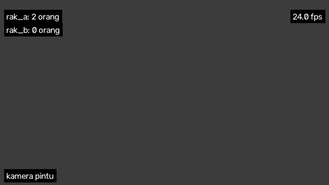
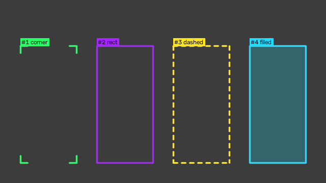
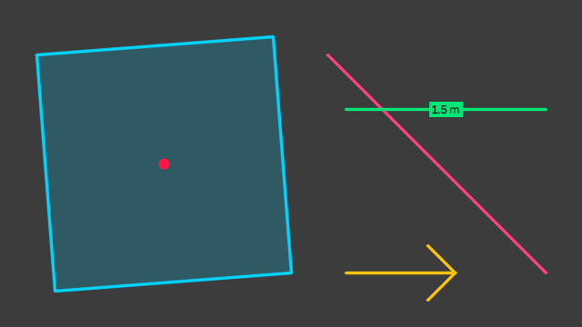
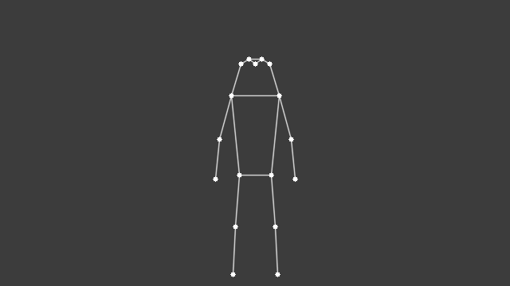
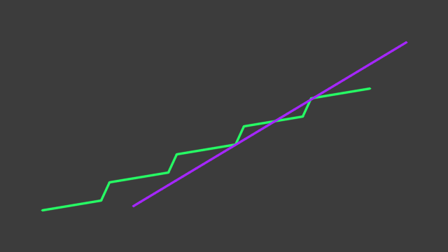
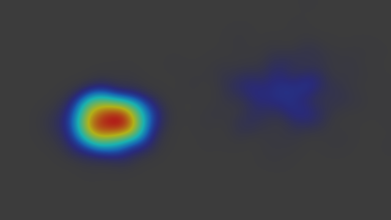

# Menggambar di frame

Modul `zul.computer_vision.draw` berisi satu fungsi untuk setiap hal yang digambar di frame video: teks di sudut, kotak dan label, poligon, garis, panah, kerangka pose, jejak gerak, dan heatmap. Setiap fungsi menggambar langsung di frame yang kamu berikan, jadi kamu bisa memanggilnya dalam urutan apa pun.

Setiap contoh di halaman ini berdiri sendiri: contoh itu membuat frame abu-abu 640×360, menggambar di atasnya, lalu menyimpannya sebagai PNG. Di videomu, ganti frame abu-abu itu dengan `frame.copy()` dari [`read_frames`](mendeteksi-dan-melacak-orang.md).

**Sebelum mulai:** install Zul dengan extra `vision`:

```shell
pip install "zul[vision] @ git+https://github.com/kazuma313/zul_utilities.git"
```

Warna ditulis sebagai `"#RRGGBB"` atau tuple BGR, misalnya `(0, 230, 118)`.

## Menulis teks di sudut frame

`draw_corner_text` menyusun beberapa baris teks menempel ke satu sudut, dengan latar hitam supaya tetap terbaca di atas video:

```python title="teks_di_sudut.py"
import cv2
import numpy as np

from zul.computer_vision import draw

frame = np.full((360, 640, 3), 60, dtype=np.uint8)

draw.draw_corner_text(frame, ["rak_a: 2 orang", "rak_b: 0 orang"])
draw.draw_corner_text(frame, ["24.0 fps"], corner=draw.Corner.TOP_RIGHT)
draw.draw_corner_text(frame, ["kamera pintu"], corner=draw.Corner.BOTTOM_LEFT)

cv2.imwrite("teks_di_sudut.png", frame)
```



Sudutnya bisa `TOP_LEFT`, `TOP_RIGHT`, `BOTTOM_LEFT`, atau `BOTTOM_RIGHT`. Jika videomu sudah punya cap waktu di kiri atas, geser teksnya ke bawah dengan `top`, misalnya `top=58`.

## Menggambar kotak dan label

`draw_labelled_box` menggambar kotak dan keterangannya di atas sudut kiri atas. `track_color` memberi warna yang tetap untuk setiap id track, jadi orang yang sama selalu berwarna sama dari frame ke frame:

```python title="kotak_dan_label.py"
import cv2
import numpy as np

from zul.computer_vision import draw

frame = np.full((360, 640, 3), 60, dtype=np.uint8)

for index, style in enumerate(draw.BoxStyle):
    track_id = index + 1
    box = [40 + index * 150, 90, 150 + index * 150, 320]
    label = f"#{track_id} {style.value}"
    draw.draw_labelled_box(frame, box, label, draw.track_color(track_id), style=style)

cv2.imwrite("kotak_dan_label.png", frame)
```



`BoxStyle` berisi keempat gaya itu: `CORNER`, yang menjadi bawaan, `RECT`, `DASHED`, dan `FILLED`. Kotak memakai format xyxy: `[x1, y1, x2, y2]` dalam piksel. Dari hasil deteksi, kotaknya ada di `people.xyxy` dan id-nya di `people.tracker_id`.

## Menggambar poligon, garis, panah, dan titik

Setiap bentuk punya fungsinya sendiri:

```python title="bentuk.py"
import cv2
import numpy as np

from zul.computer_vision import draw

frame = np.full((360, 640, 3), 60, dtype=np.uint8)

area = [[40, 60], [300, 40], [320, 300], [60, 320]]
draw.draw_polygons(frame, [area], "#00d4ff", fill_alpha=0.2)
draw.draw_point(frame, (180, 180), "#FF1744", radius=6)
draw.draw_line(frame, (360, 60), (600, 300), "#FF4081")
draw.draw_arrow(frame, (380, 300), (1, 0), "#FFC400", length=120)
draw.draw_link(frame, (380, 120), (600, 120), "#00E676", label="1.5 m")

cv2.imwrite("bentuk.png", frame)
```



| Fungsi | Gunanya |
|---|---|
| `draw_polygons` | Garis tepi satu atau beberapa poligon. `fill_alpha` di atas 0 mengisi poligon dengan warna transparan. |
| `draw_point` | Titik penuh, misalnya titik yang diuji terhadap poligon. |
| `draw_line` | Garis antara dua titik. |
| `draw_arrow` | Panah dari satu titik searah sebuah vektor, misalnya arah hadap seseorang. |
| `draw_link` | Garis dengan keterangan di tengahnya, misalnya jarak dalam meter. |

## Menggambar kerangka pose

`draw_skeleton` menggambar kerangka COCO-17 dari keypoint model pose. Keypoint dengan confidence di bawah `min_confidence` dilewati, karena keypoint yang tidak terdeteksi bernilai `(0, 0)` dan akan menarik garis ke sudut kiri atas:

```python title="kerangka_pose.py"
import cv2
import numpy as np

from zul.computer_vision import draw

frame = np.full((360, 640, 3), 60, dtype=np.uint8)

keypoints_xy = np.array([[
    [320, 80], [328, 74], [312, 74], [338, 80], [302, 80],
    [350, 120], [290, 120], [365, 175], [275, 175], [370, 225], [270, 225],
    [340, 220], [300, 220], [345, 285], [295, 285], [348, 345], [292, 345],
]])
keypoints_conf = np.ones((1, 17))

draw.draw_skeleton(frame, keypoints_xy, keypoints_conf)

cv2.imwrite("kerangka_pose.png", frame)
```



Dari hasil deteksi model pose, isi `keypoints_xy` dan `keypoints_conf` dengan `people.keypoints_xy` dan `people.keypoints_conf`.

## Menggambar jejak gerak

`TrackTrace` mengingat beberapa titik terakhir setiap track, dan `draw_traces` menggambarnya sebagai garis. Panggil `update` sekali per frame:

```python title="jejak_gerak.py"
import cv2
import numpy as np

from zul.computer_vision import draw

frame = np.full((360, 640, 3), 60, dtype=np.uint8)
trace = draw.TrackTrace(length=40)

for step in range(40):
    points = np.array([
        [60 + step * 12, 300 - step * 5 + (step % 8) * 3],
        [580 - step * 10, 60 + step * 6],
    ])
    trace.update(points, [1, 2])

draw.draw_traces(frame, trace)

cv2.imwrite("jejak_gerak.png", frame)
```



`length` adalah jumlah titik yang diingat per track. Track yang tidak muncul selama `length` frame dilupakan, jadi jejak orang yang sudah pergi hilang dengan sendirinya. Di video, titiknya biasanya kaki setiap orang: `geometry.foot_points(people.xyxy)`.

## Menggambar heatmap

`HeatMap` menjumlahkan posisi orang dari semua frame, dan `draw_heatmap` mewarnai area yang paling sering ditempati dengan warna paling panas:

```python title="heatmap.py"
import cv2
import numpy as np

from zul.computer_vision import draw

frame = np.full((360, 640, 3), 60, dtype=np.uint8)
heat = draw.HeatMap(width=640, height=360, radius=20)
rng = np.random.default_rng(0)

for _ in range(300):
    near_shelf = rng.normal([180, 200], [35, 25], size=(3, 2))
    passing = rng.normal([470, 150], [60, 40], size=(1, 2))
    heat.update(np.concatenate([near_shelf, passing]))

draw.draw_heatmap(frame, heat, alpha=0.6)

cv2.imwrite("heatmap.png", frame)
```



Heatmap mengingat semua frame secara bawaan. Untuk heatmap yang hanya menampilkan beberapa detik terakhir, isi `decay` di bawah 1, misalnya `HeatMap(640, 360, decay=0.98)`: setiap frame, nilai lama dikalikan 0,98.

## Halaman terkait

- [Menghitung dengan garis dan poligon](menghitung-dengan-garis-dan-poligon.md) untuk garis dan poligon yang menggambar angkanya sendiri.
- [Menghitamkan dan menyamarkan area](menghitamkan-dan-menyamarkan-area.md) untuk masker, blur, dan pixelate.
- [Referensi Computer Vision](../referensi/computer-vision.md#draw) untuk semua parameter fungsi gambar.
