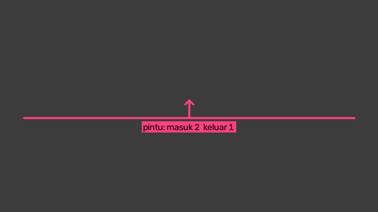
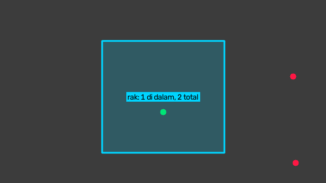

# Menghitung dengan garis dan poligon

Modul `zul.computer_vision.zones` berisi dua alat hitung yang berdiri sendiri:

- `LineCounter` menghitung orang yang melintasi sebuah garis, per arah: masuk dan keluar.
- `PolygonZone` menghitung orang di dalam sebuah poligon: di frame ini, dan jumlah orang berbeda sepanjang video.

Keduanya menerima satu titik per orang dan id track-nya, lalu `draw` menggambarnya beserta angkanya. Contoh di halaman ini memakai titik buatan supaya bisa dijalankan tanpa model dan tanpa video. Di [bagian terakhir](#memakai-hasil-deteksi) ada cara mengisinya dari hasil deteksi.

**Sebelum mulai:** `LineCounter` dan `PolygonZone` hanya butuh instalasi dasar Zul. Untuk menggambarnya, install extra `vision`:

```shell
pip install "zul[vision] @ git+https://github.com/kazuma313/zul_utilities.git"
```

## Menghitung lintasan dengan garis

1. Tentukan kedua ujung garis. Bayangkan kamu berjalan di gambar dari titik pertama ke titik kedua: sisi kirimu adalah sisi masuk.

2. Buat `LineCounter`, lalu panggil `update` sekali per frame dengan titik dan id track setiap orang. Contoh berikut menjalankan tiga orang selama 30 frame: dua berjalan ke atas melewati garis, satu ke bawah:

    ```python title="garis_penghitung.py"
    import cv2
    import numpy as np

    from zul.computer_vision import draw
    from zul.computer_vision.zones import LineCounter

    line = LineCounter(start=(40, 200), end=(600, 200), label="pintu")

    for step in range(30):
        points = np.array([
            [150, 300 - step * 6],
            [320, 320 - step * 6],
            [500, 100 + step * 6],
        ])
        crossed_in, crossed_out = line.update(points, [1, 2, 3])

    print(line.in_count, line.out_count)

    frame = np.full((360, 640, 3), 60, dtype=np.uint8)
    draw.draw_line_counter(frame, line)
    cv2.imwrite("garis_penghitung.png", frame)
    ```

    Script itu mencetak `2 1`: dua lintasan masuk dan satu keluar.

    

    `draw_line_counter` menggambar garisnya, panah kecil ke sisi masuk, dan jumlahnya di sisi keluar. Untuk kata selain "masuk" dan "keluar", isi `in_text` dan `out_text`.

3. Pakai hasil per baris dari `update` jika kamu perlu tahu siapa yang melintas di frame itu. `crossed_in[i]` bernilai True di frame saat orang di baris `i` baru dihitung masuk.

Sebuah lintasan baru dihitung setelah orang itu bertahan `minimum_frames` frame di sisi baru, bawaannya 3. Kotak yang bergetar tepat di garis tidak terhitung masuk dan keluar berulang kali. Titik yang lewat di luar kedua ujung garis tidak dihitung.

Jika masuk dan keluar tertukar, tukar urutan `start` dan `end`.

## Menghitung orang di poligon

`PolygonZone` menghitung dua angka: `current_count`, jumlah orang di dalam poligon di frame terakhir, dan `total_count`, jumlah id track berbeda yang pernah di dalamnya. Contoh berikut menjalankan tiga orang: satu berjalan melewati poligon, satu diam di dalamnya, dan satu di luar:

```python title="poligon_penghitung.py"
import cv2
import numpy as np

from zul.computer_vision import draw
from zul.computer_vision.zones import PolygonZone

zone = PolygonZone([[200, 80], [440, 80], [440, 300], [200, 300]], label="rak")

for step in range(20):
    points = np.array([[100 + step * 25, 150], [320, 220], [580, 320]])
    inside = zone.update(points, [1, 2, 3])

print(zone.current_count, zone.total_count)

frame = np.full((360, 640, 3), 60, dtype=np.uint8)
draw.draw_polygon_zone(frame, zone)
for point, is_inside in zip(points, inside):
    draw.draw_point(frame, point, "#00E676" if is_inside else "#FF1744", radius=6)
cv2.imwrite("poligon_penghitung.png", frame)
```

Script itu mencetak `1 2`: sekarang satu orang di dalam, dan sepanjang video dua orang berbeda pernah masuk.



`update` juga mengembalikan array bool per baris: apakah titik orang itu di dalam poligon. Titik tepat di tepi poligon dihitung di dalam. Untuk teks selain bawaan, isi `text`, misalnya `draw.draw_polygon_zone(frame, zone, text="rak sepatu")`.

## Menghitung beberapa poligon

Buat satu `PolygonZone` untuk setiap poligon. Satu orang bisa dihitung di dua poligon yang tumpang tindih.

Jika satu orang hanya boleh masuk ke satu zona, pakai `geometry.zone_membership`. Fungsi ini mengembalikan indeks poligon pertama yang memuat setiap titik, atau `-1` di luar semua poligon:

```python
from zul.computer_vision.geometry import count_per_zone, zone_membership

membership = zone_membership([rak_a, rak_b], points)   # misalnya array([0, -1, 1])
count_per_zone(2, membership)                           # [1, 1]
```

Hasil `zone_membership` juga menjadi masukan [`ZoneTimer`](mengukur-durasi.md) untuk mengukur lama setiap orang di setiap zona.

## Memakai hasil deteksi

Di video, titiknya datang dari kotak hasil deteksi. Pilih titik yang mewakili orang dengan `geometry.box_anchors`:

| `ratio` | Titik | Cocok untuk |
|---|---|---|
| `1.0` | Kaki, tengah bawah kotak | Garis dan area di lantai, misalnya ambang pintu. |
| `0.5` | Tengah kotak | Penghitungan umum saat lantai tidak terlihat. |
| `1 / 6` | Sekitar kepala | Area yang dihadapi orang, misalnya rak. Alasannya ada di [Cara kerja Computer Vision](../konsep/cara-kerja-computer-vision.md#satu-titik-per-orang). |

Di dalam perulangan frame dari [Mendeteksi dan melacak orang](mendeteksi-dan-melacak-orang.md), tambahkan baris berikut setelah `tracker.update`:

```python
feet = geometry.box_anchors(people.xyxy, ratio=1.0)
line.update(feet, people.tracker_id)
zone.update(feet, people.tracker_id)

draw.draw_line_counter(annotated, line)
draw.draw_polygon_zone(annotated, zone)
```

Tanpa id track, `LineCounter` tidak menghitung apa pun, dan `PolygonZone` hanya memperbarui `current_count`. Lintasan dan jumlah orang berbeda butuh id yang sama untuk orang yang sama di setiap frame.

## Halaman terkait

- [Mengukur durasi per orang](mengukur-durasi.md) untuk lama setiap orang di sebuah zona.
- [Menggambar di frame](menggambar-di-frame.md) untuk fungsi gambar lainnya.
- [Referensi Computer Vision](../referensi/computer-vision.md#zones) untuk semua parameter `LineCounter` dan `PolygonZone`.
