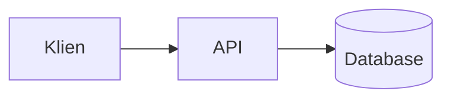

# Menulis tulisan blog

Halaman ini menunjukkan cara menambah tulisan ke [Blog](../blog/index.md) di situs ini: membuat file tulisan bertanggal dari template, menaruh gambar dan file pendukungnya, lalu menerbitkannya.

**Sebelum mulai:** `uv` terpasang dan kamu berada di root repository Zul.

## Tempat file blog

Semua file blog ada di folder `docs/blog/`:

| Path | Isi |
|---|---|
| `docs/blog/posts/` | Satu file Markdown untuk setiap tulisan, misalnya `2026-10-07-memilih-model-lokal.md`. |
| `docs/blog/resources/` | Gambar dan file pendukung. Setiap tulisan punya satu subfolder dengan nama yang sama dengan file tulisannya. |
| `docs/blog/_template.md` | Template untuk tulisan baru. File ini tidak ikut terbit. |
| `docs/blog/.authors.yml` | Nama, foto, dan tautan penulis. |
| `docs/blog/index.md` | Pengantar di atas daftar tulisan. |

## Membuat tulisan baru

1. Buat tulisan dari template:

    ```shell
    uv run python scripts/new_post.py "JUDUL" --kategori KATEGORI
    ```

    Ganti `JUDUL` dengan judul tulisanmu dan `KATEGORI` dengan topiknya, misalnya `RAG`. Untuk lebih dari satu kategori, ulangi `--kategori`. Tanpa `--kategori`, tulisan masuk kategori `Catatan`.

    Skrip mengisi tanggal hari ini, lalu mencetak lokasi tulisan dan folder file-nya:

    ```text
    Tulisan baru : docs/blog/posts/2026-10-07-judul-tulisan.md
    Folder file  : docs/blog/resources/2026-10-07-judul-tulisan/
    ```

2. Buka file tulisannya. Ganti paragraf pertama dengan ringkasan satu atau dua kalimat. Ringkasan ini tampil di halaman daftar blog, jadi biarkan baris `<!-- more -->` di bawahnya.

3. Isi bagian-bagian di bawah `<!-- more -->`, dan hapus bagian yang tidak kamu pakai.

4. Tampilkan pratinjaunya:

    ```shell
    uv run mkdocs serve
    ```

    Buka `http://127.0.0.1:8001`, lalu pilih menu **Blog**. Tulisan terbaru ada di paling atas.

Untuk tulisan dengan tanggal lain, tambahkan `--tanggal`, misalnya `--tanggal 2026-10-01`.

## Menambah gambar dan file

1. Simpan file-nya di folder resources tulisanmu, yang dicetak skrip saat tulisan dibuat.

2. Panggil file itu dari tulisan dengan path relatif:

    ```markdown
    

    [Unduh contoh kode](../resources/2026-10-07-judul-tulisan/contoh.py)
    ```

Untuk gambar yang punya versi terang dan gelap, tambahkan `#only-light` dan `#only-dark` di akhir path. Situs menampilkan versi yang cocok dengan mode yang dipilih pembaca:

```markdown


```

Simpan gambar PNG dengan lebar sekitar 1.200 sampai 1.500 piksel. Kolom tulisan lebarnya sekitar 730 piksel, jadi gambar selebar itu tetap tajam di layar beresolusi tinggi.

## Menambah diagram mermaid

Untuk diagram alur, urutan proses, atau arsitektur sebuah sistem, tulis diagramnya di blok kode `mermaid`. Diagram tidak perlu disimpan sebagai gambar: situs menggambarnya saat halaman dibuka, dan warnanya mengikuti mode terang atau gelap.

````markdown

````

Tema situs mewarnai flowchart, sequence diagram, state diagram, class diagram, dan entity-relationship diagram. Jenis diagram mermaid lain tetap tergambar, tetapi dengan warna bawaan mermaid. Contoh tulisan yang memakai flowchart, sequence diagram, gambar PNG, dan file unduhan adalah [Dari video YouTube sampai bisa dicari AI](../blog/posts/2026-10-07-dari-video-youtube-sampai-bisa-dicari-ai.md).

## Mengatur tanggal

Setiap tulisan wajib punya tanggal di header-nya. Tanpa tanggal, build gagal dan situs tidak diterbitkan:

```yaml
---
date:
  created: 2026-10-07
---
```

Saat kamu memperbarui tulisan lama, tambahkan tanggal `updated`. Halaman tulisan menampilkan kedua tanggal itu:

```yaml
date:
  created: 2026-10-07
  updated: 2026-10-20
```

## Menyimpan tulisan sebagai draf

Untuk menyimpan tulisan yang belum selesai tanpa menerbitkannya, tambahkan `draft: true` di header. Draf tampil di `uv run mkdocs serve` dengan label **Draf**, tetapi tidak ikut terbit. Hapus baris itu saat tulisannya siap.

## Menerbitkan tulisan

1. Periksa situsnya dengan pemeriksaan yang sama seperti di workflow:

    ```shell
    uv run mkdocs build --strict
    ```

    Build gagal jika ada tulisan tanpa tanggal, tanpa baris `<!-- more -->`, atau dengan tautan ke file yang tidak ada.

2. Commit tulisan beserta folder resources-nya, lalu push ke `main`:

    ```shell
    git add docs/blog
    git commit -m "Tambah tulisan blog: JUDUL"
    git push origin main
    ```

3. Buka tab **Actions** di repository dan tunggu workflow **Dokumentasi** selesai. Tulisanmu lalu ada di `https://kazuma313.github.io/zul_utilities/blog/`.

## Lihat juga

- [Format tulisan blog](../referensi/blog.md) untuk semua kunci header, alamat halaman, dan opsi `scripts/new_post.py`.
- [Menerbitkan dokumentasi](menerbitkan-dokumentasi.md) untuk cara kerja workflow penerbitan.
- [Berkontribusi](berkontribusi.md) untuk gaya penulisan di situs ini.
