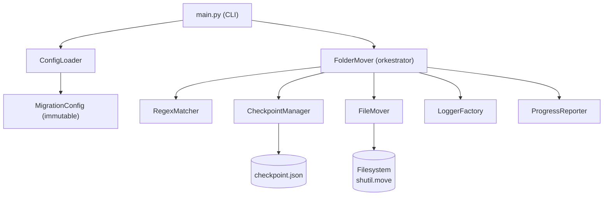
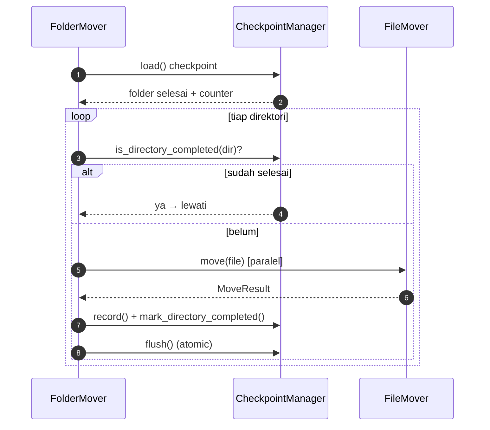

# 📦 folder_migrator

**Utility Python production-grade untuk memindahkan folder beserta seluruh isinya** dari satu direktori ke direktori lain — dirancang untuk migrasi data berskala besar (ratusan ribu hingga jutaan file) dengan **mekanisme resume**, **checkpoint**, **logging**, dan tahan terhadap crash.

> Dibangun mengikuti Clean Code, SOLID, DRY, KISS, PEP8, type hinting lengkap, dan Google-style docstrings.

---

## 1. Struktur Project

```text
research/tools/folder_migrator/
├── main.py                     # Entry point CLI (tipis, hanya delegasi)
├── config.yaml                 # Contoh konfigurasi
├── checkpoint.example.json     # Contoh checkpoint
├── requirements.txt
├── pyproject.toml              # Metadata + konfigurasi pytest
├── README.md
│
├── folder_migrator/            # Package inti
│   ├── __init__.py             # Public API
│   ├── models.py               # dataclass & Enum (MigrationConfig, Checkpoint, ...)
│   ├── exceptions.py           # ConfigurationError, CheckpointError, MoveFileError
│   ├── logger.py               # LoggerFactory (file + console)
│   ├── config.py               # ConfigLoader (YAML/JSON + validasi)
│   ├── matcher.py              # RegexMatcher (include/exclude)
│   ├── checkpoint.py           # CheckpointManager (resume, atomic write)
│   ├── utils.py                # scan_directory(), ProgressReporter, helpers
│   └── mover.py                # FileMover + FolderMover (orkestrasi)
│
└── tests/                      # pytest
    ├── conftest.py
    ├── test_matcher.py
    ├── test_config.py
    ├── test_checkpoint.py
    └── test_mover.py
```

Setiap module punya **satu tanggung jawab** (Single Responsibility Principle).

---

## 2. Arsitektur

Alur data mengikuti pola **layered / onion**: CLI di paling luar, orkestrasi di tengah, dan operasi filesystem di inti. Dependensi selalu mengarah ke dalam (Dependency Rule).



**Peran tiap class**

| Class | Tanggung jawab |
|-------|----------------|
| `ConfigLoader` | Membaca & memvalidasi config YAML/JSON → `MigrationConfig` |
| `RegexMatcher` | Memutuskan file/folder mana yang diproses (include/exclude) |
| `CheckpointManager` | Menyimpan & memuat progress secara atomic (resume) |
| `FileMover` | Memindahkan **satu** entry, tidak pernah melempar exception |
| `FolderMover` | Menelusuri tree, menjadwalkan worker, mencatat progress |
| `LoggerFactory` | Membuat logger (file + console) |
| `ProgressReporter` | Menampilkan progress real-time di console |

Ketergantungan disuntikkan lewat **dependency injection** (`FolderMover.__init__`), dan dirakit oleh factory `FolderMover.from_config()` — sehingga mudah diuji dan diganti.

---

## 3. Mengapa Scalable

Didesain untuk **jutaan file & folder sangat dalam** tanpa meledakkan memori atau stack:

- **Tidak ada daftar file penuh di memori.** Traversal memakai `os.scandir()` per direktori (lazy iterator), bukan `rglob()` yang memuat semuanya.
- **Tidak ada rekursi.** Penelusuran memakai **explicit stack** (`list` sebagai LIFO), jadi folder sedalam apa pun tidak menyebabkan `RecursionError`/stack overflow.
- **In-flight task dibatasi.** Worker thread hanya menahan maksimum `workers × 4` operasi sekaligus (`concurrent.futures.wait`), sehingga memori tetap konstan walau satu folder berisi jutaan file.
- **I/O paralel.** `ThreadPoolExecutor` menjalankan beberapa `shutil.move` bersamaan — efektif karena pemindahan didominasi I/O (terutama saat lintas-device yang berupa copy+delete).
- **Checkpoint ringkas.** Yang disimpan hanya *folder selesai* + counter agregat, bukan daftar setiap file — ukuran checkpoint tetap kecil.

---

## 4. Mengapa Maintainable

- **SRP per module** — ubah aturan regex? sentuh `matcher.py` saja. Ubah format checkpoint? `checkpoint.py` saja.
- **Model immutable** (`@dataclass(frozen=True)`) untuk konfigurasi → tidak ada state tersembunyi yang berubah diam-diam.
- **Fungsi kecil** (< 50 baris), satu level abstraksi, nama deskriptif.
- **Type hint lengkap** + docstring Google-style di semua public API → IDE & reviewer paham cepat.
- **Custom exception** (`ConfigurationError`, `CheckpointError`, `MoveFileError`) → penanganan error yang eksplisit dan bisa ditangkap per-jenis.
- **Dependency injection** → setiap bagian bisa di-mock/di-test terisolasi.
- **Tanpa global variable & tanpa magic number** (dikonstansi lewat `Final`).

---

## 5. Mekanisme Resume

Program dapat dilanjutkan setelah **mati mendadak, CTRL+C, SIGTERM, atau exception**.

**Bagaimana cara kerjanya**

1. Progres disimpan di `checkpoint.json`. Yang dicatat: daftar **direktori yang sudah selesai**, **counter** (moved/skipped/failed), dan **entry terakhir** yang diproses.
2. Penulisan checkpoint bersifat **atomic**: ditulis ke file sementara `.tmp` lalu `os.replace()` — jadi crash saat menulis tidak pernah merusak checkpoint.
3. Checkpoint di-*flush* setiap satu direktori selesai, dan juga saat menerima sinyal berhenti (SIGINT/SIGTERM ditangani lewat `threading.Event`, worker yang sedang jalan dibiarkan selesai dulu — *graceful shutdown*).
4. Saat dijalankan ulang, `FolderMover` memuat checkpoint. Direktori yang ada di daftar "selesai" **dilewati** (file-nya tidak diproses ulang).
5. **Idempoten secara alami**: karena ini operasi *move*, file yang sudah pindah tidak ada lagi di source. Ditambah pengecekan "destination exists" (saat `overwrite: false`), file yang sudah berhasil pindah tidak akan digandakan atau diproses dua kali.



---

## 6. Reliability (Aman terhadap Crash)

`FileMover` menangkap `PermissionError`, `FileNotFoundError`, `InterruptedError`, dan `OSError` lalu mengembalikan hasil `FAILED` — **satu file gagal tidak menghentikan proses**, file berikutnya tetap lanjut. `KeyboardInterrupt` & sinyal ditangani secara graceful dan selalu diakhiri dengan `flush()` checkpoint di blok `finally`.

---

## 7. Instalasi

```bash
cd research/tools/folder_migrator
pip install -r requirements.txt   # hanya butuh PyYAML (untuk config YAML)
```

> Config JSON bekerja tanpa dependensi apa pun (stdlib saja). Butuh Python 3.11+.

---

## 8. Contoh Konfigurasi (`config.yaml`)

```yaml
source: "/mnt/source"
destination: "/mnt/destination"

include:
  - ".*"

exclude:
  - "^\\.git$"
  - "__pycache__"
  - "\\.DS_Store"
  - "node_modules"
  - "\\.venv"
  - "\\.idea"

follow_symlink: false
overwrite: false
workers: 4

# Opsional
checkpoint_path: "checkpoint.json"
log_path: "logs/move_folder.log"
checkpoint_every: 500
```

---

## 9. Contoh Checkpoint (`checkpoint.json`)

```json
{
  "completed_directories": [".", "images", "images/2024", "documents/reports"],
  "moved_count": 12345,
  "skipped_count": 27,
  "failed_count": 3,
  "last_processed": "images/2024/img123.png",
  "started_at": 1753670400.0,
  "updated_at": 1753670712.5
}
```

---

## 10. Cara Menjalankan

```bash
# Memakai config default (config.yaml)
python main.py

# Menentukan file config
python main.py --config /path/to/config.json
```

Jalankan lagi perintah yang sama setelah berhenti → otomatis **melanjutkan** dari checkpoint.

Sebagai library:

```python
from folder_migrator import FolderMover

FolderMover.from_config_file("config.yaml").run()
```

---

## 11. Contoh Output

**Console (progress real-time):**

```text
Processed: 12345 | moved: 12315 | current: images/2024/img123.png
```

**Log (`logs/move_folder.log`):**

```text
2026-07-28 09:12:01,003 | INFO     | folder_migrator | Resuming from checkpoint: 12000 moved, 42 directories done
2026-07-28 09:12:01,004 | INFO     | folder_migrator | Starting migration: /mnt/source -> /mnt/destination
2026-07-28 09:12:01,010 | INFO     | folder_migrator | Processing directory: images/2024 (1500 files)
2026-07-28 09:12:03,552 | WARNING  | folder_migrator | Skipped documents/old.tmp (destination exists)
2026-07-28 09:12:04,113 | WARNING  | folder_migrator | Excluded directory: /mnt/source/project/node_modules
2026-07-28 09:12:07,900 | ERROR    | folder_migrator | Failed images/2024/locked.png: [Errno 13] Permission denied
2026-07-28 09:14:55,220 | INFO     | folder_migrator | Migration finished: 498765 moved, 27 skipped, 3 failed
```

> **Level logging:** proses/folder/resume/summary pada `INFO`; file dilewati & folder ter-exclude pada `WARNING`; kegagalan pada `ERROR`. Sukses per-file dicatat pada `DEBUG` agar log tetap terbaca saat memproses jutaan file (aktifkan `DEBUG` bila butuh jejak lengkap).

---

## 12. Testing

```bash
cd research/tools/folder_migrator
pytest
```

Cakupan test: include/exclude regex, load & validasi config, checkpoint (record/flush/reload/corrupt), **resume** (skip folder selesai), **move** file, **skip** (destination exists & exclude), dan **overwrite**.

---

## 13. Catatan Desain

- **Symlink**: default `follow_symlink: false` → symlink dilewati (aman dari loop symlink siklik). Set `true` untuk mengikutinya.
- **overwrite: false** (default) melindungi data di destination; set `true` untuk menimpa.
- **destination tidak boleh berada di dalam source** — divalidasi `ConfigLoader` untuk mencegah pemindahan berulang tanpa henti.
